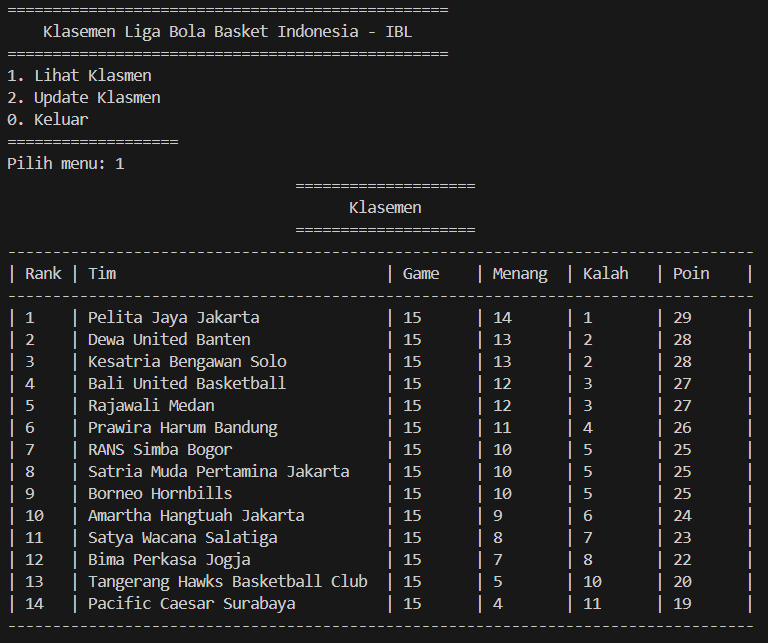
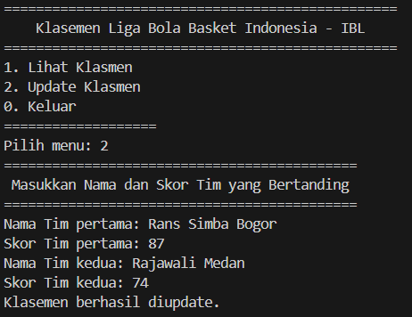
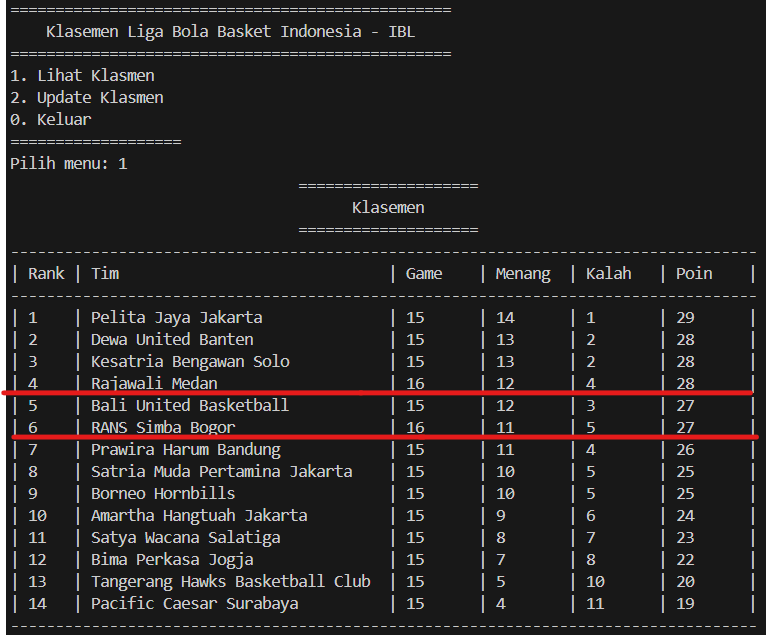

# <p align ="center"> LAPORAN PRAKTIKUM ALGORITMA DAN STRUKTUR DATA </p>

<br><br><br><br>

<p align="center">
    </p>

<br><br><br><br><br>

<p align = "center"> Nama  : Abdillah Noer Said </p>
<p align = "center"> NIM   : 2341720018 </p>
<p align = "center"> Prodi : TEKNIK INFOMATIKA</p>
<p align = "center"> Kelas : 1B </p>
<p align = "center"> Absen : 01 </p>

## Kuis 2

Class Node01
```java
public class Node01 {
    Tim01 data;
    Node01 next;
    
    Node01 (Tim01 data, Node01 berikutnya) {
        this.data = data;
        this.next = berikutnya;
        }
}
```

Class Tim01
```java
public class Tim01 {
    String namaTim;
    int jmlMatch;
    int jmlMenang;
    int jmlKalah;
    int point;

    Tim01 (String namaTim, int jmlMatch, int jmlMenang, int jmlKalah, int point) {
        this.namaTim = namaTim;
        this.jmlMatch = jmlMatch;
        this.jmlMenang = jmlMenang;
        this.jmlKalah = jmlKalah;   
        this.point = point;
    }
}
```

Class LinkedList01
```java
public class LinkedList01 {
    Node01 head, tail;

    boolean isEmpty(){
        return head == null;
    }

    void print() {
        if (!isEmpty()) {
            Node01 tmp = head;
            System.out.println("\t\t\t\t====================");
            System.out.println("\t\t\t\t      Klasemen      ");
            System.out.println("\t\t\t\t====================");
            System.out.println("-----------------------------------------------------------------------------------");
            System.out.printf("| %-4s | %-32s | %-7s | %-7s | %-7s | %-7s |\n", "Rank", "Tim", "Game", "Menang", "Kalah", "Poin");
            System.out.println("-----------------------------------------------------------------------------------");
            int i = 1;
            while(tmp != null){
                System.out.printf("| %-4s | %-32s | %-7s | %-7s | %-7s | %-7s |\n", i, tmp.data.namaTim, tmp.data.jmlMatch, tmp.data.jmlMenang, tmp.data.jmlKalah, tmp.data.point);
                tmp = tmp.next;
                i++;
            }
            System.out.println("-----------------------------------------------------------------------------------");
        } else {
            System.out.println("Linked List Kosong");
        }
    }

    void addLast(Tim01 input) {
        Node01 ndInput = new Node01(input, null);
        if (!isEmpty()) {
            tail.next = ndInput;
            tail = ndInput;
        } else {
            head = ndInput;
            tail = ndInput;
        }
        sort();
    }

    public void search(String namaTim01){
        Node01 temp = head;
        int i = 1;
        while(temp != null){
            if (temp.data.namaTim.equalsIgnoreCase(namaTim01)) {
                System.out.printf("| %-4s | %-32s | %-7s | %-7s | %-7s | %-7s |\n", "Rank", "Tim", "Game", "Menang", "Kalah", "Poin");
                System.out.printf("| %-4s | %-32s | %-7s | %-7s | %-7s | %-7s |\n", i, temp.data.namaTim, temp.data.jmlMatch, temp.data.jmlMenang, temp.data.jmlKalah, temp.data.point);
                break;
            }
            temp = temp.next;
            i++;
        }
    }

    public void sort() {
        Node01 temp = head;
        while (temp != null) {
            Node01 temp2 = temp.next;
            while (temp2 != null) {
                if (temp.data.point < temp2.data.point) {
                    Tim01 temp3 = temp.data;
                    temp.data = temp2.data;
                    temp2.data = temp3;
                }
                temp2 = temp2.next;
            }
            temp = temp.next;
        }
    }

    public void Update(String namaTim1, int skor1, String namaTim2, int skor2) {
        Node01 tim1 = null, tim2 = null;
        Node01 temp = head;

        while (temp != null) {
            if (temp.data.namaTim.equalsIgnoreCase(namaTim1)) {
                tim1 = temp;
            } else if (temp.data.namaTim.equalsIgnoreCase(namaTim2)) {
                tim2 = temp;
            }
            if (tim1 != null && tim2 != null) {
                break;
            }
            temp = temp.next;
        }

        if (tim1 != null && tim2 != null) {
            tim1.data.jmlMatch++;
            tim2.data.jmlMatch++;
            if (skor1 > skor2) {
                tim1.data.jmlMenang++;
                tim1.data.point += 2;
                tim2.data.jmlKalah++;
                tim2.data.point += 1;
            } else {
                tim2.data.jmlMenang++;
                tim2.data.point += 2;
                tim1.data.jmlKalah++;
                tim1.data.point += 1;
            }
            sort();
            System.out.println("Klasemen berhasil diupdate.");
        } else {
            System.out.println("Tim tidak ditemukan dalam klasemen.");
        }
    }   
}
```

Class Main01
```java
import java.util.Scanner;

public class Main01 {
public static void main(String[] args) {
    Scanner sc = new Scanner(System.in);
    LinkedList01 singLL = new LinkedList01();

    singLL.addLast(new Tim01("Pelita Jaya Jakarta", 15, 14, 1, 29));
    singLL.addLast(new Tim01("Dewa United Banten", 15, 13, 2, 28));
    singLL.addLast(new Tim01("Kesatria Bengawan Solo", 15, 13, 2, 28));
    singLL.addLast(new Tim01("Bali United Basketball", 15, 12, 3, 27));
    singLL.addLast(new Tim01("Rajawali Medan", 15, 12, 3, 27));
    singLL.addLast(new Tim01("Prawira Harum Bandung", 15, 11, 4, 26));
    singLL.addLast(new Tim01("RANS Simba Bogor", 15, 10, 5, 25));
    singLL.addLast(new Tim01("Satria Muda Pertamina Jakarta", 15, 10, 5, 25));
    singLL.addLast(new Tim01("Borneo Hornbills", 15, 10, 5, 25));
    singLL.addLast(new Tim01("Amartha Hangtuah Jakarta", 15, 9, 6, 24));
    singLL.addLast(new Tim01("Satya Wacana Salatiga", 15, 8, 7, 23));
    singLL.addLast(new Tim01("Bima Perkasa Jogja", 15, 7, 8, 22));
    singLL.addLast(new Tim01("Tangerang Hawks Basketball Club", 15, 5, 10, 20));
    singLL.addLast(new Tim01("Pacific Caesar Surabaya", 15, 4, 11, 19));    

    while (true) {
        System.out.println("=================================================");
        System.out.println("    Klasemen Liga Bola Basket Indonesia - IBL   ");
        System.out.println("=================================================");
        System.out.println("1. Lihat Klasmen");
        System.out.println("2. Update Klasmen"); 
        System.out.println("0. Keluar");
        System.out.println("===================");
        System.out.print("Pilih menu: ");
        int pilih = sc.nextInt();
        sc.nextLine();
        switch (pilih) {

            case 1:
                singLL.print();
                break;

            case 2:
                System.out.println("============================================");
                System.out.println(" Masukkan Nama dan Skor Tim yang Bertanding");
                System.out.println("============================================");
                System.out.print("Nama Tim pertama: ");
                String namaTim1 = sc.nextLine();
                System.out.print("Skor Tim pertama: ");
                int skor1 = sc.nextInt();
                sc.nextLine();
                System.out.print("Nama Tim kedua: ");
                String namaTim2 = sc.nextLine();
                System.out.print("Skor Tim kedua: ");
                int skor2 = sc.nextInt();
                singLL.Update(namaTim1, skor1, namaTim2, skor2);
                break;
            
            case 0:
                System.exit(0);
                break;
        
            default:
                System.out.println("Pilihan tidak tersedia");
                break;
            }
        }
    }
}
```

### Output
Menampilkan Klasemen<br>


Mengupdate Klasemen terbaru dengan memasukkan detail pertandingan<br>


Menampilkan Klasemen terbaru setelah diupdate (Rajawali dan RANS telah bertambah poin)<br>
