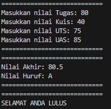

# <p align ="center"> LAPORAN PRAKTIKUM ALGORITMA DAN STRUKTUR DATA </p>

<br><br><br><br>

<p align="center">
    </p>

<br><br><br><br><br>

<p align = "center"> Nama  : Abdillah Noer Said </p>
<p align = "center"> NIM   : 2341720018 </p>
<p align = "center"> Prodi : TEKNIK INFOMATIKA</p>
<p align = "center"> Kelas : 1B </p>
<p align = "center"> Absen : 01 </p>

## Jobsheet 1

### Praktikum Pemilihan

Hasil Praktikum

```java
import java.util.Scanner;

public class Pemilihan01 {
    public static void main(String[] args) {
        Scanner sc = new Scanner(System.in);

        System.out.println("============================");
        System.out.print("Masukkan nilai Tugas: ");
        double tugas = sc.nextDouble();

        System.out.print("Masukkan nilai Kuis: ");
        double kuis = sc.nextDouble();

        System.out.print("Masukkan nilai UTS: ");
        double uts = sc.nextDouble();

        System.out.print("Masukkan nilai UAS: ");
        double uas = sc.nextDouble();
        System.out.println("============================");

        // Cek nilai valid
        if (!isValid(tugas) || !isValid(kuis) || !isValid(uts) || !isValid(uas)) {
            System.out.println("============================");
            System.out.println("Nilai tidak valid");
            System.out.println("============================");
        } else {
            // Perhitungan Nilai
            double nilaiAkhir = 0.2 * tugas + 0.2 * kuis + 0.3 * uts + 0.4 * uas;

            // Nilai huruf
            String nilaiHuruf;
            if (nilaiAkhir >= 80) {
                nilaiHuruf = "A";
            } else if (nilaiAkhir >= 73) {
                nilaiHuruf = "B+";
            } else if (nilaiAkhir >= 65) {
                nilaiHuruf = "B";
            } else if (nilaiAkhir >= 60) {
                nilaiHuruf = "C+";
            } else if (nilaiAkhir >= 50) {
                nilaiHuruf = "C";
            } else if (nilaiAkhir >= 39) {
                nilaiHuruf = "D";
            } else {
                nilaiHuruf = "E";
            }

            // Keterangan Lulus
            String keterangan = nilaiHuruf.equals("D") || nilaiHuruf.equals("E") ? "ANDA TIDAK LULUS"
                    : "SELAMAT ANDA LULUS";

            // Output
            System.out.println("============================");
            System.out.println("Nilai Akhir: " + nilaiAkhir);
            System.out.println("Nilai Huruf: " + nilaiHuruf);
            System.out.println("============================");
            System.out.println("============================");
            System.out.println(keterangan);
        }
    }

    // Cek nilai valid 0 sampai 100
    public static boolean isValid(double nilai) {
        return nilai >= 0 && nilai <= 100;
    }
}
```

Output yang tidak valid <br>


Output yang benar <br>


### Praktikum Perulangan

Hasil Percobaan

```java
import java.util.Scanner;

public class Perulangan01 {
    public static void main(String[] args) {
        Scanner sc = new Scanner(System.in);

        System.out.print("Masukkan NIM: ");
        String nim = sc.nextLine();

        // Mendapatkan 2 digit terakhir dari NIM
        int n = Integer.parseInt(nim.substring(nim.length() - 2));

        if (n < 10) {
            n += 10;
        }

        System.out.println("========================");
        System.out.println("N : " + n);
        System.out.print("");

        for (int i = 1; i <= n; i++) {
            if (i % 2 != 0) {
                System.out.print("* ");
            } else if (i == 6 || i == 10) {
                continue;
            } else {
                System.out.print(i + " ");
            }
        }
    }
}
```

Outputnya<br>
](img/OP3.png)<br><br>
](img/OP4.png)

### Praktimu Array

Hasil Praktikum

```java
import java.util.Scanner;

public class Array01 {
    public static void main(String[] args) {
        Scanner input = new Scanner(System.in);

        String[] mataKuliah = { "Pancasila", "Konsep Teknologi Informasi", "Critical Thinking and Problem Solving",
                "Matematika Dasar", "Bahasa Inggris", "Dasar Pemrograman", "Praktikum Dasar Pemrograman",
                "Keselamatan dan Kesehatan Kerja" };
        double[] sks = { 2, 2, 2, 3, 2, 2, 3, 2 };

        System.out.println("===============================");
        System.out.println("Program Menghitung IP Semester");
        System.out.println("===============================");

        double[] nilaiAngka = new double[mataKuliah.length];

        for (int i = 0; i < mataKuliah.length; i++) {
            System.out.print("Masukkan nilai Angka untuk MK " + mataKuliah[i] + ": ");
            nilaiAngka[i] = input.nextDouble();
        }

        System.out.println("=======================");
        System.out.println("Hasil Konversi Nilai");
        System.out.println("=======================");
        System.out.printf("%-40s %-15s %-15s %-15s\n", "MK", "Nilai Angka", "Nilai Huruf", "Bobot Nilai");

        double totalBobotSks = 0;
        double totalSks = 0;

        for (int i = 0; i < mataKuliah.length; i++) {
            String nilaiHuruf = konversiNilaiHuruf(nilaiAngka[i]);
            double bobotNilai = konversiNilaiSetara(nilaiAngka[i]);
            double bobotSks = bobotNilai * sks[i];
            totalBobotSks += bobotSks;
            totalSks += sks[i];
            System.out.printf("%-40s %-15.2f %-15s %-15.2f\n", mataKuliah[i], nilaiAngka[i], nilaiHuruf,
                    bobotNilai);
        }

        double ipSemester = totalBobotSks / totalSks;

        System.out.println("=========================");
        System.out.println("IP Semester Anda: " + String.format("%.2f", ipSemester));
        System.out.println("=========================");
    }

    public static String konversiNilaiHuruf(double nilaiAngka) {
        if (nilaiAngka >= 80) {
            return "A";
        } else if (nilaiAngka >= 75) {
            return "B+";
        } else if (nilaiAngka >= 65) {
            return "B";
        } else if (nilaiAngka >= 60) {
            return "C+";
        } else if (nilaiAngka >= 50) {
            return "C";
        } else if (nilaiAngka >= 40) {
            return "D";
        } else {
            return "E";
        }
    }

    public static double konversiNilaiSetara(double nilaiAngka) {
        if (nilaiAngka >= 80) {
            return 4;
        } else if (nilaiAngka >= 75) {
            return 3.5;
        } else if (nilaiAngka >= 65) {
            return 3;
        } else if (nilaiAngka >= 60) {
            return 2.5;
        } else if (nilaiAngka >= 50) {
            return 2;
        } else if (nilaiAngka >= 40) {
            return 1;
        } else {
            return 0;
        }
    }
}
```

Outputnya <br>
](img/OP5.png)

### Praktikum Fungsi

Hasil Percobaan

```java
public class Fungsi01 {
    static int stokBunga[][] = {
            { 10, 5, 15, 7 },
            { 6, 11, 9, 12 },
            { 2, 10, 10, 5 },
            { 5, 7, 12, 9 }
    };

    static int hargaBunga[] = { 75000, 50000, 60000, 10000 };

    static void pendapatanCabang() {
        System.out.println("=================================================");
        System.out.println("Pendapatan cabang RoyalGarden");
        System.out.println("=================================================");
        for (int i = 0; i < stokBunga.length; i++) {
            int totalPendapatan = 0;
            for (int j = 0; j < stokBunga[i].length; j++) {
                totalPendapatan += stokBunga[i][j] * hargaBunga[j];
            }
            System.out.println("Pendapatan cabang RoyalGarden " + (i + 1) + ": Rp " + totalPendapatan);
        }
    }

    static String NamaBunga(int index) {
        switch (index) {
            case 0:
                return "Aglonema";
            case 1:
                return "Keladi";
            case 2:
                return "Alocasia";
            case 3:
                return "Mawar";
            default:
                return "Bunga Tidak Ada";
        }
    }

    static void jumlahStockPerJenisBunga() {
        System.out.println("=================================================");
        System.out.println("Sisa stok bunga pada cabang RoyalGarden 4: ");
        System.out.println("=================================================");
        System.out.println("Stok bunga " + NamaBunga(0) + ": " + (stokBunga[3][0] - 1));
        System.out.println("Stok bunga " + NamaBunga(1) + ": " + (stokBunga[3][1] - 2));
        System.out.println("Stok bunga " + NamaBunga(2) + ": " + (stokBunga[3][2] - 0));
        System.out.println("Stok bunga " + NamaBunga(3) + ": " + (stokBunga[3][3] - 5));
    }

    public static void main(String[] args) {
        pendapatanCabang();
        jumlahStockPerJenisBunga();
    }
}
```

Outputnya <br>


### Tugas

Hasil Program nomor 1

```java
import java.util.Scanner;

public class Tugas101 {
    public static void main(String[] args) {
        Scanner sc = new Scanner(System.in);

        char Kode[] = { 'A', 'B', 'D', 'E', 'F', 'G', 'H', 'L', 'N', 'T' };
        char Kota[][] = {
                { 'B', 'A', 'N', 'T', 'E', 'N' },
                { 'J', 'A', 'K', 'A', 'R', 'T', 'A' },
                { 'B', 'A', 'N', 'D', 'U', 'N', 'G' },
                { 'C', 'I', 'R', 'E', 'B', 'O', 'N' },
                { 'B', 'O', 'G', 'O', 'R' },
                { 'P', 'E', 'K', 'A', 'L', 'O', 'N', 'G', 'A', 'N' },
                { 'S', 'E', 'M', 'A', 'R', 'A', 'N', 'G' },
                { 'S', 'U', 'R', 'A', 'B', 'A', 'Y', 'A' },
                { 'M', 'A', 'L', 'A', 'N', 'G' },
                { 'T', 'E', 'G', 'A', 'L' }
        };

        System.out.print("Masukkan kode plat : ");
        char kode = sc.next().toUpperCase().charAt(0);
        boolean kodeDitemukan = false;
        int index = 0;
        for (int i = 0; i < Kode.length; i++) {
            if (Kode[i] == kode) {
                kodeDitemukan = true;
                index = i;
                break;
            }
        }

        if (kodeDitemukan) {
            System.out.println("Kota pencarian kode plat " + kode + " adalah: ");
            for (int i = 0; i < Kota[index].length; i++) {
                System.out.print(Kota[index][i] + " ");
            }
        } else {
            System.out.println("Kode plat tidak ada!");
        }
    }
}
```

Outputnya<br>


Hasil Program nomor 2

```java
import java.util.Scanner;

public class Tugas201 {
    static Scanner sc = new Scanner(System.in);
    static int pilih = 0;

    public static void main(String[] args) {
        switch (menu()) {
            case 1:
                System.out.println("Menu hitung kecepatan");
                hitungKecepatan();
                break;
            case 2:
                System.out.println("Menu hitung jarak");
                hitungJarak();
                break;
            case 3:
                System.out.println("Menu hitung waktu");
                hitungWaktu();
                break;
            default:
                System.out.println("Invalid menu");
                break;
        }
    }

    public static int menu() {
        System.out.println("Pilih menu : ");
        System.out.println("1. Hitung Kecepatan");
        System.out.println("2. Hitung Jarak");
        System.out.println("3. Hitung Waktu");
        System.out.println("====================");
        System.out.print("Pilih menu : ");
        pilih = sc.nextInt();
        return pilih;
    }

    public static void hitungKecepatan() {
        System.out.print("Masukkan jarak (Km) : ");
        double jarak = sc.nextDouble();
        System.out.print("Masukkan waktu (Jam) : ");
        double waktu = sc.nextDouble();
        System.out.println("Kecepatan : " + jarak / waktu + " Km/Jam");
    }

    public static void hitungJarak() {
        System.out.print("Masukkan kecepatan (Km) : ");
        double kecepatan = sc.nextDouble();
        System.out.print("Masukkan waktu (Jam) : ");
        double waktu = sc.nextDouble();
        System.out.println("Jarak : " + kecepatan * waktu + " Km");
    }

    public static void hitungWaktu() {
        System.out.print("Masukkan jarak (Km) : ");
        double jarak = sc.nextDouble();
        System.out.print("Masukkan kecepatan (Jam) : ");
        double kecepatan = sc.nextDouble();
        System.out.println("Waktu : " + jarak / kecepatan + " Jam");
    }
}
```

Outputnya Kecepatan<br>
 <br>
Outputnya Jarak<br>
 <br>
Outputnya Waktu<br>

