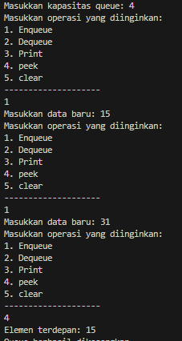
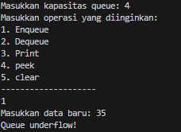
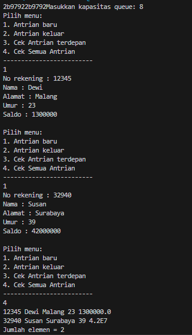
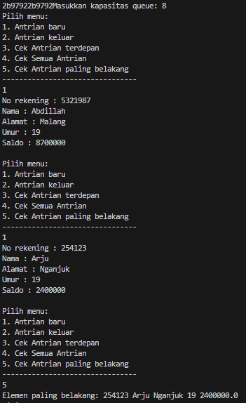
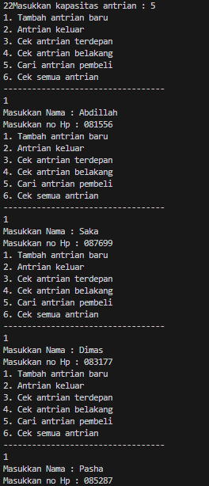
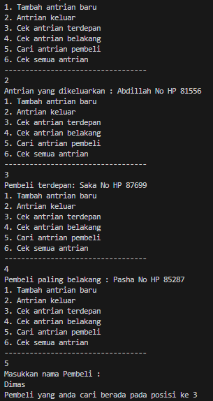
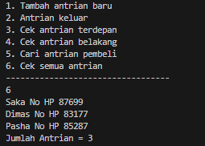

# <p align ="center"> LAPORAN PRAKTIKUM ALGORITMA DAN STRUKTUR DATA </p>

<br><br><br><br>

<p align="center">
    </p>

<br><br><br><br><br>

<p align = "center"> Nama  : Abdillah Noer Said </p>
<p align = "center"> NIM   : 2341720018 </p>
<p align = "center"> Prodi : TEKNIK INFOMATIKA</p>
<p align = "center"> Kelas : 1B </p>
<p align = "center"> Absen : 01 </p>

## Jobsheet 10

### Percobaan 1

Class Queue01

```java
   package Praktikum1;

public class Queue01 {
    int[] data;
    int front, rear, size, max;

    public Queue01(int n) {
        max = n;
        data = new int[max];
        size = 0;
        front = rear = -1;
    }

    public boolean IsEmpty() {
        if (size == 0) {
            return true;
        } else {
            return false;
        }
    }

    public boolean IsFull() {
        if (size == max) {
            return true;
        } else {
            return false;
        }
    }

    public void peek() {
        if (!IsEmpty()) {
            System.out.println("Elemen terdepan: " + data[front]);
        } else {
            System.out.println("Queue masih kosong");
        }
    }

    public void print() {
        if (IsEmpty()) {
            System.out.println("Queue masih kosong");
        } else {
            int i = front;
            while (i != rear) {
                System.out.print(data[i] + " ");
                i = (i + 1) % max;
            }
            System.out.println(data[i] + " ");
            System.out.println("Jumlah elemen = " + size);
        }
    }

    public void clear() {
        if (!IsEmpty()) {
            front = rear = -1;
            size = 0;
            System.out.println("Queue berhasil dikosongkan");
        } else {
            System.out.println("Queue masih kosong");
        }
    }

    public void Enqueue(int dt) {
        if (IsFull()) {
            System.out.println("Queue sudah penuh");
        } else {
            if (IsEmpty()) {
                front = rear = 0;
            } else {
                if (rear == max - 1) {
                    rear = 0;
                } else {
                    rear++;
                }
            }
            data[rear] = dt;
            size++;
        }
    }

    public int Dequeue() {
        int dt = 0;
        if (IsEmpty()) {
            System.out.println("Queue masih kosong");
        } else {
            dt = data[front];
            size--;
            if (IsEmpty()) {
                front = rear = -1;
            } else {
                if (front == max - 1) {
                    front = 0;
                } else {
                    front++;
                }
            }
        }
        return dt;
    }
}
```

Class QueueMain01

```java
   package Praktikum1;

import java.util.Scanner;

public class QueueMain01 {
    public static void menu() {
        System.out.println("Masukkan operasi yang diinginkan:");
        System.out.println("1. Enqueue");
        System.out.println("2. Dequeue");
        System.out.println("3. Print");
        System.out.println("4. peek");
        System.out.println("5. clear");
        System.out.println("--------------------");
    }

    public static void main(String[] args) {
        Scanner sc = new Scanner(System.in);

        System.out.print("Masukkan kapasitas queue: ");
        int n = sc.nextInt();

        Queue01 Q = new Queue01(n);
        int pilih;

        do {
            menu();
            pilih = sc.nextInt();
            switch (pilih) {
                case 1:
                    System.out.print("Masukkan data baru: ");
                    int dataMasuk = sc.nextInt();
                    Q.Enqueue(dataMasuk);
                    break;
                case 2:
                    int dataKeluar = Q.Dequeue();
                    if (dataKeluar != 0) {
                        System.out.println("Data yang dikeluarkan: " + dataKeluar);
                        break;
                    }
                case 3:
                    Q.print();
                case 4:
                    Q.peek();
                case 5:
                    Q.clear();
                    break;
            }
        } while (pilih == 1 || pilih == 2 || pilih == 3 || pilih == 4 || pilih == 5);
    }
}
```

Output



### Pertanyaan

1. Pada konstruktor, mengapa nilai awal atribut front dan rear bernilai -1, sementara atribut size bernilai 0?<br>
   Jawab : Atribut front dan rear bernilai -1 karena pada awalnya, ketika objek antrian pertama kali dibuat, antrian tersebut belum berisi elemen apa pun. Oleh karena itu, kedua atribut ini menunjuk pada posisi yang tidak valid dalam array data. Sementara itu, atribut size diatur ke nilai 0 karena pada awalnya tidak ada elemen yang ada dalam antrian, Size digunakan untuk melacak jumlah elemen yang ada dalam antrian.
2. Pada method Enqueue, jelaskan maksud dan kegunaan dari potongan kode berikut!

```java
   if (rear == max -1) {
      rear = 01;
```

Jawab : Code tersebut untuk mengimplementasikan siklus antrian, dimana ketika rear mencapai batas maksimum array, penambahan elemen berikutnya akan dimulai lagi dari awal array dan elemen-elemen yang ditambahkan akan mengisi ruang yang tersedia, bahkan setelah rear mencapai indeks maksimum array.

3. Pada method Dequeue, jelaskan maksud dan kegunaan dari potongan kode berikut!

```java
   if(front == max -1) {
      front = 0;
```

Jawab : Code tersebut untuk mengimplementasikan siklus antrian agar dapat terus menghapus elemen dari antrian dengan benar, bahkan setelah front mencapai indeks maksimum array.

4. Pada method print, mengapa pada proses perulangan variabel i tidak dimulai dari 0 (int i=0), melainkan int i=front?

Jawab : agar dapat mencetak elemen-elemen dalam antrian secara berurutan, dimulai dari elemen pertama tanpa mencetak elemen yang tidak valid

5. Perhatikan kembali method print, jelaskan maksud dari potongan kode berikut!

```java
   i = (i + 1 ) % max;
```

Jawab : digunakan untuk memindahkan indeks i ke elemen berikutnya dalam array yang mewakili antrian, dengan memperhatikan batas kapasitas maksimum antrian max.

6. Tunjukkan potongan kode program yang merupakan queue overflow!

Jawab : Queue overflow terjadi ketika mencoba menambahkan elemen baru ke dalam antrian yang sudah penuh.

```java
   public boolean IsFull() {
        if (size == max) {
            return true;
        } else {
            return false;
        }
    }
```

7. Pada saat terjadi queue overflow dan queue underflow, program tersebut tetap dapat berjalan dan hanya menampilkan teks informasi. Lakukan modifikasi program sehingga pada saat terjadi queue overflow dan queue underflow, program dihentikan!

```java
   public boolean IsEmpty() {
        if (size == 0) {
            System.out.println("Queue underflow!");
            System.exit(0);
            return true;
        } else {
            return false;
        }
    }

    public boolean IsFull() {
        if (size == max) {
            System.out.println("Queue overflow!");
            System.exit(0);
            return true;
        } else {
            return false;
        }
    }
```

Output



### Praktikum 2

Class Nasabah01

```java
package Praktikum2;

public class Nasabah01 {
    String norek, nama, alamat;
    int umur;
    double saldo;

    Nasabah01(String norek, String nama, String alamat, int umur, double saldo) {
        this.norek = norek;
        this.nama = nama;
        this.alamat = alamat;
        this.umur = umur;
        this.saldo = saldo;
    }

    Nasabah01() {

    }
}
```

Class Queue01

```java
package Praktikum2;

public class Queue01 {
    Nasabah01[] data;
    int front, rear, size, max;

    public Queue01(int n) {
        max = n;
        data = new Nasabah01[max];
        size = 0;
        front = rear = -1;
    }

    public boolean IsEmpty() {
        if (size == 0) {
            return true;
        } else {
            return false;
        }
    }

    public boolean IsFull() {
        if (size == max) {
            return true;
        } else {
            return false;
        }
    }

    public void peek() {
        if (!IsEmpty()) {
            System.out.println("Elemen terdepan: " + data[front].norek + " " + data[front].nama
                    + " " + data[front].alamat + " " + data[front].umur + " " + data[front].saldo);
        } else {
            System.out.println("Queue masih kosong");
        }
    }

    public void print() {
        if (IsEmpty()) {
            System.out.println("Queue masih kosong");
        } else {
            int i = front;
            while (i != rear) {
                System.out.println(data[i].norek + " " + data[i].nama
                        + " " + data[i].alamat + " " + data[i].umur + " " + data[i].saldo);
                i = (i + 1) % max;
            }
            System.out.println(data[i].norek + " " + data[i].nama
                    + " " + data[i].alamat + " " + data[i].umur + " " + data[i].saldo);
            System.out.println("Jumlah elemen = " + size);
        }
    }

    public void clear() {
        if (!IsEmpty()) {
            front = rear = -1;
            size = 0;
            System.out.println("Queue berhasil dikosongkan");
        } else {
            System.out.println("Queue masih kosong");
        }
    }

    public void Enqueue(Nasabah01 dt) {
        if (IsFull()) {
            System.out.println("Queue sudah penuh");
        } else {
            if (IsEmpty()) {
                front = rear = 0;
            } else {
                if (rear == max - 1) {
                    rear = 0;
                } else {
                    rear++;
                }
            }
            data[rear] = dt;
            size++;
        }
    }

    public Nasabah01 Dequeue() {
        Nasabah01 dt = new Nasabah01();
        if (IsEmpty()) {
            System.out.println("Queue masih kosong");
        } else {
            dt = data[front];
            size--;
            if (IsEmpty()) {
                front = rear = -1;
            } else {
                if (front == max - 1) {
                    front = 0;
                } else {
                    front++;
                }
            }
        }
        return dt;
    }
}
```

Class QueueMain01

```java
package Praktikum2;

import java.util.Scanner;

public class QueueMain01 {
    public static void menu() {
        System.out.println("Pilih menu: ");
        System.out.println("1. Antrian baru");
        System.out.println("2. Antrian keluar");
        System.out.println("3. Cek Antrian terdepan");
        System.out.println("4. Cek Semua Antrian");
        System.out.println("-------------------------");
    }

    public static void main(String[] args) {
        Scanner sc = new Scanner(System.in);
        Scanner Scanner = new Scanner(System.in);
        System.out.print("Masukkan kapasitas queue: ");
        int jumlah = sc.nextInt();
        Queue01 antri = new Queue01(jumlah);
        int pilih;

        do {
            menu();
            pilih = sc.nextInt();
            switch (pilih) {
                case 1:
                    System.out.print("No rekening : ");
                    String norek = Scanner.nextLine();
                    System.out.print("Nama : ");
                    String nama = Scanner.nextLine();
                    System.out.print("Alamat : ");
                    String alamat = Scanner.nextLine();
                    System.out.print("Umur : ");
                    int umur = sc.nextInt();
                    System.out.print("Saldo : ");
                    double saldo = sc.nextDouble();
                    sc.nextLine();
                    Nasabah01 nb = new Nasabah01(norek, nama, alamat, umur, saldo);
                    sc.nextLine();
                    antri.Enqueue(nb);
                    break;
                case 2:
                    Nasabah01 data = antri.Dequeue();
                    if (!"".equals(data.norek) && !"".equals(data.nama) && !"".equals(data.alamat)
                            && data.umur != 0 && data.saldo != 0) {
                        System.out.println("Antrian yang keluar : " + data.norek + " " + data.nama + " "
                                + data.alamat + " " + data.umur + " " + data.saldo);
                        break;
                    }
                case 3:
                    antri.peek();
                    break;
                case 4:
                    antri.print();
                    break;
            }
        } while (pilih == 1 || pilih == 2 || pilih == 3 || pilih == 4);
    }
}
```

Output



### Pertanyaan

1. Pada class QueueMain, jelaskan fungsi IF pada potongan kode program berikut!

```java
Nasabah01 data = antri.Dequeue();
                    if (!"".equals(data.norek) && !"".equals(data.nama) && !"".equals(data.alamat)
                            && data.umur != 0 && data.saldo != 0) {
                        System.out.println("Antrian yang keluar : " + data.norek + " " + data.nama + " "
                                + data.alamat + " " + data.umur + " " + data.saldo);
                        break;
                    }
```

Jawab : program memastikan bahwa hanya data nasabah01 yang valid yang akan ditampilkan setelah proses dequeue, dan jika data tersebut tidak valid, maka tidak akan ditampilkan.

2. Lakukan modifikasi program dengan menambahkan method baru bernama peekRear pada class Queue yang digunakan untuk mengecek antrian yang berada di posisi belakang! Tambahkan pula daftar menu 5. Cek Antrian paling belakang pada class QueueMain sehingga method peekRear dapat dipanggil

Jawab :

class Queue01

```java
public void peekRear() {
        if (!IsEmpty()) {
            System.out.println("Elemen paling belakang: " + data[rear].norek + " " + data[rear].nama
                    + " " + data[rear].alamat + " " + data[rear].umur + " " + data[rear].saldo);
        } else {
            System.out.println("Queue masih kosong");
        }
    }
```

Class QueueMain01

```java
package Praktikum2;

import java.util.Scanner;

public class QueueMain01 {
    public static void menu() {
        System.out.println("Pilih menu: ");
        System.out.println("1. Antrian baru");
        System.out.println("2. Antrian keluar");
        System.out.println("3. Cek Antrian terdepan");
        System.out.println("4. Cek Semua Antrian");
        System.out.println("5. Cek Antrian paling belakang");
        System.out.println("--------------------------------");
    }

    public static void main(String[] args) {
        Scanner sc = new Scanner(System.in);
        Scanner Scanner = new Scanner(System.in);
        System.out.print("Masukkan kapasitas queue: ");
        int jumlah = sc.nextInt();
        Queue01 antri = new Queue01(jumlah);
        int pilih;

        do {
            menu();
            pilih = sc.nextInt();
            switch (pilih) {
                case 1:
                    System.out.print("No rekening : ");
                    String norek = Scanner.nextLine();
                    System.out.print("Nama : ");
                    String nama = Scanner.nextLine();
                    System.out.print("Alamat : ");
                    String alamat = Scanner.nextLine();
                    System.out.print("Umur : ");
                    int umur = sc.nextInt();
                    System.out.print("Saldo : ");
                    double saldo = sc.nextDouble();
                    sc.nextLine();
                    Nasabah01 nb = new Nasabah01(norek, nama, alamat, umur, saldo);
                    sc.nextLine();
                    antri.Enqueue(nb);
                    break;
                case 2:
                    Nasabah01 data = antri.Dequeue();
                    if (!"".equals(data.norek) && !"".equals(data.nama) && !"".equals(data.alamat)
                            && data.umur != 0 && data.saldo != 0) {
                        System.out.println("Antrian yang keluar : " + data.norek + " " + data.nama + " "
                                + data.alamat + " " + data.umur + " " + data.saldo);
                        break;
                    }
                case 3:
                    antri.peek();
                    break;
                case 4:
                    antri.print();
                    break;
                case 5:
                    antri.peekRear();
                    break;
            }
        } while (pilih == 1 || pilih == 2 || pilih == 3 || pilih == 4 || pilih == 5);
    }
}
```

Output



### Tugas

Class Pembeli01.java

```java
package Tugas;

public class Pembeli01 {
    String nama;
    int noHP;

    Pembeli01(String nama, int noHP) {
        this.nama = nama;
        this.noHP = noHP;
    }

    Pembeli01() {

    }
}
```

Class Queue01

```java
package Tugas;

public class Queue01 {
    Pembeli01[] antrian;
    int front, rear, size, max;

    Queue01(int n) {
        max = n;
        antrian = new Pembeli01[max];
        size = 0;
        front = rear = -1;
    }

    public boolean IsEmpty() {
        if (size == 0) {
            return true;
        } else {
            return false;
        }
    }

    public boolean IsFull() {
        if (size == max) {
            return true;
        } else {
            return false;
        }
    }

    public void Enqueue(Pembeli01 dt) {
        if (IsFull()) {
            System.out.println("Queue sudah penuh");
        } else {
            if (IsEmpty()) {
                front = rear = 0;
            } else {
                if (rear == max - 1) {
                    rear = 0;
                } else {
                    rear++;
                }
            }
            antrian[rear] = dt;
            size++;
        }
    }

    public Pembeli01 Dequeue() {
        Pembeli01 dt = new Pembeli01();
        if (IsEmpty()) {
            System.out.println("Queue kosong");
        } else {
            dt = antrian[front];
            size--;
            if (IsEmpty()) {
                front = rear = -1;
            } else {
                if (front == max - 1) {
                    front = 0;
                } else {
                    front++;
                }
            }
        }
        return dt;
    }

    public void print() {
        if (IsEmpty()) {
            System.out.println("Queue masih kosong");
        } else {
            int i = front;
            while (i != rear) {
                System.out.print(antrian[i] + " No HP ");
                i = (i + 1) % max;
            }
            System.out.println(antrian[i] + " No HP ");
            System.out.println("Jumlah Antrian = " + size);
        }
    }

    public void peek() {
        if (!IsEmpty()) {
            System.out.println("Pembeli terdepan: " + antrian[front].nama + " No HP " + antrian[front].noHP);
        } else {
            System.out.println("Antrian kosong");
        }
    }

    void peekRear() {
        if (!IsEmpty()) {
            System.out.println("Pembeli paling belakang : " + antrian[rear].nama + " No HP " + antrian[rear].noHP);
        } else {
            System.out.println("Queue masih kosong");
        }
    }

    void peekPosition(String nama) {
        int pos = -1;
        int i = front;
        while (i != rear) {
            if (antrian[i].nama.equals(nama)) {
                pos = i;
            }
            i = (i + 1) % max;
        }
        if (pos > 0) {
            System.out.println("Pembeli yang anda cari berada pada posisi ke " + (pos + 1));
        } else {
            System.out.println("Pembeli yang anda cari tidak ada");
        }
    }

    public void daftarPembeli() {
        if (IsEmpty()) {
            System.out.println("Queue masih kosong");
        } else {
            int i = front;
            while (i != rear) {
                System.out.println(antrian[i].nama + " No HP " + antrian[i].noHP);
                i = (i + 1) % max;
            }
            System.out.println(antrian[i].nama + " No HP " + antrian[i].noHP);
            System.out.println("Jumlah Antrian = " + size);
        }
    }
}
```

Class QueueMain01

```java
package Tugas;

import java.util.Scanner;

public class QueueMain01 {
    public static void menu() {
        System.out.println("1. Tambah antrian baru");
        System.out.println("2. Antrian keluar");
        System.out.println("3. Cek antrian terdepan");
        System.out.println("4. Cek antrian belakang");
        System.out.println("5. Cari antrian pembeli");
        System.out.println("6. Cek semua antrian");
        System.out.println("----------------------------------");
    }

    public static void main(String[] args) {
        Scanner sc = new Scanner(System.in);
        Scanner Scanner = new Scanner(System.in);
        System.out.print("Masukkan kapasitas antrian : ");
        int jumlah = sc.nextInt();
        Queue01 Q = new Queue01(jumlah);
        int pilih;

        do {
            menu();
            pilih = sc.nextInt();
            switch (pilih) {
                case 1:
                    System.out.print("Masukkan Nama : ");
                    String nama = sc.next();
                    System.out.print("Masukkan no Hp : ");
                    int noHP = Scanner.nextInt();
                    Pembeli01 pembeli = new Pembeli01(nama, noHP);
                    Q.Enqueue(pembeli);
                    break;
                case 2:
                    Pembeli01 data = Q.Dequeue();
                    if (data != null) {
                        System.out.println("Antrian yang dikeluarkan : " + data.nama + " No HP " + data.noHP);
                    }
                    break;
                case 3:
                    Q.peek();
                    break;
                case 4:
                    Q.peekRear();
                    break;
                case 5:
                    System.out.println("Masukkan nama Pembeli : ");
                    String cariNama = sc.next();
                    Q.peekPosition(cariNama);
                    break;
                case 6:
                    Q.daftarPembeli();
                    break;
            }
        } while (pilih == 1 || pilih == 2 || pilih == 3 || pilih == 4 || pilih == 5 || pilih == 6);
    }
}
```

Outputnya






