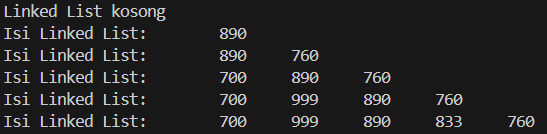
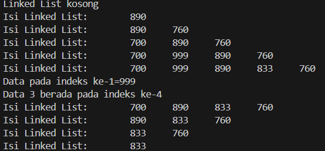

ALGORITMA DAN STRUKTUR DATA </p>

<br><br><br><br>

<p align="center">
    </p>

<br><br><br><br><br>

<p align = "center"> Nama  : Abdillah Noer Said </p>
<p align = "center"> NIM   : 2341720018 </p>
<p align = "center"> Prodi : TEKNIK INFOMATIKA</p>
<p align = "center"> Kelas : 1B </p>
<p align = "center"> Absen : 01 </p>

## Jobsheet 11

### Percobaan 1

Class Node
```java
public class Node01 {
    int data;
    Node01 next;

    Node01(int nilai, Node01 berikutnya){
        data = nilai;
        next = berikutnya;
    }
}
```

Class SingleLinkedList
```java
public class SingleLinkedList01 {
    Node01 head, tail;

    boolean isEmpty() {
        return head == null;
    }

    void print() {
        if (isEmpty()) {
            System.out.println("Linked List kosong");
        } else {
            Node01 tmp = head;
            System.out.print("Isi Linked List:\t");
            while (tmp != null) {
                System.out.print(tmp.data + "\t");
                tmp = tmp.next;
            }
            System.out.println("");
        }
    }
    
    void addFirst(int input) {
        Node01 ndInput = new Node01(input, null);
        if(isEmpty()) {
            head = ndInput;
            tail = ndInput;
        } else {
            ndInput.next = head;
            head = ndInput;
        }
    }

    void addLast(int input) {
        Node01 ndInput = new Node01(input, null);
        if(isEmpty()) {
            head = ndInput;
            tail = ndInput;
        } else {
            tail.next = ndInput;   
            tail = ndInput;
        }
    }

    void insertAfter(int key, int input) {
        Node01 ndInput = new Node01(input, null);
        Node01 temp = head;
        do{
            if(temp.data == key) {
                ndInput.next = temp.next;
                temp.next = ndInput;
                if(ndInput.next == null) {
                    tail = ndInput;
                }
            }
            temp = temp.next;
        } while (temp != null); 
    }

    void insertAt(int index, int input) {
        if (index < 0) {
            System.out.println("Indeks tidak valid");
            return;
        } else if (index == 0) {
            addFirst(input);
            return;
        } else {
            Node01 ndInput = new Node01(input, null);
            Node01 temp = head;
            for (int i = 0; i < index - 1; i++) {
                temp = temp.next;
            }
            ndInput.next = temp.next;
            temp.next = ndInput;
            if (ndInput.next == null) {
                tail = ndInput;
            }
        }
    }
}
```

Class SLLMain
```java
public class SLLMain01 {
    public static void main(String[] args) {
        SingleLinkedList01 singLL = new SingleLinkedList01();
        singLL.print();
        singLL.addFirst(890);
        singLL.print();
        singLL.addLast(760);
        singLL.print();
        singLL.addFirst(700);
        singLL.print();
        singLL.insertAfter(700, 999);
        singLL.print();
        singLL.insertAt(3, 833);
        singLL.print();
    }
}
```

Output<br>


### Pertanyaan
1. Mengapa hasil compile kode program di baris pertama menghasilkan “Linked List Kosong”?<br>
Jawab : Karena program melakukan print data kosong dahulu dan belum di inputkan linked list nya. dan setelah di print baru di inputkan<br>
2. Jelaskan kegunaan variable temp secara umum pada setiap method!
Jawab : temp digunakan untuk membantu dalam menemukan posisi yang tepat untuk menyisipkan node dalam linked list
3. Perhatikan class SingleLinkedList, pada method insertAt Jelaskan kegunaan kode berikut 
```java
if(temp.next.next==null) tail=temp.next;
```
Jawab : digunakan untuk memeriksa apakah node yang akan ditempati adalah node terakhir. jika benar, node baru yang dimasukkan akan menjadi node terakhir dalam linked list.

### Modifikasi Elemen pada Single Linked List

Class SingleLinkedList
```java
int getData(int index) {
        Node01 tmp = head;
        for (int i = 0; i < index - 1; i++) {
            tmp = tmp.next;
        }
        return tmp.next.data;
    }

    int indexOf(int key) {
        Node01 tmp = head;
        int index = 0;
        while (tmp != null && tmp.data != key) {
            tmp = tmp.next;
            index++;
        }
        if(tmp == null) {
            return -1;
        } else {
            return index;
        }
    }

    void removeFirst() {
        if (isEmpty()) {
            System.out.println("Linked List masih kosong," 
                        + " tidak bisa di hapus");
        } else if (head == tail) {
            head = tail = null;
        } else {
            head = head.next;
        }
    }

    void removeLast() {
        if (isEmpty()) {
            System.out.println("Linked List masih kosong," 
                        + " tidak bisa di hapus");
        } else if (head == tail) {
            head = tail = null;
        } else {
            Node01 temp = head;
            while (temp.next == null) {
                temp = temp.next;
            }
            temp.next = null;
            tail = temp.next;
        }
    }

    void remove(int key) {
        if (isEmpty()) {
            System.out.println("Linked List masih kosong," 
                        + " tidak bisa di hapus");
        } else {
            Node01 temp = head;
            while (temp != null) {
                if(head.data == key && temp == head){
                    removeFirst();
                    break;
                } else if (temp.next.data == key){
                    temp.next = temp.next.next;
                    if(temp.next == null){
                        tail = temp;
                    }
                    break;
                }
                temp = temp.next;
            }
        }
    }

    public void removeAt (int index) {
        if (index ==0 ) {
            removeFirst();
        } else {
            Node01 temp = head;
            for (int i = 0; i < index - 1; i++) {
                temp = temp.next;
            }
            temp.next = temp.next.next;
            if (temp.next == null) {
                tail = temp;
            }
        }
    }
```

Class SLLMain
```java
public class SLLMain01 {
    public static void main(String[] args) {
        SingleLinkedList01 singLL = new SingleLinkedList01();
        singLL.print();
        singLL.addFirst(890);
        singLL.print();
        singLL.addLast(760);
        singLL.print();
        singLL.addFirst(700);
        singLL.print();
        singLL.insertAfter(700, 999);
        singLL.print();
        singLL.insertAt(3, 833);
        singLL.print();

        System.out.println("Data pada indeks ke-1=" + singLL.getData(1));
        System.out.println("Data 3 berada pada indeks ke-" + singLL.indexOf(760));

        singLL.remove(999);
        singLL.print();
        singLL.removeAt(0);
        singLL.print();
        singLL.removeFirst();
        singLL.print();
        singLL.removeLast();
        singLL.print();
    }
}
```

Output<br>


### Pertanyaan
1. Mengapa digunakan keyword break pada fungsi remove? Jelaskan!<br>
Jawab : Untuk menghentikan loop setelah elemen yang cocok dengan key ditemukan lalu dihapus
2. Jelaskan kegunaan kode dibawah pada method remove
```java
else if (temp.next.data == key) {
    temp.next = temp.next.next;
```
Jawab : kode tersebut digunakan untuk mencarin nilai node yang memiliki nilai yang sama dengan key. kemudian melakukan operasi penghapusan dari linked list dengan mengubah referensi 'next' dari node saat temp ke node setelah node yang akan dihapus.

### TUGAS

1. Implementasikan ilustrasi Linked List Berikut. Gunakan 4 macam penambahan data yang telah dipelajari sebelumnya untuk menginputkan data.<br>


Jawab:<br> 
Class Mahasiswa01
```java
package Tugas;
public class Mahasiswa01 {
    String nim, nama;
    Mahasiswa01 next;

    Mahasiswa01(String nim, String nama, Mahasiswa01 next) {
        this.nim = nim;
        this.nama = nama;
        this.next = next;
    }
}
```

Class SingleLinkedList01
```java
package Tugas;

public class SingleLinkedList01 {
    Mahasiswa01 head, tail;

    boolean isEmpty() {
        return head == null;
    }

    void print() {
        if (isEmpty()) {
            System.out.println("Linked List kosong");
        } else {
            Mahasiswa01 tmp = head;
            System.out.println("Linked list:");
            while (tmp != null) {
                System.out.println("NIM: " + tmp.nim + ", Nama: " + tmp.nama);
                tmp = tmp.next;
            }
        }
    }
    
    void addFirst(String nim, String nama) {
        Mahasiswa01 ndInput = new Mahasiswa01(nim, nama, null);
        if (isEmpty()) {
            head = ndInput;
            tail = ndInput;
        } else {
            ndInput.next = head;
            head = ndInput;
        }
    }

    void addLast(String nim, String nama) {
        Mahasiswa01 ndInput = new Mahasiswa01(nim, nama, null);
        if (isEmpty()) {
            head = ndInput;
            tail = ndInput;
        } else {
            tail.next = ndInput;   
            tail = ndInput;
        }
    }

    void insertAfter(String key, String nim, String nama) {
        Mahasiswa01 ndInput = new Mahasiswa01(nim, nama, null);
        Mahasiswa01 temp = head;
        while (temp != null) {
            if (temp.nim.equals(key)) {
                ndInput.next = temp.next;
                temp.next = ndInput;
                if (ndInput.next == null) {
                    tail = ndInput;
                }
                break;
            }
            temp = temp.next;
        }
    }

    void insertAt(int index, String nim, String nama) {
        if (index < 0) {
            System.out.println("Indeks tidak valid");
            return;
        } else if (index == 0) {
            addFirst(nim, nama);
            return;
        } else {
            Mahasiswa01 ndInput = new Mahasiswa01(nim, nama, null);
            Mahasiswa01 temp = head;
            for (int i = 0; i < index - 1; i++) {
                if (temp.next == null) {
                    System.out.println("Indeks tidak valid");
                    return;
                }
                temp = temp.next;
            }
            ndInput.next = temp.next;
            temp.next = ndInput;
            if (ndInput.next == null) {
                tail = ndInput;
            }
        }
    }
}
```

Class SLLMain01
```java
package Tugas;

public class SLLMain01 {
    public static void main(String[] args) {
        SingleLinkedList01 singLL = new SingleLinkedList01();

        singLL.addFirst("111", "Anton");
        singLL.addLast("115", "Sari");
        singLL.insertAfter("111", "112", "Prita");
        singLL.insertAfter("112", "113", "Yusuf");
        singLL.insertAt(3, "114", "Doni");

        singLL.print();
    }
}
```

Output<br>
<br>
2. Buatlah implementasi program antrian layanan unit kemahasiswaan sesuai dengan kondisi yang ditunjukkan pada soal nomor 1! Ketentuan<br>
a. Implementasi antrian menggunakan Queue berbasis Linked List!<br>
b. Program merupakan proyek baru, bukan modifikasi dari soal nomor 1!<br>
Jawab : <br>
Class Mahasiswa201
```java
package Tugas.Nomor2;
    public class Mahasiswa201 {
        String nim, nama;
        Mahasiswa201 next;
    
        Mahasiswa201(String nim, String nama, Mahasiswa201 next) {
            this.nim = nim;
            this.nama = nama;
            this.next = next;
    }
}
```

Class Queue01
```java
package Tugas.Nomor2;

public class Queue01 {
    Mahasiswa201 front, rear;

    boolean isEmpty() {
        return front == null;
    }

    void enqueue(String nim, String nama) {
        Mahasiswa201 newMhs = new Mahasiswa201(nim, nama, null);
        if (isEmpty()) {
            front = rear = newMhs;
        } else {
            rear.next = newMhs;
            rear = newMhs;
        }
    }

    void dequeue() {
        if (isEmpty()) {
            System.out.println("Antrian kosong");
        } else {
            front = front.next;
            if (front == null) {
                rear = null;
            }
        }
    }

    void print() {
        if (isEmpty()) {
            System.out.println("Antrian kosong");
        } else {
            Mahasiswa201 tmp = front;
            System.out.println("Antrian: ");
            while (tmp != null) {
                System.out.println("NIM: " + tmp.nim + ", Nama: " + tmp.nama);
                tmp = tmp.next;
            }
        }
    }
}
```

Class QueueMain01
```java
package Tugas.Nomor2;

public class QueueMain01 {
    public static void main(String[] args) {
        Queue01 queue = new Queue01();

        queue.enqueue("111", "Anton");
        queue.enqueue("112", "Prita");
        queue.enqueue("113", "Yusuf");
        queue.enqueue("114", "Doni");
        queue.enqueue("115", "Sari");
        queue.print();

        System.out.println("Mengeluarkan Mahasiswa di antrian pertama");
        queue.dequeue();
        queue.print();
    }
}
```

Output<br>
