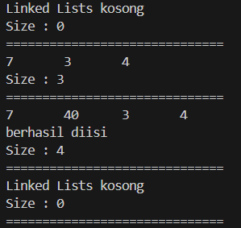
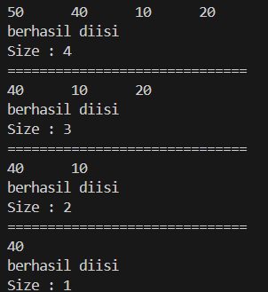
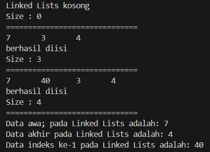

ALGORITMA DAN STRUKTUR DATA </p>

<br><br><br><br>

<p align="center">
    </p>

<br><br><br><br><br>

<p align = "center"> Nama  : Abdillah Noer Said </p>
<p align = "center"> NIM   : 2341720018 </p>
<p align = "center"> Prodi : TEKNIK INFOMATIKA</p>
<p align = "center"> Kelas : 1B </p>
<p align = "center"> Absen : 01 </p>

## Jobsheet 13

### Percobaan 1

Class Node
```java
public class Node {
    int data;
    Node prev, next;

    Node(Node prev, int data, Node next) {
        this.prev = prev;
        this.data = data;
        this.next = next;
    }
}
```

Class DoubleLinkedLists
```java
public class DoubleLinkedLists {
    Node head;
    int size;

    public DoubleLinkedLists() {
        head = null;
        size = 0;
    }

    public boolean isEmpty() {
        return head == null;
    }

    public void addFirst(int item) {
        if (isEmpty()) {
            head = new Node(null, item, null);
        } else {
            Node newNode = new Node(null, item, head);
            head.prev = newNode;
            head = newNode;
        }
        size++;
    }

    public void addLast(int item) {
        if (isEmpty()) {
            addFirst(item);
        } else {
            Node current = head;
            while (current.next != null) {
                current = current.next;     
            }
            Node newNode = new Node(current, item, null);
            current.next = newNode;
            size++;
        }
    }

    public void add(int item, int index) throws Exception {
        if (isEmpty()) {
            addFirst(item);     
        } else if (index < 0 || index > size) {
            throw new Exception("Nilai indeks di luar batas");
        } else {
            Node current = head;
            int i = 0;
            while (i < index) {
                current = current.next;
                i++;
            }
            if (current.prev == null) {
                Node newNode = new Node(null, item, current);
                current.prev = newNode;
                head = newNode;
            } else {
                Node newNode = new Node(current.prev, item, current);
                newNode.prev = current.prev;
                newNode.next = current;
                current.prev.next = newNode;
                current.prev = newNode;
            }
        }
        size++;
    }

    public int size() {
        return size;    
    }

    public void clear() {
        head = null;
        size = 0;
    }

    public void print() {
        if (!isEmpty()) {
            Node tmp = head;
            while (tmp != null) {
                System.out.print(tmp.data + "\t");
                tmp = tmp.next;
            }
            System.out.println("\nberhasil diisi");
        } else {
            System.out.println("Linked Lists kosong");
        }
    }
}
```

Class DoubleLinkedListsMain
```java
public class DoubleLinkedListsMain {
    public static void main(String[] args) throws Exception {
        DoubleLinkedLists dll = new DoubleLinkedLists();
        dll.print();
        System.out.println("Size : "+dll.size);
        System.out.println("==============================");
        dll.addFirst(3);
        dll.addLast(4);
        dll.addFirst(7);
        dll.print();
        System.out.println("Size : "+dll.size);
        System.out.println("==============================");
        dll.add(40, 1);
        dll.print();
        System.out.println("Size : "+dll.size);
        System.out.println("==============================");
        dll.clear();
        dll.print();
        System.out.println("Size : "+dll.size);
        System.out.println("==============================");
    }
}
```

Output<br>


### Pertanyaan

1. Jelaskan perbedaan antara single linked list dengan double linked lists!<br>
Jawab : Single linked list adalah struktur data di mana setiap node memiliki satu pointer ke node berikutnya, memungkinkan traversal searah dari awal ke akhir. Ini lebih hemat memori karena hanya menggunakan satu pointer per node, tetapi operasi penambahan dan penghapusan node bisa memakan waktu lebih lama karena perlu traversal dari awal. Jika, double linked list memiliki dua pointer per node satu ke node berikutnya dan satu ke node sebelumnya, memungkinkan traversal dua arah. Ini membuat operasi penambahan dan penghapusan lebih fleksibel dan efisien, terutama untuk node di tengah atau akhir list, meskipun menggunakan lebih banyak memori.<br>

2. Perhatikan class Node, di dalamnya terdapat atribut next dan prev. Untuk apakah atribut tersebut?<br>
Jawab : Atribut next dan prev memungkinkan traversal dua arah dalam double linked list. Ini memberikan fleksibilitas untuk bergerak maju dan mundur melalui list, yang memudahkan operasi penambahan, penghapusan, dan pencarian node di berbagai posisi dalam list.<br>

3. Perhatikan konstruktor pada class DoubleLinkedLists. Apa kegunaan inisialisasi atribut head dan size seperti pada gambar berikut ini?
```java
public DoubleLinkedLists() {
        head = null;
        size = 0;
    }
```
Jawab : Inisialisasi ini memastikan bahwa double linked list dimulai dalam keadaan kosong dan siap untuk menerima operasi penambahan node secara dinamis.<br>

4. Pada method addFirst(), kenapa dalam pembuatan object dari konstruktor class Node prev dianggap sama dengan null?
Node newNode = new Node(null, item, head);<br>
Jawab : karena node baru tersebut akan menjadi node pertama dalam list. Sebagai node pertama, tidak ada node sebelum itu, sehingga prev harus 'null'.<br>

5. Perhatikan pada method addFirst(). Apakah arti statement head.prev = newNode ?<br>
Jawab : menghubungkan node yang sebelumnya menjadi head dengan node baru yang ditambahkan di depan list, memastikan bahwa double linked list tetap terhubung dengan benar dari kedua arah.<br>

6. Perhatikan isi method addLast(), apa arti dari pembuatan object Node dengan mengisikan parameter prev dengan current, dan next dengan null?<br>
Node newNode = new Node(current, item, null);<br>
Jawab : Menyambungkan node baru ke node terakhir yang ada (current) sebagai node berikutnya dan Menunjukkan bahwa node baru ini adalah node terakhir dalam list, sehingga next diatur null.<br>

7. Pada method add(), terdapat potongan kode program sebagai berikut:
```java
if (current.prev == null) {
                Node newNode = new Node(null, item, current);
                current.prev = newNode;
                head = newNode;
```
jelaskan maksud dari bagian yang ditandai dengan kotak kuning.<br>
Jawab : Untuk memastikan bahwa jika node baru ditambahkan pada posisi paling awal dalam double linked list, node baru tersebut akan diatur dengan benar sebagai node pertama, dan node yang sebelumnya menjadi head akan dihubungkan sebagai node berikutnya dalam list.<br>

### Percobaan 2

Modifikasi Class DoubelLinkedLists
```java
public void removeFirst() throws Exception {
        if (isEmpty()) {
            throw new Exception("Linked List masih kosong, tidak dapat dihapus");
        } else if (size == 1) {
            removeLast();
        } else {
            head = head.next;
            head.prev = null;
            size--;
        }
    }

    public void removeLast() throws Exception {
        if (isEmpty()) {
            throw new Exception("Linked List masih kosong, tidak dapat dihapus");
        } else if (head.next == null) {
            head = null;
            size--;
            return;
        }
        Node current = head;
        while (current.next.next != null) {
            current = current.next;
        }
        current.next = null;
        size--;
    }

    public void remove(int index) throws Exception {
        if (isEmpty()) {
            throw new Exception("Nilai indeks di luar batas");
        } else if (index == 0) {
            removeFirst();
        } else {
            Node current = head;
            int i = 0;
            while (i < index) {
                current = current.next;
                i++;
            }
            if (current.next == null) {
                current.prev.next = null;
            } else if (current.prev == null) {
                current = current.next;
                current.prev = null;
                head = current;
            } else {
                current.prev.next = current.next;
                current.next.prev = current.prev;
            }
            size--;
        }
    }
```
Modifikasi Class DoubleLinkedListsMain
```java
        dll.addLast(50);
        dll.addLast(40);
        dll.addLast(10);
        dll.addLast(20);
        dll.print();
        System.out.println("Size : "+dll.size);
        System.out.println("==============================");
        dll.removeFirst();
        dll.print();
        System.out.println("Size : "+dll.size);
        System.out.println("==============================");
        dll.removeLast();
        dll.print();
        System.out.println("Size : "+dll.size);
        System.out.println("==============================");
        dll.remove(1);
        dll.print();
        System.out.println("Size : "+dll.size);
```

Output<br>


### Pertanyaan

1. Apakah maksud statement berikut pada method removeFirst()?<br>
head = head.next;
head.prev = null;<br>
Jawab : Untuk menggeser head ke node berikutnya dalam list, karena node pertama akan dihapus, sehingga node yang berada di urutan kedua akan menjadi node pertama baru dan untuk memutuskan hubungan antara node pertama yang baru dengan node sebelumnya.<br>

2. Bagaimana cara mendeteksi posisi data ada pada bagian akhir pada method removeLast()?<br>
Jawab : Untuk menemukan node terakhir dan kemudian memeriksa apakah current.next adalah null. Jika iya, maka kita dapat menghapus current.next, menjadikan current sebagai node terakhir dalam list.<br>

3. Jelaskan alasan potongan kode program di bawah ini tidak cocok untuk perintah remove!
```java
Node tmp = head.next;

head.next=tmp.next;
tmp.next.prev=head;
```
Jawab : Karena tidak memperhatikan node yang akan dihapus bisa jadi node terakhir atau bukan. Ini dapat menyebabkan kehilangan referensi ke node-node lain dalam list.<br>

4. Jelaskan fungsi kode program berikut ini pada fungsi remove!
```java
    current.prev.next = current.next;
    current.next.prev = current.prev;
```
Jawab : Untuk memutuskan hubungan antara node yang akan dihapus dengan node sebelumnya dan node setelahnya dalam list, sehingga node yang dihapus tidak lagi terhubung dengan list.<br>

### Pecobaan 3

Modifikasi Class DoubleLinkedLists
```java
public int getFirst() throws Exception {
        if (isEmpty()) {
            throw new Exception("Linked List kosong");
        }
        return head.data;
    }

    public int getLast() throws Exception {
        if (isEmpty()) {
            throw new Exception("Linked List kosong");
        } 
        Node tmp = head;
        while (tmp.next != null) {
            tmp = tmp.next;
        }
        return tmp.data;
    }

    public int get(int index) throws Exception {
        if (isEmpty() || index >=size) {
            throw new Exception("Nilai indeks di luar batas");
        }
        Node tmp = head;
        for (int i = 0; i < index; i++) {
            tmp = tmp.next;
        }
        return tmp.data;
    }
```

Modifikasi Class DoubleLinkedListsMain
```java
dll.print();
        System.out.println("Size : "+dll.size);
        System.out.println("==============================");
        dll.addFirst(3);
        dll.addLast(4);
        dll.addFirst(7);
        dll.print();
        System.out.println("Size : "+dll.size);
        System.out.println("==============================");
        dll.add(40, 1);
        dll.print();
        System.out.println("Size : "+dll.size);
        System.out.println("==============================");
        System.out.println("Data awa; pada Linked Lists adalah: " + dll.getFirst());
        System.out.println("Data akhir pada Linked Lists adalah: " + dll.getLast());
        System.out.println("Data indeks ke-1 pada Linked Lists adalah: " + dll.get(1));
```

Output<br>


### Pertanyaan

1. Jelaskan method size() pada class DoubleLinkedLists!<br>
Jawab : Untuk mengembalikan jumlah node yang ada dalam double linked list. Ini memberikan informasi tentang berapa banyak elemen yang ada dalam list pada saat itu.<br>

2. Jelaskan cara mengatur indeks pada double linked lists supaya dapat dimulai dari indeks ke1!<br>
Jawab : Cara mengatur indeks pada double linked lists supaya dapat dimulai dari indeks ke-1 adalah dengan mengisi nilai awal variabel counter index (biasanya i) dengan 1 bukan nol. Berikut contohnya:
```java
Node current = head;
int i = 1; // sebelumnya int i = 0;
while (i < index) {
        current = current.next;
        i++;
```

3. Jelaskan perbedaan karakteristik fungsi Add pada Double Linked Lists dan Single Linked Lists!<br>
Jawab : Perbedaan antara fungsi add pada DLL dan SLL terletak pada kompleksitas waktu operasi penambahan di berbagai posisi dalam list. DLL memiliki fleksibilitas lebih besar untuk menambahkan elemen di tengah list dengan kompleksitas waktu yang tetap efisien, sementara SLL memiliki kompleksitas waktu yang lebih rendah untuk penambahan di depan list.<br>

4. Jelaskan perbedaan logika dari kedua kode program di bawah ini!<br>
A
```java
public boolean isEmpty(){
    if(size==o){
        return true;
    } else {
        return false;
    }
}
```
B
```java
public boolean isEmpty() {
        return head == null;
    }
```
Jawab : <br>
- Kode program A menggunakan variabel size untuk menentukan apakah linked list kosong atau tidak, sedangkan kode program B menggunakan variabel head.
- Kode program A bergantung pada jumlah elemen (size) dalam linked list, sementara kode program B bergantung pada keberadaan node pertama (head).
- Kode program B memiliki logika yang lebih langsung dan efisien, karena langsung memeriksa keberadaan node pertama, sementara kode program A memerlukan variabel tambahan (size) dan operasi perbandingan.