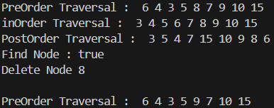
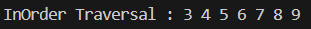
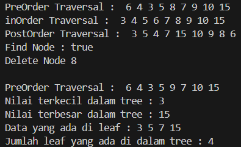
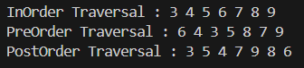

# <p align ="center"> LAPORAN PRAKTIKUM ALGORITMA DAN STRUKTUR DATA </p>

<br><br><br><br>

<p align="center">
    </p>

<br><br><br><br><br>

<p align = "center"> Nama  : Abdillah Noer Said </p>
<p align = "center"> NIM   : 2341720018 </p>
<p align = "center"> Prodi : TEKNIK INFOMATIKA</p>
<p align = "center"> Kelas : 1B </p>

## Jobsheet 14

### Percobaan 1

Class Node01
```java
public class Node01 {
    int data;
    Node01 left, right;

    public Node01(int data) {
        this.left = null;
        this.data = data;
        this.right = null;
    }

    public Node01() {

    }
}
```
Class BinaryTree01
```java
public class BinaryTree01 {
    Node01 root;
    int size;

    public BinaryTree01() {
        root = null;
    }

    boolean isEmpty() {
        return root == null;
    }

    void add(int data) {
        if (isEmpty()) {
            root = new Node01(data);
        } else {
            Node01 current = root;
            while (true) {
                if (data > current.data) {
                    if (current.right != null) {
                        current = current.right;
                    } else {
                        current.right = new Node01(data);
                        break;
                    }
                } else if (data < current.data) {
                    if (current.left != null) {
                        current = current.left;
                    } else {
                        current.left = new Node01(data);
                        break;
                    }
                } else {
                    break;
                }
            }
        }
    }

    boolean find(int data) {
        boolean result = false;
        Node01 current = root;
        while (current != null) {
            if (current.data == data) {
                result = true;
                break;  
            } else if (data > current.data) {
                current = current.right;
            } else {
                current = current.left;
            }
        }
        return result;
    }

    void traversePreOrder(Node01 node) {
        if (node != null) {
            System.out.print(" " + node.data);
            traversePreOrder(node.left);
            traversePreOrder(node.right);
        }
    }

    void traversePostOrder(Node01 node) {
        if (node != null) {
            traversePostOrder(node.left);
            traversePostOrder(node.right);
            System.out.print(" " + node.data);
        }
    }

    void traverseInOrder(Node01 node) {
        if (node != null) {
            traverseInOrder(node.left);
            System.out.print(" " + node.data);
            traverseInOrder(node.right);
        }
    }
    
    Node01 getSuccessor(Node01 del) {
        Node01 successor = del.right;
        Node01 successorParent = del;
        while (successor.left != null) {
            successorParent = successor;
            successor = successor.left; 
        }
        if (successor != del.right) {
            successorParent.left = successor.right;
            successor.right = del.right;
        }
        return successor;
    }

    void delete(int data) {
        if (isEmpty()) {
            System.out.println("Tree is empty!");
            return;
        }
        Node01 parent = root;
        Node01 current = root;
        boolean isLeftChild = false;
        while (current != null) {
            if (current.data == data) {
                break;  
            } else if (data < current.data) {
                parent = current;
                current = current.left;
                isLeftChild = true;
            } else if (data > current.data) {
                parent = current;
                current = current.right;
                isLeftChild = false;
            }
        }

        if (current == null) {
            System.out.println("Couldn't find data!");
            return;
        } else {
            if (current.left == null && current.right == null) {
                if (current == root) {
                    root = null;
                } else {
                    if (isLeftChild) {
                        parent.left = null;
                    } else {
                        parent.right = null;
                    }
                }
            } else if (current.left == null) {
                if (current == root) {
                    root = current.right;
                } else {
                    if (isLeftChild) {
                        parent.left = current.right;
                    } else {
                        parent.right = current.right;
                    }
                }
            } else if (current.right == null) {
                if (current == root) {
                    root = current.left;
                } else {
                    if (isLeftChild) {
                        parent.left = current.left;
                    } else {
                        parent.right = current.left;
                    }
                }
            } else {
                Node01 successor = getSuccessor(current);
                if (current == root) {
                    root = successor;
                } else {
                    if (isLeftChild) {
                        parent.left = successor;
                    } else {
                        parent.right = successor;
                    }
                    successor.left = current.left;
                }
            }
        }
    }
}
```

Class BinaryTreeMain01
```java
public class BinaryTreeMain01 {
    public static void main(String[] args) {
        BinaryTree01 bt = new BinaryTree01();
        bt.add(6);
        bt.add(4);
        bt.add(8);
        bt.add(3);
        bt.add(5);
        bt.add(7);
        bt.add(9);
        bt.add(10);
        bt.add(15);
        System.out.print("PreOrder Traversal : ");
        bt.traversePreOrder(bt.root);
        System.out.println("");
        System.out.print("inOrder Traversal : ");
        bt.traverseInOrder(bt.root);
        System.out.println("");
        System.out.print("PostOrder Traversal : ");
        bt.traversePostOrder(bt.root);  
        System.out.println("");
        System.out.println("Find Node : " + bt.find(5));
        System.out.println("Delete Node 8 ");
        bt.delete(8);
        System.out.println("");
        System.out.print("PreOrder Traversal : ");
        bt.traversePreOrder(bt.root);
        System.out.println("");
    }
}
```

Output<br>


### Pertanyaan 

1. Mengapa dalam binary search tree proses pencarian data bisa lebih efektif dilakukan dibanding
binary tree biasa?<br>
Jawab : karena strukturnya yang teratur dan Properti Binary Search Tree yang memastikan nilai di subtree kiri selalu lebih kecil dan di subtree kanan selalu lebih besar memungkinkan proses pencarian lebih cepat dan lebih efisien.<br>

2. Untuk apakah di class Node, kegunaan dari atribut left dan right?<br>
Jawab : untuk menyimpan data dalam struktur hierarkis yang memungkinkan operasi pencarian, penambahan, dan penghapusan dilakukan dengan efisien.<br>

3. a. Untuk apakah kegunaan dari atribut root di dalam class BinaryTree?<br>
Jawab : sebagai titik referensi utama untuk semua operasi yang melibatkan tree. Dengan memiliki root, kita dapat mengelola, mencari, menambah, menghapus, dan melakukan traversal pada tree dengan efisien.<br>
   b. Ketika objek tree pertama kali dibuat, apakah nilai dari root?<br>
Jawab : Ketika objek tree pertama kali dibuat, nilai dari atribut root adalah null. Ini menunjukkan bahwa tree tersebut awalnya kosong dan belum memiliki node apa pun.<br>

4. Ketika tree masih kosong, dan akan ditambahkan sebuah node baru, proses apa yang akan terjadi?<br>
Jawab : Pengecekan Kekosongangan Tree, Penambahan Node baru dan Inisialisasi Node pertama<br>

5. Perhatikan method add(), di dalamnya terdapat baris program seperti di bawah ini. Jelaskan
secara detil untuk apa baris program tersebut?<br>
```java
if(data<current.data){
 if(current.left!=null){
 current = current.left;
 }else{
 current.left = new Node(data);
 break;
 }
}
```
Jawab : untuk menavigasi ke subtree kiri dari node saat ini jika data baru lebih kecil dari data node saat ini, dan menempatkan node baru di posisi yang sesuai dalam subtree kiri jika posisi tersebut kosong.<br>

### Praktikum 2

Class BinaryTreeArray01
```java
public class BinaryTreeArray01 {
    int[] data;
    int idxLast;

    public BinaryTreeArray01() {
        data = new int[10];
    }

    void populateData(int data[], int idxLast) {
        this.data = data;
        this.idxLast = idxLast;
    }

    void traverseInOrder(int idxStart) {
        if (idxStart <= idxLast) {
            traverseInOrder(2 * idxStart + 1);
            System.out.print(data[idxStart] + " ");
            traverseInOrder(2 * idxStart + 2);
        }
    }
}
```

Class BinaryTreeArrayMain01
```java
public class BinaryTreeArrayMain01 {
    public static void main(String[] args) {
        BinaryTreeArray01 bta = new BinaryTreeArray01();
        int[] data = {6,4,8,3,5,7,9,0,0,0};
        int idxLast = 6;
        bta.populateData(data, idxLast);
        System.out.print("\nInOrder Traversal : ");
        bta.traverseInOrder(0);
        System.out.println("\n");
    }
}
```

Output<br>


### Pertanyaan

1. Apakah kegunaan dari atribut data dan idxLast yang ada di class BinaryTreeArray?<br>
Jawab : Atribut data menyimpan struktur pohon biner dalam bentuk array, sedangkan idxLast memastikan hanya elemen valid yang diakses dan diproses selama operasi pada pohon.<br>

2. Apakah kegunaan dari method populateData()?<br>
Jawab : Untuk mengisi dan mengatur data dalam array yang mewakili pohon biner, serta menetapkan indeks terakhir yang valid. Ini memungkinkan inisialisasi dan pembaruan cepat dari struktur data pohon biner tanpa harus menambahkan elemen satu per satu, sehingga lebih efisien dan mudah dikelola.<br>

3. Apakah kegunaan dari method traverseInOrder()?<br>
Jawab : Untuk melakukan traversal in-order pada pohon biner yang diwakili oleh array. Dengan menggunakan rekursi, metode ini mengunjungi anak kiri, node saat ini, dan kemudian anak kanan, sehingga mencetak elemen-elemen dalam urutan in-order. Traversal in-order sering digunakan untuk mendapatkan elemen-elemen dari pohon biner dalam urutan yang terurut.<br>

4. Jika suatu node binary tree disimpan dalam array indeks 2, maka di indeks berapakah posisi left child dan rigth child masin-masing?<br>
Jawab : jika suatu node disimpan di indeks 2, maka left child-nya akan berada di indeks 2 * 2 + 1 = 5, dan right child-nya akan berada di indeks 2 * 2 + 2 = 6.<br>

5. Apa kegunaan statement int idxLast = 6 pada praktikum 2 percobaan nomor 4?<br>
Jawab : Untuk menunjukkan indeks terakhir dari array yang berisi data untuk pohon biner. Dalam konteks ini, nilai 6 menunjukkan bahwa array tersebut memiliki 7 elemen valid.<br>

### Tugas
1. Buat method di dalam class BinaryTree yang akan menambahkan node dengan cara rekursif.<br>
Jawab : 
```java
Node01 addRekursif(Node01 current, int data) {
        if (current == null) {
            return new Node01(data);
        }

        if (data < current.data) {
            current.left = addRekursif(current.left, data);
        } else if (data > current.data) {
            current.right = addRekursif(current.right, data);
        }
        return current;
    }
```
2. Buat method di dalam class BinaryTree untuk menampilkan nilai paling kecil dan yang paling besar yang ada di dalam tree.<br>
Jawab :
```java
int findMinValue() {
        Node01 current = root;
        while (current.left != null) {
            current = current.left;
        }
        return current.data;
    }

    int findMaxValue() {
        Node01 current = root;
        while (current.right != null) {
            current = current.right;
        }
        return current.data;
    }
```
3. Buat method di dalam class BinaryTree untuk menampilkan data yang ada di leaf.<br>
Jawab : 
```java
void printLeaf(Node01 node) {
        if (node == null) {
            return;
        }
        if (node.left == null && node.right == null) {
            System.out.print(node.data + " ");
        }
        printLeaf(node.left);
        printLeaf(node.right);
    }
```
4. Buat method di dalam class BinaryTree untuk menampilkan berapa jumlah leaf yang ada di dalam tree.<br>
Jawab : 
```java
int printJumlahLeaf(Node01 node) {
        if (node == null) {
            return 0;
        }
        if (node.left == null && node.right == null) {
            return 1; 
        }
        int leafKiri = printJumlahLeaf(node.left);
        int leafKanan = printJumlahLeaf(node.right);
        return leafKiri + leafKanan;
    }
```

Penambahan pada Class BinaryTreeMain01 setelah penambahan method:
```java
public class BinaryTreeMain01 {
    public static void main(String[] args) {
        BinaryTree01 bt = new BinaryTree01();
        bt.add(6);
        bt.add(4);
        bt.add(8);
        bt.add(3);
        bt.add(5);
        bt.add(7);
        bt.add(9);
        bt.add(10);
        bt.add(15);
        System.out.print("PreOrder Traversal : ");
        bt.traversePreOrder(bt.root);
        System.out.println("");
        System.out.print("inOrder Traversal : ");
        bt.traverseInOrder(bt.root);
        System.out.println("");
        System.out.print("PostOrder Traversal : ");
        bt.traversePostOrder(bt.root);  
        System.out.println("");
        System.out.println("Find Node : " + bt.find(5));
        System.out.println("Delete Node 8 ");
        bt.delete(8);
        System.out.println("");
        System.out.print("PreOrder Traversal : ");
        bt.traversePreOrder(bt.root);
        System.out.println("");
        System.out.println("Nilai terkecil dalam tree : " + bt.findMinValue());
        System.out.println("Nilai terbesar dalam tree : " + bt.findMaxValue());
        System.out.print("Data yang ada di leaf : ");
        bt.printLeaf(bt.root);
        System.out.println("");
        System.out.println("Jumlah leaf yang ada di dalam tree : " + bt.printJumlahLeaf(bt.root));
    }
}
```

Output<br>


5. Modifikasi class BinaryTreeArray, dan tambahkan :<br>
• method add(int data) untuk memasukan data ke dalam tree
```java
void add(int data) {
        if (idxLast < this.data.length - 1) {
            idxLast++;
            this.data[idxLast] = data;
        } else {
            System.out.println("Tree sudah penuh, tidak bisa menambahkan elemen!");
        }
    }
```
• method traversePreOrder() dan traversePostOrder()
```java
void traversePreOrder(int idxStart) {
        if (idxStart <= idxLast) {
            System.out.print(data[idxStart] + " ");
            traversePreOrder(2 * idxStart + 1);
            traversePreOrder(2 * idxStart + 2); 
        }
    }
    
    void traversePostOrder(int idxStart) {
        if (idxStart <= idxLast) {
            traversePostOrder(2 * idxStart + 1);
            traversePostOrder(2 * idxStart + 2); 
            System.out.print(data[idxStart] + " ");
        }
    }
```
Penambahan pada Class BinaryTreeArrayMain01 setelah penambahan method:
```java
public class BinaryTreeArrayMain01 {
    public static void main(String[] args) {
        BinaryTreeArray01 bta = new BinaryTreeArray01();
        int[] data = {6,4,8,3,5,7,9,0,0,0};
        int idxLast = 6;
        bta.populateData(data, idxLast);
        System.out.print("\nInOrder Traversal : ");
        bta.traverseInOrder(0);
        System.out.print("\nPreOrder Traversal : ");
        bta.traversePreOrder(0);
        System.out.print("\nPostOrder Traversal : ");
        bta.traversePostOrder(0);
        System.out.println("\n");
    }
}
```
Output<br>
