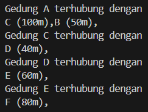
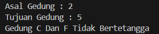
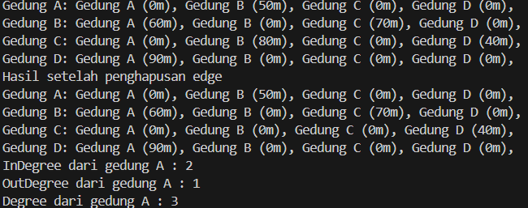

# <p align ="center"> LAPORAN PRAKTIKUM ALGORITMA DAN STRUKTUR DATA </p>

<br><br><br><br>

<p align="center">
    </p>

<br><br><br><br><br>

<p align = "center"> Nama  : Abdillah Noer Said </p>
<p align = "center"> NIM   : 2341720018 </p>
<p align = "center"> Prodi : TEKNIK INFOMATIKA</p>
<p align = "center"> Kelas : 1B </p>

## Jobsheet 15

### Percobaan 1

Class Node01
```java
public class Node01 {
    int data;
    Node01 prev, next;
    int jarak;

    Node01(Node01 prev, int data, int jarak, Node01 next) {
        this.prev = prev;
        this.data = data;
        this.next = next;
        this.jarak = jarak;
    }
}
```

Class DoubleLinkedList01
```java
public class DoubleLinkedList01 {
    Node01 head;
    int size;

    public DoubleLinkedList01() {
        head = null;
        size = 0;
    }

    public boolean isEmpty() {
        return head == null;
    }

    public void addFirst(int item, int jarak) {
        if (isEmpty()) {
            head = new Node01(null, item, jarak, null);
        } else {
            Node01 newNode01 = new Node01(null, item, jarak, head);
            head.prev = newNode01;
            head = newNode01;
        }
        size++;
    }

    public int getJarak(int index) throws Exception {
        if (isEmpty() || index >= size) {
            throw new Exception("Nilai indeks di luar batas");
        }
        Node01 tmp = head;
        for (int i = 0; i < index; i++) {
            tmp = tmp.next;
        }
        return tmp.jarak;
    }

    public void remove(int indeks) {
        Node01 current = head;
            while (current != null) {
                if (current.data == indeks) {
                    if (current.prev != null) {
                        current.prev.next = current.next;
                    } else {
                        head = current.next;
                    }
                    if (current.next != null) {
                        current.next.prev = current.prev;
                    }
                    size--;
                    break;
                }
                current = current.next;
            }
    }

    public int size() {
        return size;    
    }

    public void clear() {
        head = null;
        size = 0;
    }

    public int get(int index) throws Exception {
        if (isEmpty() || index >=size) {
            throw new Exception("Nilai indeks di luar batas");
        }
        Node01 tmp = head;
        for (int i = 0; i < index; i++) {
            tmp = tmp.next;
        }
        return tmp.data;
    }
}
```

Class Graph01
```java
public class Graph01 {
    int vertex;
    DoubleLinkedList01 list[];

    public Graph01(int v) {
        vertex = v;
        list = new DoubleLinkedList01[v];
        for (int i = 0; i < v; i++) {
            list[i] = new DoubleLinkedList01();
        }
    }

    public void addEdge(int asal, int tujuan, int jarak) {
        list[asal].addFirst(tujuan, jarak); //directed
    }

    public void degree(int asal) throws Exception {
        int totalIn = 0, totalOut = list[asal].size();
        // InDegree
        for (int i = 0; i < vertex ; i++) {
            for (int j = 0; j < list[i].size(); j++) {
                if (list[i].get(j) == asal) {
                    totalIn++;
                }
            }
        }
        System.out.println("InDegree dari Gedung " +(char) ('A' + asal) + ": " + totalIn);
        System.out.println("OutDegree dari Gedung " +(char) ('A' + asal) + ": " + totalOut);
        System.err.println("Degree dari Gedung " +(char) ('A' + asal) + ": " + (totalIn + totalOut)); // Directed
    }

    public void removeEdge(int asal, int tujuan) throws Exception {
        for (int i = 0; i < vertex; i++) {
            if (i == tujuan) {
                list[asal].remove(tujuan);
            }
        }
    }

    public void removeAllEdges() {
        for (int i = 0; i < vertex; i++) {
            list[i].clear();
        }
        System.out.println("Graf berhasil dikosongkan");
    }

    public void printGraph() throws Exception {
        for (int i = 0; i < vertex; i++) {
            if (list[i].size() > 0) {
                System.out.println("Gedung " + (char) ('A' + i) + " terhubung dengan ");
                for (int j = 0; j < list[i].size(); j++) {
                    System.out.print((char) ('A' + list[i].get(j)) + " (" + list[i].getJarak(j) + "m),");
                }
                System.out.println("");
            }
        }
        System.out.println("");
    }
}
```

Class GraphMain01
```java
public class GraphMain01 {
    public static void main(String[] args) throws Exception {
        Graph01 gedung = new Graph01(6);
        gedung.addEdge(0, 1, 50);
        gedung.addEdge(0, 2, 100);
        gedung.addEdge(1, 3, 70);
        gedung.addEdge(2, 3, 40);
        gedung.addEdge(3, 4, 60);
        gedung.addEdge(4, 5, 80);
        gedung.degree(0);
        gedung.printGraph();
        gedung.removeEdge(1, 3);
        gedung.printGraph();
    }
}
```

Output<br>
Hasil running pada langkah 14<br>


Hasil running pada langkah 17<br>


### Pertanyaan

1. Perbaiki kode program Anda apabila terdapat error atau hasil kompilasi kode tidak sesuai!<br>
Jawab : Done<br>

2. Pada class Graph, terdapat atribut list[] bertipe DoubleLinkedList. Sebutkan tujuan pembuatan variabel tersebut!<br>
Jawab : Atribut tersebut digunakan untuk memodelkan dan memanipulasi graf dengan cara yang terstruktur, efisien dan efektif<br>

3. Jelaskan alur kerja dari method removeEdge!<br>
Jawab : Alurkerjanya menghapus sebuah edge dari graf yang diwakili dua simpul asal dan tujuan<br>

4. Apakah alasan pemanggilan method addFirst() untuk menambahkan data, bukan method add jenis lain saat digunakan pada method addEdge pada class Graph?<br>
Jawab : untuk menambahkan edge baru, dengan mempertahankan representasi yang efisien dan mudah diakses dalam implementasi graf menggunakan linked list.<br>

5. Modifikasi kode program sehingga dapat dilakukan pengecekan apakah terdapat jalur antara suatu node dengan node lainnya, seperti contoh berikut (Anda dapat memanfaatkan Scanner).<br>
```
Masukkan gedung asal: 2
Masukkan gedung tujuan: 3
Gedung C dan D bertetangga

Masukkan gedung asal: 2
Masukkan gedung tujuan: 5
Gedung C dan F tidak bertetangga
```
Jawab : <br>
Modifikasi Class Graph01
```java
public void cekEdge(int asal, int tujuan) throws Exception {
        boolean found = false;
        for (int i = 0; i < list[asal].size(); i++) {
            if (list[asal].get(i) == tujuan) {
                found = true;
            break;
            }
        }
        if (found) {
            System.out.println("Gedung " + (char) ('A' + asal) + " Dan " + (char) ('A' + tujuan) + " Bertetangga");
        } else {
            System.out.println("Gedung " + (char) ('A' + asal) + " Dan " + (char) ('A' + tujuan) + " Tidak Bertetangga");
        }
    }
```

Modifikasi Class GraphMain01
```java
import java.util.Scanner;
public class GraphMain01 {
    public static void main(String[] args) throws Exception {
        Graph01 gedung = new Graph01(6);
        Scanner sc = new Scanner(System.in);
        gedung.addEdge(0, 1, 50);
        gedung.addEdge(0, 2, 100);
        gedung.addEdge(1, 3, 70);
        gedung.addEdge(2, 3, 40);
        gedung.addEdge(3, 4, 60);
        gedung.addEdge(4, 5, 80);
        gedung.degree(0);
        gedung.printGraph();
        gedung.removeEdge(1, 3);
        gedung.printGraph();
        System.out.print("Asal Gedung : ");
        int asal = sc.nextInt();
        System.out.print("Tujuan Gedung : ");
        int tujuan = sc.nextInt();
        gedung.cekEdge(asal, tujuan);
```

Output<br>
<br>
<br>

### Percobaan 2

Class GraphMatriks01
```java
public class GraphMatriks01 {
    int vertex;
    int[][] matriks;

    public GraphMatriks01(int v) {
        vertex = v;
        matriks = new int[v][v];
    }

    public void makeEdge(int asal, int tujuan, int jarak) {
        matriks[asal][tujuan] = jarak;
    }

    public void removeEdge(int asal, int tujuan) {
        matriks[asal][tujuan] = 0;
    }

    public void printGraph() {
        for (int i = 0; i < vertex; i++) {
            System.out.print("Gedung " + (char) ('A' + i) + ": ");
            for (int j = 0; j < vertex; j++) {
                if (matriks[i][j] != -1) {
                    System.out.print("Gedung " + (char) ('A' + j) + " (" + matriks[i][j] + "m), ");
                }
            }
            System.out.println();
        }
    }
}
```

Modifikasi Class GraphMain01
```java
        GraphMatriks01 gdg = new GraphMatriks01(4);
        gdg.makeEdge(0, 1, 50);
        gdg.makeEdge(1, 0, 60);
        gdg.makeEdge(1, 2, 70);
        gdg.makeEdge(2, 1, 80);
        gdg.makeEdge(2, 3, 40);
        gdg.makeEdge(3, 0, 90);
        gdg.printGraph();
        System.out.println("Hasil setelah penghapusan edge");
        gdg.removeEdge(2,1);
        gdg.printGraph();
```

Output<br>


### Pertanyaan

1. Perbaiki kode program Anda apabila terdapat error atau hasil kompilasi kode tidak sesuai!<br>
Jawab : Done<br>

2. Apa jenis graph yang digunakan pada Percobaan 2?<br>
Jawab : Representasi Graf Adjacency Matrix<br>

3. Apa maksud dari dua baris kode berikut?
```java
gdg.makeEdge(1,2,70);
gdg.makeEdge(2,1,80);
```
Jawab : Membuat sebuah edge dari simpul ke simpul dengan bobotnya<br>

4. Modifikasi kode program sehingga terdapat method untuk menghitung degree, termasuk inDegree dan outDegree!<br>
Jawab : <br>
Modifikasi Class GraphMatriks01
```
public void degree(int asal) {
        int totalIn = 0, totalOut = 0;
        for(int i = 0; i < vertex; i++){
            if (matriks[i][asal] != 0) {
            totalIn++;
            }
        }
        for (int i = 0; i < vertex; i++) {
            if (matriks[asal][i] != 0) {
            totalOut++;
            }
        }
        System.out.println("InDegree dari gedung " + (char)('A' + asal) + " : " + totalIn);
        System.out.println("OutDegree dari gedung " + (char)('A' + asal) + " : " + totalOut);
        System.out.println("Degree dari gedung " + (char)('A' + asal) + " : " + (totalIn + totalOut)); 
    }
```

Output<br>


### Latihan Praktikum

1. Modifikasi kode program pada class GraphMain sehingga terdapat menu program yang bersifat
dinamis, setidaknya terdiri dari:<br>
a) Add Edge<br>
b) Remove Edge<br>
c) Degree<br>
d) Print Graph<br>
e) Cek Edge<br>
Pengguna dapat memilih menu program melalui input Scanner
2. Tambahkan method updateJarak pada Percobaan 1 yang digunakan untuk mengubah jarak
antara dua node asal dan tujuan!
3. Tambahkan method hitungEdge untuk menghitung banyaknya edge yang terdapat di dalam graf!

### Jawab

Berikut Modifikasi kode program Latihan praktikum

Class Node01
```java
public class Node01 {
    int data;
    Node01 prev, next;
    int jarak;

    Node01(Node01 prev, int data, int jarak, Node01 next) {
        this.prev = prev;
        this.data = data;
        this.next = next;
        this.jarak = jarak;
    }
}
```

Class DoubleLinkedList01
```java
public class DoubleLinkedList01 {
    Node01 head;
    int size;

    public DoubleLinkedList01() {
        head = null;
        size = 0;
    }

    public boolean isEmpty() {
        return head == null;
    }

    public void addFirst(int item, int jarak) {
        if (isEmpty()) {
            head = new Node01(null, item, jarak, null);
        } else {
            Node01 newNode01 = new Node01(null, item, jarak, head);
            head.prev = newNode01;
            head = newNode01;
        }
        size++;
    }

    public int getJarak(int index) throws Exception {
        if (isEmpty() || index >= size) {
            throw new Exception("Nilai indeks di luar batas");
        }
        Node01 tmp = head;
        for (int i = 0; i < index; i++) {
            tmp = tmp.next;
        }
        return tmp.jarak;
    }

    public void remove(int indeks) {
        Node01 current = head;
            while (current != null) {
                if (current.data == indeks) {
                    if (current.prev != null) {
                        current.prev.next = current.next;
                    } else {
                        head = current.next;
                    }
                    if (current.next != null) {
                        current.next.prev = current.prev;
                    }
                    size--;
                    break;
                }
                current = current.next;
            }
    }

    public int size() {
        return size;    
    }

    public void clear() {
        head = null;
        size = 0;
    }

    public int get(int index) throws Exception {
        if (isEmpty() || index >=size) {
            throw new Exception("Nilai indeks di luar batas");
        }
        Node01 tmp = head;
        for (int i = 0; i < index; i++) {
            tmp = tmp.next;
        }
        return tmp.data;
    }

    public void updateJarak(int index, int jarak) throws Exception {
        if (isEmpty() || index >=size) {
            throw new Exception("Nilai indeks di luar batas");
        }
        Node01 tmp = head;
        for (int i = 0; i < index; i++) {
            tmp = tmp.next;
        }
        tmp.jarak = jarak;
    }
}
```

Class Graph01
```java
public class Graph01 {
    int vertex;
    DoubleLinkedList01 list[];

    public Graph01(int v) {
        vertex = v;
        list = new DoubleLinkedList01[v];
        for (int i = 0; i < v; i++) {
            list[i] = new DoubleLinkedList01();
        }
    }

    public void addEdge(int asal, int tujuan, int jarak) {
        list[asal].addFirst(tujuan, jarak); //directed
    }

    public void degree(int asal) throws Exception {
        int k, totalIn = 0, totalOut = 0;
        for(int i = 0; i < vertex; i++){
            for(int j = 0; j < list[i].size(); j++){
                if(list[i].get(j) == asal)
                    ++totalIn;
            }
            for(k = 0; k < list[asal].size(); k++){
                list[asal].get(k);
            }
            totalOut = k;
        }
        System.out.println("InDegree dari Gedung " +(char) ('A' + asal) + ": " + totalIn);
        System.out.println("OutDegree dari Gedung " +(char) ('A' + asal) + ": " + totalOut);
        System.err.println("Degree dari Gedung " +(char) ('A' + asal) + ": " + (totalIn + totalOut));
    }

    public void removeEdge(int asal, int tujuan) throws Exception {
        for (int i = 0; i < vertex; i++) {
            if (i == tujuan) {
                list[asal].remove(tujuan);
            }
        }
    }

    public void removeAllEdges() {
        for (int i = 0; i < vertex; i++) {
            list[i].clear();
        }
        System.out.println("Graf berhasil dikosongkan");
    }

    public void printGraph() throws Exception {
        for (int i = 0; i < vertex; i++) {
            if (list[i].size() > 0) {
                System.out.println("Gedung " + (char) ('A' + i) + " terhubung dengan ");
                for (int j = 0; j < list[i].size(); j++) {
                    System.out.print((char) ('A' + list[i].get(j)) + " (" + list[i].getJarak(j) + "m),");
                }
                System.out.println("");
            }
        }
        System.out.println("");
    }

    public void cekEdge(int asal, int tujuan) throws Exception {
        boolean found = false;
        for (int i = 0; i < list[asal].size(); i++) {
            if (list[asal].get(i) == tujuan) {
                found = true;
            break;
            }
        }
        if (found) {
            System.out.println("Gedung " + (char) ('A' + asal) + " Dan " + (char) ('A' + tujuan) + " Bertetangga");
        } else {
            System.out.println("Gedung " + (char) ('A' + asal) + " Dan " + (char) ('A' + tujuan) + " Tidak Bertetangga");
        }
    }

    public void updateJarak(int asal, int tujuan, int jarak) throws Exception{
        boolean found = false;
        for (int i = 0; i < list[asal].size(); i++) {
            if (list[asal].get(i) == tujuan) {
                list[asal].updateJarak(i, jarak);
                found = true;
                break;
            }
        }
        if (found) {
            System.out.println("Berhasil diupdate");
        } else {
            System.out.println("Edge tidak ditemukan");
        }
    }

    public int hitungEdge() {
        int totalEdges = 0;
        for (int i = 0; i < vertex; i++) {
            totalEdges += list[i].size();
        }
        return totalEdges;
    }
}
```

Class GraphMain01
```java
import java.util.Scanner;
public class GraphMain01 {
    public static void main(String[] args) throws Exception {
        Graph01 gedung = new Graph01(6);
        Scanner sc = new Scanner(System.in);
        int menu;

        do {
        System.out.println("=========================");
        System.out.println("|          Menu         |");
        System.out.println("=========================");
        System.out.println("1. Add Edge");
        System.out.println("2. Remove Edge");
        System.out.println("3. Degree");
        System.out.println("4. Print Graph");
        System.out.println("5. Cek Edge");
        System.out.println("6. Update Jarak");
        System.out.println("7. Hitung Edge");
        System.out.println("0. Keluar");
        System.out.println("=========================");
        
        System.out.print("Pilih Menu : ");
        menu = sc.nextInt();
        sc.nextLine();
        
            switch (menu) {
                case 1:
                System.out.println("Penambahan Data");
                System.out.print("Asal : ");
                int asal = sc.nextInt();
                System.out.print("Tujuan : ");
                int tujuan = sc.nextInt();
                System.out.print("Jarak : ");
                int jarak = sc.nextInt();
                gedung.addEdge(asal, tujuan, jarak);
                break;

                case 2:
                System.out.println("Penghapusan Data");
                System.out.print("Asal : ");
                int asal1 = sc.nextInt();
                System.out.print("Tujuan : ");
                int tujuan1 = sc.nextInt();
                gedung.removeEdge(asal1, tujuan1);
                break;

                case 3:
                System.out.println("Degree");
                System.out.print("Asal : ");
                int asal2 = sc.nextInt();
                gedung.degree(asal2);
                break;

                case 4:
                System.out.println("Print Graph");
                gedung.printGraph();
                break;

                case 5:
                System.out.println("Cek Data");
                System.out.print("Asal   : ");
                int asal3 = sc.nextInt();
                System.out.print("Tujuan : ");
                int tujuan3 = sc.nextInt();
                gedung.cekEdge(asal3, tujuan3);
                break;

                case 6:
                System.out.println("Cek Data");
                System.out.print("Asal   : ");
                int asal4 = sc.nextInt();
                System.out.print("Tujuan : ");
                int tujuan4 = sc.nextInt();
                System.out.print("Update Jarak ");
                System.out.print("Jarak : ");
                int jarak4 = sc.nextInt();
                gedung.updateJarak(asal4, tujuan4, jarak4);
                break;

                case 7:
                System.out.println("Edge ada : " + gedung.hitungEdge());
                break;

                default:
                System.out.println("Pilihan Salah");
                break;
            }
        } while (menu != 0);
    }
}
```

Berikut Output menunya<br>
<br>
<br>
<br>
<br>
<br>
<br>
<br>