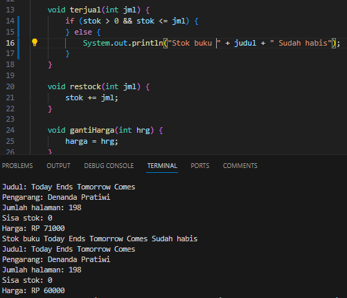
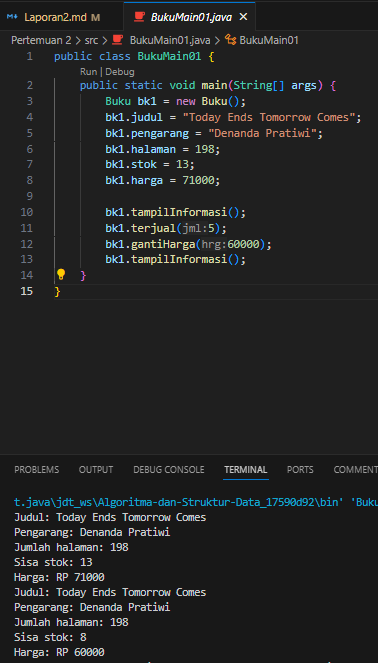
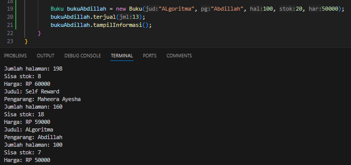

# <p align ="center"> LAPORAN PRAKTIKUM ALGORITMA DAN STRUKTUR DATA </p>

<br><br><br><br>

<p align="center">
    </p>

<br><br><br><br><br>

<p align = "center"> Nama  : Abdillah Noer Said </p>
<p align = "center"> NIM   : 2341720018 </p>
<p align = "center"> Prodi : TEKNIK INFOMATIKA</p>
<p align = "center"> Kelas : 1B </p>
<p align = "center"> Absen : 01 </p>

## Jobsheet 2

### Percobaan 1

Hasil Percobaan

](docs/img/image.png)](docs/img/P1.png)

### Pertanyaan

1. Sebutkan dua karakteristik class atau object!<br>
   Jawab: Atribut dan Behavior<br>
2. Perhatikan class Buku pada Praktikum 1 tersebut, ada berapa atribut yang dimiliki oleh class Buku? Sebutkan apa saja atributnya!<br>
   Jawab: Ada 5 Atribut yaitu Judul, Pengarang, Halaman, Stok dan Harga<br>
3. Ada berapa method yang dimiliki oleh class tersebut? Sebutkan apa saja methodnya!<br>
   Jawab: Ada 4 Method yaitu tampilInformasi, terjual, restock dan gantiHarga<br>
4. Perhatikan method terjual() yang terdapat di dalam class Buku. Modifikasi isi method tersebut sehingga proses pengurangan hanya dapat dilakukan jika stok masih ada (lebih besar dari 0)!<br>
   Jawab: Hasil Modidikasi<br>
   
5. Menurut Anda, mengapa method restock() mempunyai satu parameter berupa bilangan int?<br>
   Jawab: Agar pengguna dibatasi dengan input nilai berupa int(bilangan bulat)

### Percobaan 2

Hasil Percobaan



### Pertanyaan

1. Pada class BukuMain, tunjukkan baris kode program yang digunakan untuk proses instansiasi! Apa nama object yang dihasilkan?<br>
   Jawab: Baris kode program yang digunakan untuk proses instansiasi adalah **Buku bk1 = new Buku();**, Nama objek yang dihasilkan adalah **bk1**<br>
2. Bagaimana cara mengakses atribut dan method dari suatu objek?<br>
   Jawab: Menggunakan (.) setelah nama objek dan diikuti dengan nama atribut/method<br>
3. Mengapa hasil output pemanggilan method tampilInformasi() pertama dan kedua berbeda?<br>
   Jawab: karena method (terjual dan ganti harga) mengubah nilai atribut stok dan harga<br>

### Percobaan 3

Hasil Percobaan Buku

](docs/img/P3.1.png)

Hasil Percobaan BukuMain dan Outputnya

](docs/img/P3.2.png)

### Pertanyaan

1. Pada class Buku di Percobaan 3, tunjukkan baris kode program yang digunakan untuk
   mendeklarasikan konstruktor berparameter!<br>
   Jawab: Baris yang mendeklarasikan konstruktor
   **public Buku(String jud, String pg, int hal, int stok, int har) {
   judul = jud;
   pengarang = pg;
   halaman = hal;
   this.stok = stok;
   harga = har;
   }**<br>
2. Perhatikan class BukuMain. Apa sebenarnya yang dilakukan pada baris program berikut?<br>
   **Buku bk2 = new Buku("Self Reward", "Maheera Ayesha", 160, 29, 59000);**<br>
   Jawab: Baris program tersebut membuat objek baru dari class buku dengan nama bk2. objek bk2 memiliki nilai sebagai berikut: judul= Self Reward, pengarang= Maheera Ayesha, halaman= 160, stok= 29, harga= 59000.<br>
3. Hapus konstruktor default pada class Buku, kemudian compile dan run program. Bagaimana hasilnya? Jelaskan mengapa hasilnya demikian!<br>
   Jawab: Akan terjadi eror, karena tidak ada cara untuk membuat objek bari dari class **Buku**<br>
   ](docs/img/P3S3.png)
4. Setelah melakukan instansiasi object, apakah method di dalam class Buku harus diakses secara berurutan? Jelaskan alasannya!<br>
   Jawab: Tidak, method didalam class Buku tidak harus diakses secara berurutan. akses method dalam class tidak tergantung pada urutan<br>
5. Buat object baru dengan nama buku**NamaMahasiswa** menggunakan konstruktor
   berparameter dari class Buku!<br>
   Jawab:<br> 

### Latihan Praktikum

1. Modifikasi Buku01.java Latihan praktikum

```java
class Buku01 {
    String judul, pengarang;
    int halaman, stok, harga, terjual;

    public Buku01() {

    }

    public Buku01(String jud, String pg, int hal, int stok, int har) {
        judul = jud;
        pengarang = pg;
        halaman = hal;
        this.stok = stok;
        harga = har;
    }

    void tampilInformasi() {
        System.out.println("Judul: " + judul);
        System.out.println("Pengarang: " + pengarang);
        System.out.println("Jumlah halaman: " + halaman);
        System.out.println("Sisa stok: " + stok);
        System.out.println("Harga: Rp " + harga);
    }

    void terjual(int jml) {
        if (stok > 0 && stok >= jml) {
            stok -= jml;
            terjual = jml;
        } else {
            System.out.println("Stok buku " + judul + " sudah habis.");
        }
    }

    void restock(int jml) {
        stok += jml;
    }

    void gantiHarga(int hrg) {
        harga = hrg;
    }

    int hitungHargaTotal() {
        return terjual * harga;
    }

    int hitungDiskon() {
        int totalHarga = hitungHargaTotal();
        double diskon = 0;

        if (totalHarga > 150000) {
            diskon = 0.12;
        } else if (totalHarga >= 75000) {
            diskon = 0.05;
        }
        return (int) (totalHarga * diskon);
    }

    int hitungHargaBayar() {
        int totalHarga = hitungHargaTotal();
        int diskon = hitungDiskon();
        return totalHarga - diskon;
    }
}
```

2. Hasil Latihan praktikum class Dragon

```java
class Dragon {
    int x, y, width, height;

    Dragon(int x, int y, int width, int height) {
        this.x = x;
        this.y = y;
        this.width = width;
        this.height = height;
    }

    void moveLeft() {
        x--;
        if (x < 0) {
            detectCollision();
        }
    }

    void moveRight() {
        x++;
        if (x > width) {
            detectCollision();
        }
    }

    void moveUp() {
        y--;
        if (y < 0) {
            detectCollision();
        }
    }

    void moveDown() {
        y++;
        if (y > height) {
            detectCollision();
        }
    }

    void printPosition() {
        System.out.println("Posisi Dragon: (" + x + ", " + y + ")");
    }

    void detectCollision() {
        System.out.println("Game Over");
    }
}

public class Dragon01 {
    public static void main(String[] args) {
        Dragon dragon = new Dragon(3, 3, 5, 5);

        dragon.printPosition();
        dragon.moveRight();
        dragon.moveRight();
        dragon.moveRight();
    }
}
```
