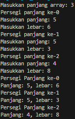
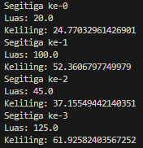

# <p align ="center"> LAPORAN PRAKTIKUM ALGORITMA DAN STRUKTUR DATA </p>

<br><br><br><br>

<p align="center">
    </p>

<br><br><br><br><br>

<p align = "center"> Nama  : Abdillah Noer Said </p>
<p align = "center"> NIM   : 2341720018 </p>
<p align = "center"> Prodi : TEKNIK INFOMATIKA</p>
<p align = "center"> Kelas : 1B </p>
<p align = "center"> Absen : 01 </p>

## Jobsheet 3

### Percobaan 1

Hasil percobaan<br>

Class

```java
public class PersegiPanjang01 {
    public int panjang;
    public int lebar;
}
```

Main

```java
class ArrayObjects01 {
    public static void main(String[] args) {
        PersegiPanjang01[] ppArray = new PersegiPanjang01[3];
        ppArray[0] = new PersegiPanjang01();
        ppArray[0].panjang = 110;
        ppArray[0].lebar = 30;

        ppArray[1] = new PersegiPanjang01();
        ppArray[1].panjang = 80;
        ppArray[1].lebar = 40;

        ppArray[2] = new PersegiPanjang01();
        ppArray[2].panjang = 100;
        ppArray[2].lebar = 20;

        System.out.println("Persegi Panjang ke-0, panjang: " + ppArray[0].panjang + ", lebar: " + ppArray[0].lebar);
        System.out.println("Persegi Panjang ke-1, panjang: " + ppArray[1].panjang + ", lebar: " + ppArray[1].lebar);
        System.out.println("Persegi Panjang ke-2, panjang: " + ppArray[2].panjang + ", lebar: " + ppArray[2].lebar);
    }
}
```

Outputnya <br>
](docs/img/image.png)](docs/img/OP1.png)

### Pertanyaan

1. Berdasarkan uji coba 3.2, apakah class yang akan dibuat array of object harus selalu memiliki atribut dan sekaligus method?Jelaskan! <br>
   Jawab : Tidak, karena class yang digunakan sebagai array of object tidak sesalu harus memiliki atribut dan method, hal ini tergantung pada kebutuhan program<br><br>
2. Apakah class PersegiPanjang memiliki konstruktor?Jika tidak, kenapa dilakukan pemanggilan
   konstruktur pada baris program berikut :

```java
ppArray[1] = new PersegiPanjang01();
```

Jawab : Tidak, Karena java akan menyediakan konstruktor default secara otomatis jika tidak ada konstruktor lain yang didfinisikan <br><br>

3. Apa yang dimaksud dengan kode berikut ini:

```java
PersegiPanjang01[] ppArray = new PersegiPanjang01[3];
```

Jawab : Kode tersebut mendeklarasikan array yang dapat mennampung 3 objek <br><br>

4. Apa yang dimaksud dengan kode berikut ini:

```java
ppArray[1] = new PersegiPanjang01();
        ppArray[1].panjang = 80;
        ppArray[1].lebar = 40;
```

Jawab : Kode tersebut membuat objek dari class PersegiPanjang01 dan disimpan di elemen array ke-1, kode tersebut menetapkan nillai 80 ke variabel panjang dan 40 ke lebar <br><br>

5. Mengapa class main dan juga class PersegiPanjang dipisahkan pada uji coba 3.2? <br>
   Jawab : Karena dapat lebih mudah pengembangan dan pemeliharaan program dan juga mengikuti konsep desain dan struktur program yang baik.

### Percobaan 2

Hasil Percobaan

```java
import java.util.Scanner;

class ArrayObjects01 {
    public static void main(String[] args) {
        Scanner sc = new Scanner(System.in);
        PersegiPanjang01[] ppArray = new PersegiPanjang01[3];

        for (int i = 0; i < 3; i++) {
            ppArray[i] = new PersegiPanjang01();
            System.out.println("Persegi panjang ke-" + i);
            System.out.print("Masukkan panjang: ");
            ppArray[i].panjang = sc.nextInt();
            System.out.print("Masukkan lebar: ");
            ppArray[i].lebar = sc.nextInt();
        }

        for (int i = 0; i < 3; i++) {
            System.out.println("Persegi Panjang ke-" + i);
            System.out.println("Panjang: " + ppArray[i].panjang + ", lebar: " + ppArray[i].lebar);
        }
    }
}
```

Outputnya <br>
](docs/img/OP2.png)

### Pertanyaan

1. Apakah array of object dapat diimplementasikan pada array 2 Dimensi?<br>
   Jawab : Bisa <br><br>

2. Jika jawaban soal no satu iya, berikan contohnya! Jika tidak, jelaskan!<br>
   Jawab :

```java
PersegiPanjang[][] array2D = new PersegiPanjang[3][3];
    for (int i = 0; i < 3; i++) {
        for (int j = 0; j < 3; j++) {
            array2D[i][j] = new PersegiPanjang((i + 1) * 3, (j + 1) * 5);
        }
    }
```

<br><br>

3.  Jika diketahui terdapat class Persegi yang memiliki atribut sisi bertipe integer, maka kode dibawah ini akan memunculkan error saat dijalankan. Mengapa?

    ```java
    Persegi[] pgArray = new Persegi[100];
    pgArray[5].sisi = 20;
    ```

    Jawab : pada kode tersebut kita hanya memberikan alokasi memori untuk objek, namun belum membuat objek itu sendiri. Sehingga saat mencoba mengakses atribut sisi dari null, yang akan menghasilkan kesalahan NullPointerException. <br><br>

4.  Modifikasi kode program pada praktikum 3.3 agar length array menjadi inputan dengan Scanner!<br>
    Jawab : <br>
    Kode program <br>

    ````java
    import java.util.Scanner;

        class ArrayObjects01 {
        public static void main(String[] args) {
            Scanner sc = new Scanner(System.in);

            System.out.print("Masukkan panjang array: ");
            int arrayLength = sc.nextInt();

            PersegiPanjang01[] ppArray = new PersegiPanjang01[arrayLength];

            for (int i = 0; i < arrayLength; i++) {
                ppArray[i] = new PersegiPanjang01();
                System.out.println("Persegi panjang ke-" + i);
                System.out.print("Masukkan panjang: ");
                ppArray[i].panjang = sc.nextInt();
                System.out.print("Masukkan lebar: ");
                ppArray[i].lebar = sc.nextInt();
            }

            for (int i = 0; i < arrayLength; i++) {
                System.out.println("Persegi Panjang ke-" + i);
                System.out.println("Panjang: " + ppArray[i].panjang + ", lebar: " + ppArray[i].lebar);
            }
        }
        }
        ```
        Outputnya <br>

    

    ````

5.  Apakah boleh Jika terjadi duplikasi instansiasi array of objek, misalkan saja instansiasi dilakukan pada ppArray[i] sekaligus ppArray[0]?Jelaskan !<br>
    Jawab : Boleh, namun tidak dianjurkan karena menimbulkan ketidakkonsistenan data.

### Percobaan 3

Hasil percobaan<br>
Class Balok

```java
public class Balok01 {
    public int panjang;
    public int lebar;
    public int tinggi;

    public Balok01(int p, int l, int t) {
        panjang = p;
        lebar = l;
        tinggi = t;
    }

    public int hitungVolume() {
        return panjang * lebar * tinggi;
    }
}
```

Main Balok

```java
public class ArrayBalok01 {
    public static void main(String[] args) {
        Balok01[] blArray = new Balok01[3];
        blArray[0] = new Balok01(100, 30, 12);
        blArray[1] = new Balok01(120, 40, 15);
        blArray[2] = new Balok01(210, 50, 25);

        for (int i = 0; i < 3; i++) {
            System.out.println("Volume balok ke " + i + ": " + blArray[i].hitungVolume());
        }
    }
}
```

Outputnya <br>
](docs/img/OP3.png)

### Pertanyaan

1.  Dapatkah konstruktor berjumlah lebih dalam satu kelas? Jelaskan dengan contoh!<br>
    jawab : Bisa karena satu kelas bisa lebih dari satu konstruktor <br>

    ```java
    public class PersegiPanjang01 {
        public int panjang;
        public int lebar;

        public PersegiPanjang01() {
            panjang = 0;
            lebar = 0;
        }

        public PersegiPanjang01(int p, int l) {
            panjang = p;
            lebar = l;
        }
    }
    ```

    <br>

2.  Jika diketahui terdapat class Segitiga seperti berikut ini:

        ```java
        public class Segitiga {
            public int alas;
            public int tinggi;
        }
        ```

    Tambahkan konstruktor pada class Segitiga tersebut yang berisi parameter int a, int t yang masing-masing digunakan untuk mengisikan atribut alas dan tinggi.
    <br>

    Jawab : <br>

    ```java
    public class Segitiga01 {
    public int alas;
    public int tinggi;

    public Segitiga01(int a, int t) {
        alas = a;
        tinggi = t;
    }
    }
    ```

    <br>

3.  Tambahkan method hitungLuas() dan hitungKeliling() pada class Segitiga
    tersebut. Asumsi segitiga adalah segitiga siku-siku. (Hint: Anda dapat menggunakan bantuan library Math pada Java untuk mengkalkulasi sisi miring)<br>
    Jawab : <br>

    ```java
        import java.lang.Math;

        public class Segitiga01 {
        public int alas;
        public int tinggi;

        public Segitiga01(int a, int t) {
            alas = a;
            tinggi = t;
        }

        public double hitungLuas() {
            return alas * tinggi / 2;
        }

        public double hitungKeliling() {
            double sisiMiring = Math.sqrt(alas * alas + tinggi * tinggi);
            return alas + tinggi + sisiMiring;
        }
        }
    ```

    <br>

4.  Pada fungsi main, buat array Segitiga sgArray yang berisi 4 elemen, isikan masing-masing atributnya sebagai berikut: <br>
    sgArray ke-0 alas: 10, tinggi: 4<br>
    sgArray ke-1 alas: 20, tinggi: 10<br>
    sgArray ke-2 alas: 15, tinggi: 6<br>
    sgArray ke-3 alas: 25, tinggi: 10 <br>
    Jawab : <br>

    ```java
    public class ArraySegitiga01 {
    public static void main(String[] args) {
        Segitiga01[] sgArray = new Segitiga01[4];
        sgArray[0] = new Segitiga01(10, 4);
        sgArray[1] = new Segitiga01(20, 10);
        sgArray[2] = new Segitiga01(15, 6);
        sgArray[3] = new Segitiga01(25, 10);
        }
    }
    ```

    <br>

5.  Kemudian menggunakan looping, cetak luas dan keliling dengan cara memanggil method
    hitungLuas() dan hitungKeliling().<br>
    Jawab : <br>

    ```java
    for (int i = 0; i < 4; i++) {
        System.out.println("Segitiga ke-" + i);
        System.out.println("Luas: " + sgArray[i].hitungLuas());
        System.out.println("Keliling: " + sgArray[i].hitungKeliling());
    }
    ```

    <br>

    Outputnya <br>
    

### Latihan

Latihan 1

Hasil Latihan

Class Kerucut

```java
public class Kerucut01 {
    double jariJari;
    double sisiMiring;

    Kerucut01(double jariJari, double sisiMiring) {
        this.jariJari = jariJari;
        this.sisiMiring = sisiMiring;
    }

    double hitungLuasPermukaan() {
        return Math.PI * jariJari * (jariJari + sisiMiring);
    }

    double hitungVolume() {
        return (1.0 / 3.0) * Math.PI * jariJari * jariJari * sisiMiring;
    }
}
```

Class Limas Segi Empat Sama Sisi

```java
public class LimasSegiEmpat01 {
    double sisiAlas;
    double tinggiLimas;

    LimasSegiEmpat01(double sisiAlas, double tinggiLimas) {
        this.sisiAlas = sisiAlas;
        this.tinggiLimas = tinggiLimas;
    }

    double hitungLuasPermukaan() {
        double luasAlas = sisiAlas * sisiAlas;
        double luasSegitiga = (sisiAlas - tinggiLimas) / 2;
        return luasAlas + 4 * luasSegitiga;
    }

    double hitungVolume() {
        return (1.0 / 3.0) * sisiAlas * sisiAlas * tinggiLimas;
    }
}
```

Class Bola

```java
public class Bola01 {
    double jariJari;

    Bola01(double jariJari) {
        this.jariJari = jariJari;
    }

    double hitungLuasPermukaan() {
        return 4 * Math.PI * jariJari * jariJari;
    }

    double hitungVolume() {
        return (4.0 / 3.0) * Math.PI * jariJari * jariJari * jariJari;
    }
}
```

Main Latihan 1

```java
import java.util.Scanner;

public class ArrayLatihan01 {
    public static void main(String[] args) {
        Scanner scanner = new Scanner(System.in);

        System.out.print("Masukkan jumlah bangun ruang: ");
        int jumlahBangunRuang = scanner.nextInt();

        Object[] bangunRuangArray = new Object[jumlahBangunRuang];

        for (int i = 0; i < jumlahBangunRuang; i++) {
            System.out.println("\nBangun Ruang ke-" + (i + 1));
            System.out.print("Pilih jenis bangun ruang (1. Kerucut, 2. Limas Segi Empat, 3. Bola): ");
            int pilihan = scanner.nextInt();

            switch (pilihan) {
                case 1:
                    System.out.print("Masukkan jari-jari kerucut: ");
                    double jariJariKerucut = scanner.nextDouble();
                    System.out.print("Masukkan sisi miring kerucut: ");
                    double sisiMiringKerucut = scanner.nextDouble();
                    bangunRuangArray[i] = new Kerucut01(jariJariKerucut, sisiMiringKerucut);
                    break;
                case 2:
                    System.out.print("Masukkan panjang sisi alas limas: ");
                    double panjangSisiAlasLimas = scanner.nextDouble();
                    System.out.print("Masukkan tinggi limas: ");
                    double tinggiLimas = scanner.nextDouble();
                    bangunRuangArray[i] = new LimasSegiEmpat01(panjangSisiAlasLimas, tinggiLimas);
                    break;
                case 3:
                    System.out.print("Masukkan jari-jari bola: ");
                    double jariJariBola = scanner.nextDouble();
                    bangunRuangArray[i] = new Bola01(jariJariBola);
                    break;
                default:
                    System.out.println("Pilihan tidak valid.");
                    i--;
                    break;
            }
        }

        System.out.println("\nHasil Perhitungan:");
        for (int i = 0; i < jumlahBangunRuang; i++) {
            System.out.println("\nBangun Ruang ke-" + (i + 1));
            if (bangunRuangArray[i] instanceof Kerucut01) {
                Kerucut01 kerucut = (Kerucut01) bangunRuangArray[i];
                System.out.println("Luas Permukaan: " + kerucut.hitungLuasPermukaan());
                System.out.println("Volume: " + kerucut.hitungVolume());
            } else if (bangunRuangArray[i] instanceof LimasSegiEmpat01) {
                LimasSegiEmpat01 limas = (LimasSegiEmpat01) bangunRuangArray[i];
                System.out.println("Luas Permukaan: " + limas.hitungLuasPermukaan());
                System.out.println("Volume: " + limas.hitungVolume());
            } else if (bangunRuangArray[i] instanceof Bola01) {
                Bola01 bola = (Bola01) bangunRuangArray[i];
                System.out.println("Luas Permukaan: " + bola.hitungLuasPermukaan());
                System.out.println("Volume: " + bola.hitungVolume());
            }
        }
    }
}
```

Outputnya<br>

](docs/img/OP6.png)

Latihan 2

Hasil Latihan

```java
import java.util.Scanner;

public class InformasiMahasiswa01 {
    public static void main(String[] args) {
        Scanner scanner = new Scanner(System.in);

        int jumlahMahasiswa = 3;

        String[] nama = new String[jumlahMahasiswa];
        String[] nim = new String[jumlahMahasiswa];
        char[] jenisKelamin = new char[jumlahMahasiswa];
        double[] ipk = new double[jumlahMahasiswa];

        for (int i = 0; i < jumlahMahasiswa; i++) {
            System.out.println("Masukkan data mahasiswa ke-" + (i + 1));
            System.out.print("Masukkan nama: ");
            nama[i] = scanner.next();
            System.out.print("Masukkan nim: ");
            nim[i] = scanner.next();
            System.out.print("Masukkan jenis kelamin (P/L): ");
            jenisKelamin[i] = scanner.next().charAt(0);
            System.out.print("Masukkan IPK: ");
            ipk[i] = scanner.nextDouble();
        }

        for (int i = 0; i < jumlahMahasiswa; i++) {
            System.out.println("\nData Mahasiswa ke-" + (i + 1));
            System.out.println("Nama: " + nama[i]);
            System.out.println("NIM: " + nim[i]);
            System.out.println("Jenis kelamin: " + jenisKelamin[i]);
            System.out.println("Nilai IPK: " + ipk[i]);
        }
    }
}
```

Latihan 3

Hasil Latihan
