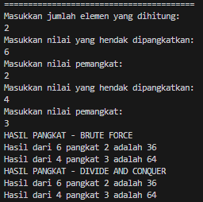
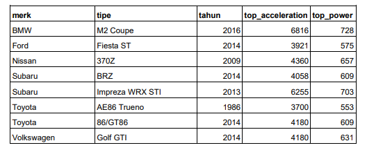

# <p align ="center"> LAPORAN PRAKTIKUM ALGORITMA DAN STRUKTUR DATA </p>

<br><br><br><br>

<p align="center">
    </p>

<br><br><br><br><br>

<p align = "center"> Nama  : Abdillah Noer Said </p>
<p align = "center"> NIM   : 2341720018 </p>
<p align = "center"> Prodi : TEKNIK INFOMATIKA</p>
<p align = "center"> Kelas : 1B </p>
<p align = "center"> Absen : 01 </p>

## Jobsheet 4

### Percobaan 1

Hasil Percobaan

Code Class Faktorial

```java
public class Faktorial01 {
    public int nilai;

    int faktorialBF(int n) {
        int fakto = 1;
        for (int i = 1; i <= n; i++) {
            fakto = fakto * i;
        }
        return fakto;
    }

    int faktorialDC(int n) {
        if (n == 1) {
            return 1;
        } else {
            int fakto = n * faktorialDC(n - 1);
            return fakto;
        }
    }
}
```

Code Main Faktorial

```java
import java.util.Scanner;

public class MainFaktorial01 {
    public static void main(String[] args) {
        Scanner sc = new Scanner(System.in);
        System.out.println("========================");
        System.out.println("Masukkan jumlah elemen: ");
        int iJml = sc.nextInt();

        Faktorial01[] fk = new Faktorial01[10];
        for (int i = 0; i < iJml; i++) {
            fk[i] = new Faktorial01();
            System.out.println("Masukkan elemen ke-" + (i + 1) + ": ");
            fk[i].nilai = sc.nextInt();
        }
        System.out.println("HASIL - BRUTE FORCE");
        for (int i = 0; i < iJml; i++) {
            System.out.println(
                    "Hasil penghitungan faktorial menggunakan Brute Force adalah "
                            + fk[i].faktorialBF(fk[i].nilai));
        }
        System.out.println("HASIL - DIVIDE AND CONQUER");
        for (int i = 0; i < iJml; i++) {
            System.out.println(
                    "Hasil penghitungan faktorial menggunakan Divide and Conquer adalah "
                            + fk[i].faktorialDC(fk[i].nilai));
        }
    }
}
```

Output <br>
](docs/img/OP1.png)

### Pertanyaan

1. Pada base line Algoritma Divide Conquer untuk melakukan pencarian nilai faktorial, jelaskan perbedaan bagian kode pada penggunaan if dan else!<br>
   Jawab : Pada bagian if, kondisi diperiksa untuk menentukan apakah nilai n adalah kasus dasar. Jika ya, nilai faktorialnya langsung dikembalikan. Jika tidak, masalah dibagi menjadi submasalah yang lebih kecil dan dipecahkan secara rekursif.<br>
2. Apakah memungkinkan perulangan pada method faktorialBF() dirubah selain menggunakan for?Buktikan!<br>
   Jawab : Bisa, menggunakan perulangan while<br>
   ](docs/img/Soal1.2.png)<br>
3. Jelaskan perbedaan antara fakto _= i; dan int fakto = n _ faktorialDC(n-1); !<br>
   Jawab : Perbedaannya adalah bahwa fakto _= i; digunakan dalam konteks iteratif sederhana untuk menghitung faktorial, sementara int fakto = n _ faktorialDC(n-1); digunakan dalam konteks rekursif untuk mengimplementasikan pendekatan Divide and Conquer, secara rekursif memecah masalah menjadi submasalah hingga mencapai kasus dasar

### Percobaan 2

Hasil Percobaan

Code Class pangkat

```java
public class Pangkat01 {
    public int nilai, pangkat;

    int pangkatBF(int a, int n) {
        int hasil = 1;
        for (int i = 0; i < n; i++) {
            hasil *= a;
        }
        return hasil;
    }

    int pangkatDC(int a, int n) {
        if (n == 0) {
            return 1;
        } else {
            if (n % 2 == 1) {
                return (pangkatDC(a, n / 2) * pangkatDC(a, n / 2) * a);
            } else {
                return (pangkatDC(a, n / 2) * pangkatDC(a, n / 2));
            }
        }
    }
}
```

Code Main pangkat

```java
import java.util.Scanner;

public class MainPangkat01 {
    public static void main(String[] args) {
        Scanner sc = new Scanner(System.in);
        System.out.println("========================================");
        System.out.println("Masukkan jumlah elemen yang dihitung: ");
        int elemen = sc.nextInt();

        Pangkat01[] png = new Pangkat01[elemen];
        for (int i = 0; i < elemen; i++) {
            png[i] = new Pangkat01();
            System.out.println("Masukkan nilai yang hendak dipangkatkan: ");
            png[i].nilai = sc.nextInt();
            System.out.println("Masukkan nilai pemangkat: ");
            png[i].pangkat = sc.nextInt();
        }

        System.out.println("HASIL PANGKAT - BRUTE FORCE");
        for (int i = 0; i < elemen; i++) {
            System.out.println("Hasil dari "
                    + png[i].nilai + " pangkat "
                    + png[i].pangkat + " adalah "
                    + png[i].pangkatBF(png[i].nilai, png[i].pangkat));
        }
        System.out.println("HASIL PANGKAT - DIVIDE AND CONQUER");
        for (int i = 0; i < elemen; i++) {
            System.out.println("Hasil dari "
                    + png[i].nilai + " pangkat "
                    + png[i].pangkat + " adalah "
                    + png[i].pangkatDC(png[i].nilai, png[i].pangkat));
        }
    }
}
```

Output<br>


### Pertanyaan

1. Jelaskan mengenai perbedaan 2 method yang dibuat yaitu PangkatBF() dan PangkatDC()!<br>
   Jawab : Metode VF langsung mengalikan bilangan 'a' dengan dirinya sendiri sebanyak 'n', Sederhana tapi membutuhkan waktu eksekusi yang lama untuk pangkat besar, sedangkan metode DC memecah masalah menjadi submasalah yang lebih kecil dan menghasilkan efisiensi lebih tinggi terutama untuk nilai pangkat yang besar.<br>
2. Apakah tahap combine sudah termasuk dalam kode tersebut?Tunjukkan!<br>
   Jawab : Iya, proses rekursif itu sendiri adalah tahap di mana hasil dari submasalah yang lebih kecil digabungkan untuk membentuk solusi akhir.

```java
if (n % 2 == 1) {
                return (pangkatDC(a, n / 2) * pangkatDC(a, n / 2) * a);
            } else {
                return (pangkatDC(a, n / 2) * pangkatDC(a, n / 2));
            }
```

3. Modifikasi kode program tersebut, anggap proses pengisian atribut dilakukan dengan konstruktor.<br>
   Jawab : <br>

```java
public class Pangkat01 {
    public int nilai, pangkat;

    public Pangkat01(int nilai, int pangkat) {
        this.nilai = nilai;
        this.pangkat = pangkat;
    }

    int pangkatBF(int a, int n) {
        int hasil = 1;
        for (int i = 0; i < n; i++) {
            hasil *= a;
        }
        return hasil;
    }

    int pangkatDC(int a, int n) {
        if (n == 0) {
            return 1;
        } else {
            if (n % 2 == 1) {
                return (pangkatDC(a, n / 2) * pangkatDC(a, n / 2) * a);
            } else {
                return (pangkatDC(a, n / 2) * pangkatDC(a, n / 2));
            }
        }
    }
}
```

```java
import java.util.Scanner;

public class MainPangkat01 {
    public static void main(String[] args) {
        Scanner sc = new Scanner(System.in);
        System.out.println("========================================");
        System.out.println("Masukkan jumlah elemen yang dihitung: ");
        int elemen = sc.nextInt();

        Pangkat01[] png = new Pangkat01[elemen];
        for (int i = 0; i < elemen; i++) {            System.out.println("Masukkan nilai yang hendak dipangkatkan: ");
            int nilai = sc.nextInt();
            System.out.println("Masukkan nilai pemangkat: ");
            int pangkat = sc.nextInt();
            png[i] = new Pangkat01(nilai, pangkat);
        }

        System.out.println("HASIL PANGKAT - BRUTE FORCE");
        for (int i = 0; i < elemen; i++) {
            System.out.println("Hasil dari "
                    + png[i].nilai + " pangkat "
                    + png[i].pangkat + " adalah "
                    + png[i].pangkatBF(png[i].nilai, png[i].pangkat));
        }
        System.out.println("HASIL PANGKAT - DIVIDE AND CONQUER");
        for (int i = 0; i < elemen; i++) {
            System.out.println("Hasil dari "
                    + png[i].nilai + " pangkat "
                    + png[i].pangkat + " adalah "
                    + png[i].pangkatDC(png[i].nilai, png[i].pangkat));
        }
    }
}
```

4. Tambahkan menu agar salah satu method yang terpilih saja yang akan dijalankan menggunakan switch-case!<br>
   Jawab : <br>

```java
import java.util.Scanner;

public class MainPangkat01 {
    public static void main(String[] args) {
        Scanner sc = new Scanner(System.in);
        System.out.println("========================================");
        System.out.println("Masukkan jumlah elemen yang dihitung: ");
        int elemen = sc.nextInt();

        Pangkat01[] png = new Pangkat01[elemen];
        for (int i = 0; i < elemen; i++) {
            System.out.println("Masukkan nilai yang hendak dipangkatkan: ");
            int nilai = sc.nextInt();
            System.out.println("Masukkan nilai pemangkat: ");
            int pangkat = sc.nextInt();
            png[i] = new Pangkat01(nilai, pangkat);
        }

        System.out.println("Pilih metode:");
        System.out.println("1. Brute Force");
        System.out.println("2. Divide and Conquer");
        System.out.print("Pilihan Anda: ");
        int pilihan = sc.nextInt();

        switch (pilihan) {
            case 1:
                System.out.println("HASIL PANGKAT - BRUTE FORCE");
                for (int i = 0; i < elemen; i++) {
                    System.out.println("Hasil dari "
                            + png[i].nilai + " pangkat "
                            + png[i].pangkat + " adalah "
                            + png[i].pangkatBF(png[i].nilai, png[i].pangkat));
                }
                break;
            case 2:
                System.out.println("HASIL PANGKAT - DIVIDE AND CONQUER");
                for (int i = 0; i < elemen; i++) {
                    System.out.println("Hasil dari "
                            + png[i].nilai + " pangkat "
                            + png[i].pangkat + " adalah "
                            + png[i].pangkatDC(png[i].nilai, png[i].pangkat));
                }
                break;
            default:
                System.out.println("Pilihan tidak valid.");
        }
    }
}
```

### Percobaan 3

Hasil percobaan

Code Class Sum

```java
public class Sum01 {
    int elemen;
    double keuntungan[], total;

    Sum01(int elemen) {
        this.elemen = elemen;
        this.keuntungan = new double[elemen];
        this.total = 0;
    }

    double totalBF(double arr[]) {
        for (int i = 0; i < elemen; i++) {
            total = total + arr[i];
        }
        return total;
    }

    double totalDC(double arr[], int l, int r) {
        if (l == r) {
            return arr[l];
        } else if (l < r) {
            int mid = (l + r) / 2;
            double lsum = totalDC(arr, l, mid);
            double rsum = totalDC(arr, mid + 1, r);
            return lsum + rsum;
        }
        return 0;
    }
}
```

Code Main Sum

```java
import java.util.Scanner;

public class MainSum01 {
    public static void main(String[] args) {
        Scanner sc = new Scanner(System.in);
        System.out.println("============================================================");
        System.out.println("Program Menghitung Keuntungan Total (Satuan Juta, Misal 5,9)");
        System.out.print("Masukkan jumlah bulan : ");
        int elm = sc.nextInt();

        Sum01 sm = new Sum01(elm);
        System.out.println("============================================================");
        for (int i = 0; i < sm.elemen; i++) {
            System.out.print("Masukkan untung bulan ke - " + (i + 1) + " = ");
            sm.keuntungan[i] = sc.nextDouble();
        }

        System.out.println("============================================================");
        System.out.println("Algoritma Brute Force");
        System.out.println(
                "Tatal keuntungan perusahaan selama " + sm.elemen + " bulan adalah = " + sm.totalBF(sm.keuntungan));
        System.out.println("============================================================");
        System.out.println("Algoritma Divide Conquer");
        System.out.println("Total keuntungan perusahaan selama " + sm.elemen + " bulan adalah = "
                + sm.totalDC(sm.keuntungan, 0, sm.elemen - 1));
    }
}
```

Output <br>
](docs/img/OP3.png)

### Pertanyaan

1. Mengapa terdapat formulasi return value berikut?Jelaskan!

```java
return lsum+rsum+arr[mid];
```

Jawab : baris kode tersebut digunakan untuk menambahkan total semua nilai dari 'lsum' yang merupakan total dari sub-array disebelah kiri, 'rsum' adalah total dari sub-array di sebelah kanan, dan 'arr[mid]' adalah elemen tengah dari array.<br> 2. Kenapa dibutuhkan variable mid pada method TotalDC()?<br>
Jawab : Digunakan untuk membagi sub-array menjadi 2 bagian yang sama besar yaitu lsum dan rsum.<br> 3. Program perhitungan keuntungan suatu perusahaan ini hanya untuk satu perusahaan saja. Bagaimana cara menghitung sekaligus keuntungan beberapa bulan untuk beberapa perusahaan.(Setiap perusahaan bisa saja memiliki jumlah bulan berbeda-beda)? Buktikan dengan program!<br>
Jawab :Berikut code programnya<br>

```java
public class Sum01 {
    int elemen;
    double[] keuntungan;
    double total;

    Sum01(int elemen) {
        this.elemen = elemen;
        this.keuntungan = new double[elemen];
        this.total = 0;
    }

    public void setKeuntungan(double[] keuntungan) {
        this.keuntungan = keuntungan;
    }

    double totalBF() {
        total = 0;
        for (int i = 0; i < elemen; i++) {
            total = total + keuntungan[i];
        }
        return total;
    }

    double totalDC(int l, int r) {
        if (l == r) {
            return keuntungan[l];
        } else if (l < r) {
            int mid = (l + r) / 2;
            double lsum = totalDC(l, mid);
            double rsum = totalDC(mid + 1, r);
            return lsum + rsum;
        }
        return 0;
    }
}
```

```java
import java.util.Scanner;

public class MainSum01 {
    public static void main(String[] args) {
        Scanner sc = new Scanner(System.in);
        System.out.println("============================================================");
        System.out.println("Program Menghitung Keuntungan Total (Satuan Juta, Misal 5,9)");
        System.out.print("Masukkan jumlah perusahaan: ");
        int jumlahPerusahaan = sc.nextInt();
        System.out.print("Masukkan jumlah bulan: ");
        int jumlahBulan = sc.nextInt();

        double[][] keuntunganPerusahaan = new double[jumlahPerusahaan][jumlahBulan];

        for (int i = 0; i < jumlahPerusahaan; i++) {
            System.out.println("============================================================");
            System.out.println("Masukkan data keuntungan untuk Perusahaan " + (i + 1) + ":");
            for (int j = 0; j < jumlahBulan; j++) {
                System.out.print("Masukkan untung bulan ke-" + (j + 1) + " = ");
                keuntunganPerusahaan[i][j] = sc.nextDouble();
            }
        }

        for (int i = 0; i < jumlahPerusahaan; i++) {
            Sum01 sm = new Sum01(jumlahBulan);
            sm.setKeuntungan(keuntunganPerusahaan[i]);
            System.out.println("============================================================");
            System.out.println("Perusahaan " + (i + 1));
            System.out.println("Algoritma Brute Force");
            System.out.println("Total keuntungan perusahaan selama " + jumlahBulan + " bulan adalah = "
                    + sm.totalBF());
            System.out.println("Algoritma Divide Conquer");
            System.out.println("Total keuntungan perusahaan selama " + jumlahBulan + " bulan adalah = "
                    + sm.totalDC(0, jumlahBulan - 1));
        }
    }
}
```

Output<br>
](docs/img/Soal3.3.png)

### Latihan Praktikum

1. Sebuah showroom memiliki daftar mobil dengan data sesuai tabel di bawah ini



Tentukan:

a) top_acceleration tertinggi menggunakan Divide and Conquer!<br>

```java
public class DaftarMobil01 {
    String merk[] = { "BMW", "Ford", "Nissan", "Subaru", "Toyota", "Volkswagen" };
    String tipe[] = { "M2 Coupe", "Fiesta ST", "370Z", "BRZ", "Impreza WRX STI", "AE86 Trueno", "86/GT86", "Golf GTI" };
    int tahun[] = { 2016, 2014, 2009, 2014, 2013, 1986, 2014, 2014 };
    int topAcceleration[] = { 6816, 3921, 4360, 4058, 6255, 3700, 4180, 4180 };
    int topPower[] = { 728, 575, 657, 609, 703, 553, 609, 631 };

    int maxAcceleration(int arr[], int l, int r) {
        if (l == r) {
            return arr[l];
        } else {
            int mid = (l + r) / 2;
            int left = maxAcceleration(arr, l, mid);
            int right = maxAcceleration(arr, mid + 1, r);

            int maxAcceleration;
            if (left > right) {
                maxAcceleration = left;
            } else {
                maxAcceleration = right;
            }
            return maxAcceleration;
        }
    }
}
```

```java
public class MainMobil {
    public static void main(String[] args) {
        DaftarMobil01 outputMobil = new DaftarMobil01();
        System.out.println("=====================================================");
        System.out.println("Mobil dengan top Accaleration tertinggi adalah "
                + outputMobil.maxAcceleration(outputMobil.topAcceleration, 0, outputMobil.topAcceleration.length - 1));
    }
}
```

Output<br>
](docs/img/Latihan1.png)<br>
b) top_acceleration terendah menggunakan Divide and Conquer!<br>

```java
public class DaftarMobil01 {
    String merk[] = { "BMW", "Ford", "Nissan", "Subaru", "Toyota", "Volkswagen" };
    String tipe[] = { "M2 Coupe", "Fiesta ST", "370Z", "BRZ", "Impreza WRX STI", "AE86 Trueno", "86/GT86", "Golf GTI" };
    int tahun[] = { 2016, 2014, 2009, 2014, 2013, 1986, 2014, 2014 };
    int topAcceleration[] = { 6816, 3921, 4360, 4058, 6255, 3700, 4180, 4180 };
    int topPower[] = { 728, 575, 657, 609, 703, 553, 609, 631 };

    int maxAcceleration(int arr[], int l, int r) {
        if (l == r) {
            return arr[l];
        } else {
            int mid = (l + r) / 2;
            int left = maxAcceleration(arr, l, mid);
            int right = maxAcceleration(arr, mid + 1, r);

            int maxAcceleration;
            if (left > right) {
                maxAcceleration = left;
            } else {
                maxAcceleration = right;
            }
            return maxAcceleration;
        }
    }

    int minAcceleration(int arr[], int l, int r) {
        if (l == r) {
            return arr[l];
        } else {
            int mid = (l + r) / 2;
            int left = minAcceleration(arr, l, mid);
            int right = minAcceleration(arr, mid + 1, r);

            int minAcceleration;
            if (left < right) {
                minAcceleration = left;
            } else {
                minAcceleration = right;
            }
            return minAcceleration;
        }
    }
}
```

```java
public class MainMobil {
    public static void main(String[] args) {
        DaftarMobil01 outputMobil = new DaftarMobil01();
        System.out.println("=====================================================");
        System.out.println("Mobil dengan top Accaleration tertinggi adalah "
                + outputMobil.maxAcceleration(outputMobil.topAcceleration, 0, outputMobil.topAcceleration.length - 1));
        System.out.println("Mobil dengan top Accaleration terendah adalah "
                + outputMobil.minAcceleration(outputMobil.topAcceleration, 0, outputMobil.topAcceleration.length - 1));
    }
}
```

Output<br>
](docs/img/Latihan2.png)<br>
c) Rata-rata top_power dari seluruh mobil menggunakan Brute Force!<br>

```java
public class DaftarMobil01 {
    String merk[] = { "BMW", "Ford", "Nissan", "Subaru", "Toyota", "Volkswagen" };
    String tipe[] = { "M2 Coupe", "Fiesta ST", "370Z", "BRZ", "Impreza WRX STI", "AE86 Trueno", "86/GT86", "Golf GTI" };
    int tahun[] = { 2016, 2014, 2009, 2014, 2013, 1986, 2014, 2014 };
    int topAcceleration[] = { 6816, 3921, 4360, 4058, 6255, 3700, 4180, 4180 };
    int topPower[] = { 728, 575, 657, 609, 703, 553, 609, 631 };

    int maxAcceleration(int arr[], int l, int r) {
        if (l == r) {
            return arr[l];
        } else {
            int mid = (l + r) / 2;
            int left = maxAcceleration(arr, l, mid);
            int right = maxAcceleration(arr, mid + 1, r);

            int maxAcceleration;
            if (left > right) {
                maxAcceleration = left;
            } else {
                maxAcceleration = right;
            }
            return maxAcceleration;
        }
    }

    int minAcceleration(int arr[], int l, int r) {
        if (l == r) {
            return arr[l];
        } else {
            int mid = (l + r) / 2;
            int left = minAcceleration(arr, l, mid);
            int right = minAcceleration(arr, mid + 1, r);

            int minAcceleration;
            if (left < right) {
                minAcceleration = left;
            } else {
                minAcceleration = right;
            }
            return minAcceleration;
        }
    }

    double rataPower() {
        double totalPower = 0;
        for (int i = 0; i < topPower.length; i++) {
            totalPower += topPower[i];
        }
        return totalPower / topPower.length;
    }
}
```

```java
public class MainMobil {
    public static void main(String[] args) {
        DaftarMobil01 outputMobil = new DaftarMobil01();
        System.out.println("=====================================================");
        System.out.println("Mobil dengan top Accaleration tertinggi adalah "
                + outputMobil.maxAcceleration(outputMobil.topAcceleration, 0, outputMobil.topAcceleration.length - 1));
        System.out.println("Mobil dengan top Accaleration terendah adalah "
                + outputMobil.minAcceleration(outputMobil.topAcceleration, 0, outputMobil.topAcceleration.length - 1));
        System.out.println("Rata-rata top power adalah " + outputMobil.rataPower());
    }
}
```

Output<br>
](docs/img/Latihan3.png)
