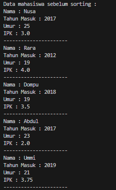
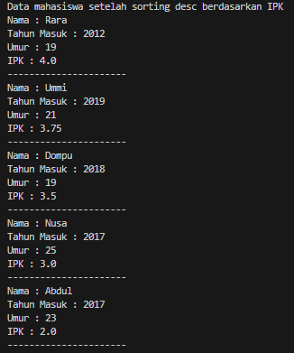
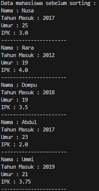
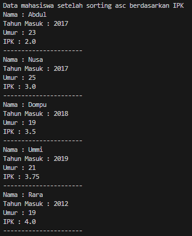
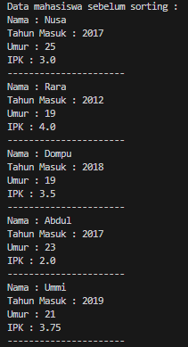
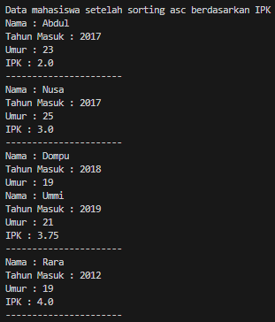
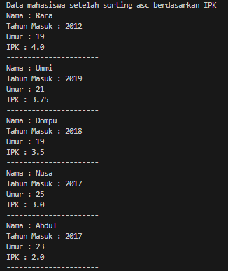
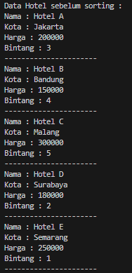
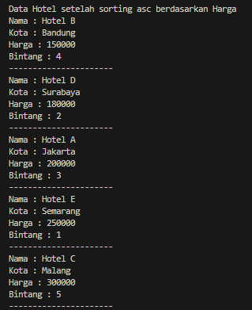
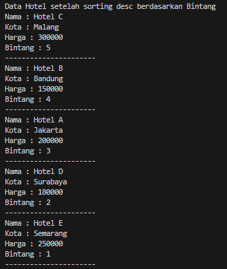

# <p align ="center"> LAPORAN PRAKTIKUM ALGORITMA DAN STRUKTUR DATA </p>

<br><br><br><br>

<p align="center">
    </p>

<br><br><br><br><br>

<p align = "center"> Nama  : Abdillah Noer Said </p>
<p align = "center"> NIM   : 2341720018 </p>
<p align = "center"> Prodi : TEKNIK INFOMATIKA</p>
<p align = "center"> Kelas : 1B </p>
<p align = "center"> Absen : 01 </p>

## Jobsheet 5

### Percobaan 1

Hasil Percobaan

Class Mahasiswa01

```java
public class Mahasiswa01 {
    String nama;
    int thnMasuk, umur;
    double ipk;

    Mahasiswa01(String n, int t, int u, double i) {
        nama = n;
        thnMasuk = t;
        umur = u;
        ipk = i;
    }

    void tampil() {
        System.out.println("Nama : " + nama);
        System.out.println("Tahun Masuk : " + thnMasuk);
        System.out.println("Umur : " + umur);
        System.out.println("IPK : " + ipk);
    }
}
```

Class DaftarMahasiswaBerprestasi01

```java
public class DaftarMahasiswaBerprestasi01 {
    Mahasiswa01 listMhs[] = new Mahasiswa01[5];
    int idx;

    void tambah(Mahasiswa01 m) {
        if (idx < listMhs.length) {
            listMhs[idx] = m;
            idx++;
        } else {
            System.out.println("Data sudah penuh!!");
        }
    }

    void tampil() {
        for (Mahasiswa01 m : listMhs) {
            m.tampil();
            System.out.println("----------------------");
        }
    }

    void bubbleSort() {
        for (int i = 0; i < listMhs.length - 1; i++) {
            for (int j = 1; j < listMhs.length - i; j++) {
                if (listMhs[j].ipk > listMhs[j - 1].ipk) {
                    Mahasiswa01 tmp = listMhs[j];
                    listMhs[j] = listMhs[j - 1];
                    listMhs[j - 1] = tmp;
                }
            }
        }
    }
}
```

Main01

```java
import java.util.Scanner;

public class Main01 {
    public static void main(String[] args) {
        DaftarMahasiswaBerprestasi01 list = new DaftarMahasiswaBerprestasi01();
        Mahasiswa01 m1 = new Mahasiswa01("Nusa", 2017, 25, 3);
        Mahasiswa01 m2 = new Mahasiswa01("Rara", 2012, 19, 4);
        Mahasiswa01 m3 = new Mahasiswa01("Dompu", 2018, 19, 3.5);
        Mahasiswa01 m4 = new Mahasiswa01("Abdul", 2017, 23, 2);
        Mahasiswa01 m5 = new Mahasiswa01("Ummi", 2019, 21, 3.75);

        list.tambah(m1);
        list.tambah(m2);
        list.tambah(m3);
        list.tambah(m4);
        list.tambah(m5);

        System.out.println("Data mahasiswa sebelum sorting : ");
        list.tampil();

        System.out.println("Data mahasiswa setelah sorting desc berdasarkan IPK");
        list.bubbleSort();
        list.tampil();
    }
}
```

Output <br>





### Pertanyaan

1. Terdapat di method apakah proses bubble sort?<br>
   Jawab : Terdapat pada method bubbleShort()<br>
2. Di dalam method bubbleSort(), terdapat baris program seperti di bawah ini:

```java
if (listMhs[j].ipk > listMhs[j - 1].ipk) {
    Mahasiswa01 tmp = listMhs[j];
    listMhs[j] = listMhs[j - 1];
    listMhs[j - 1] = tmp;
}
```

Untuk apakah proses tersebut? <br>
Jawab : Untuk mengurutkan array listMhs berdasarkan ipk dari objek Mahasiswa01 jika nilai listMhs[j] lebih besar dari listMhs[j - 1] maka akan ditukar posisinya agar yang leih esar berada di posisi awal <br> 3. Perhatikan perulangan di dalam bubbleSort() di bawah ini:

```java
for (int i = 0; i < listMhs.length - 1; i++) {
    for (int j = 1; j < listMhs.length - i; j++) {
```

a. Apakah perbedaan antara kegunaan perulangan i dan perulangan j?<br>
Jawab : perulangan i digunakan untuk mengatur seluruh array listMhs sedangkan j digunakan untuk membandingkan dan menukar pasangan elemen dalam array listMhs <br>
b. Mengapa syarat dari perulangan i adalah i<listMhs.length-1 ?<br>
Jawab : karena pada setiap iterasi i, tidak perlu membandingkan elemen terakhir dengan elemen lainnya. Karena pada setiap iterasi, elemen terbesar telah dipindahkan ke posisi yang benar di akhir array, sehingga tidak perlu dibandingkan lagi.
c. Mengapa syarat dari perulangan j adalah j<listMhs.length-i ?<br>
Jawab : Karena pada setiap iterasi i, elemen terbesar telah dipindahkan ke posisi yang benar di akhir array, tidak perlu membandingkan elemen terakhir dalam array dengan elemen lainnya.
d. Jika banyak data di dalam listMhs adalah 50, maka berapakali perulangan i akan berlangsung? Dan ada berapa Tahap bubble sort yang ditempuh?<br>
Jawab : Perulangan i akan berlangsung sebanyak 49 kali. <br>

### Percobaan 2

Tambahan code pada DaftarMahasiswaBerprestasi01

```java
void selectionSort() {
        for (int i = 0; i < listMhs.length - 1; i++) {
            int idxMin = i;
            for (int j = i + 1; j < listMhs.length; j++) {
                if (listMhs[j].ipk < listMhs[idxMin].ipk) {
                    idxMin = j;
                }
            }
            Mahasiswa01 tmp = listMhs[idxMin];
            listMhs[idxMin] = listMhs[i];
            listMhs[i] = tmp;
        }
    }
```

Tambahan code pada Main

```java
System.out.println("Data mahasiswa setelah sorting asc berdasarkan IPK");
        list.selectionSort();
        list.tampil();
```

Output<br>




### Pertanyaan

Di dalam method selection sort, terdapat baris program seperti di bawah ini:

```java
int idxMin = i;
            for (int j = i + 1; j < listMhs.length; j++) {
                if (listMhs[j].ipk < listMhs[idxMin].ipk) {
                    idxMin = j;
                }
            }
```

Untuk apakah proses tersebut, jelaskan!<br>
Jawab : Proses ini dilakukan dengan membandingkan nilai IPK dari setiap elemen dengan nilai IPK dari elemen terkecil yang sudah ditemukan sebelumnya. Jika ditemukan elemen dengan nilai IPK yang lebih kecil, maka indeks elemen tersebut disimpan dalam variabel idxMin. Proses ini diulangi hingga seluruh array. Setelah proses pencarian selesai, idxMin akan menyimpan indeks dari elemen terkecil di antara elemen yang belum terurut.<br>

### Percobaan 3

Tambahan code pada DaftarMahasiswaBerprestasi01

```java
void insertionSort() {
        for (int i = 1; i < listMhs.length; i++) {
            Mahasiswa01 temp = listMhs[i];
            int j = i;
            while (j > 0 && listMhs[j - 1].ipk > temp.ipk) {
                listMhs[j] = listMhs[j - 1];
                j--;
            }
            listMhs[j] = temp;
        }
    }
```

Tambahan code pada Main

```java
System.out.println("Data mahasiswa setelah sorting asc berdasarkan IPK");
        list.insertionSort();
        list.tampil();
```

Output<br>




### Pertanyaan

Ubahlah fungsi pada InsertionSort sehingga fungsi ini dapat melaksanakan proses sorting dengan cara descending.<br>
Modifikasi ke descending

```java
void insertionSort() {
        for (int i = 1; i < listMhs.length; i++) {
            Mahasiswa01 temp = listMhs[i];
            int j = i;
            while (j > 0 && listMhs[j - 1].ipk < temp.ipk) {
                listMhs[j] = listMhs[j - 1];
                j--;
            }
            listMhs[j] = temp;
        }
    }
```

Output<br>


### Latihan Praktikum

Sebuah platform travel yang menyediakan layanan pemesanan kebutuhan travelling sedang
mengembangkan backend untuk sistem pemesanan/reservasi akomodasi (penginapan), salah
satu fiturnya adalah menampilkan daftar penginapan yang tersedia berdasarkan pilihan filter
yang diinginkan user. Daftar penginapan ini harus dapat disorting berdasarkan

1. Harga dimulai dari harga termurah ke harga tertinggi.
2. Rating bintang penginapan dari bintang tertinggi (5) ke terendah (1)

Buatlah proses sorting data untuk kedua filter tersebut dengan menggunakan algoritma
bubble sort dan selection sort.<br>


Kode class Hotel01

```java
public class Hotel01 {
    String nama, kota;
    int harga;
    Byte bingtang;

    Hotel01(String n, String k, int h, Byte b) {
        nama = n;
        kota = k;
        harga = h;
        bingtang = b;
    }

    void tampil() {
        System.out.println("Nama : " + nama);
        System.out.println("Kota : " + kota);
        System.out.println("Harga : " + harga);
        System.out.println("Bintang : " + bingtang);
    }
}
```

Kode HotelService01

```java
public class HotelService01 {
    Hotel01 hotel[] = new Hotel01[5];
    int idx;

    void tambah(Hotel01 h) {
        if (idx < hotel.length) {
            hotel[idx] = h;
            idx++;
        } else {
            System.out.println("Data sudah penuh!!");
        }
    }

    void tampil() {
        for (Hotel01 h : hotel) {
            h.tampil();
            System.out.println("----------------------");
        }
    }

    public void bubbleSortHarga() {
        for (int i = 0; i < idx - 1; i++) {
            for (int j = 0; j < idx - i - 1; j++) {
                if (hotel[j].harga > hotel[j + 1].harga) {
                    Hotel01 temp = hotel[j];
                    hotel[j] = hotel[j + 1];
                    hotel[j + 1] = temp;
                }
            }
        }
    }

    public void selectionSortRating() {
        for (int i = 0; i < idx - 1; i++) {
            int idxMax = i;
            for (int j = i + 1; j < idx; j++) {
                if (hotel[j].bingtang > hotel[idxMax].bingtang) {
                    idxMax = j;
                }
            }
            Hotel01 temp = hotel[idxMax];
            hotel[idxMax] = hotel[i];
            hotel[i] = temp;
        }
    }
}
```

Kode MainHotel01

```java
public class MainHotel01 {
    public static void main(String[] args) {
        HotelService01 list = new HotelService01();
        Hotel01 h1 = new Hotel01("Hotel A", "Jakarta", 200000, (byte) 3);
        Hotel01 h2 = new Hotel01("Hotel B", "Bandung", 150000, (byte) 4);
        Hotel01 h3 = new Hotel01("Hotel C", "Malang", 300000, (byte) 5);
        Hotel01 h4 = new Hotel01("Hotel D", "Surabaya", 180000, (byte) 2);
        Hotel01 h5 = new Hotel01("Hotel E", "Semarang", 250000, (byte) 1);

        list.tambah(h1);
        list.tambah(h2);
        list.tambah(h3);
        list.tambah(h4);
        list.tambah(h5);

        System.out.println("Data Hotel sebelum sorting : ");
        list.tampil();

        System.out.println("Data Hotel setelah sorting asc berdasarkan Harga");
        list.bubbleSortHarga();
        list.tampil();

        System.out.println("Data Hotel setelah sorting desc berdasarkan Bintang");
        list.selectionSortRating();
        list.tampil();
    }
}
```

Output<br>





