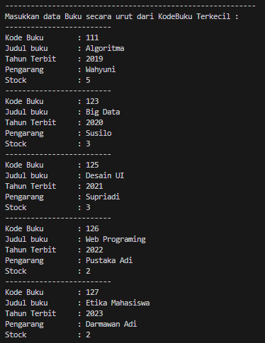
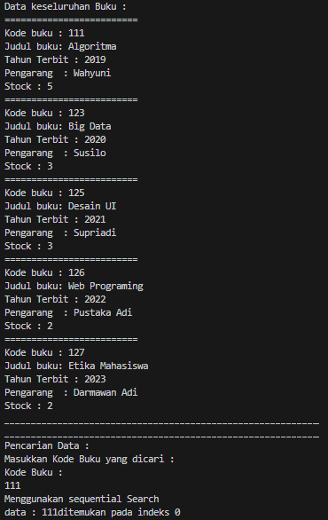
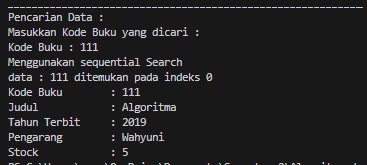
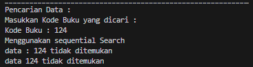
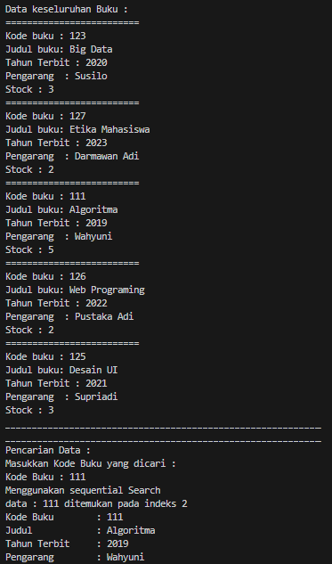
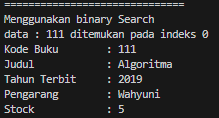
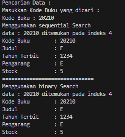

# <p align ="center"> LAPORAN PRAKTIKUM ALGORITMA DAN STRUKTUR DATA </p>

<br><br><br><br>

<p align="center">
    </p>

<br><br><br><br><br>

<p align = "center"> Nama  : Abdillah Noer Said </p>
<p align = "center"> NIM   : 2341720018 </p>
<p align = "center"> Prodi : TEKNIK INFOMATIKA</p>
<p align = "center"> Kelas : 1B </p>
<p align = "center"> Absen : 01 </p>

## Jobsheet 6

### Percobaan 1

Hasil Percobaan

Class Buku01

```java
public class Buku01 {
    int kodeBuku, tahunTerbit, stock;
    String judulBuku, pengarang;

    public Buku01(int kodeBuku, String judulBuku, int tahunTerbit, String pengarang, int stock) {
        this.kodeBuku = kodeBuku;
        this.judulBuku = judulBuku;
        this.tahunTerbit = tahunTerbit;
        this.pengarang = pengarang;
        this.stock = stock;
    }

    public void tampilDataBuku() {
        System.out.println("=========================");
        System.out.println("Kode buku : " + kodeBuku);
        System.out.println("Judul buku: " + judulBuku);
        System.out.println("Tahun Terbit : " + tahunTerbit);
        System.out.println("Pengarang  : " + pengarang);
        System.out.println("Stock : " + stock);
    }
}
```

Class PencarianBuku01

```java
public class PencarianBuku01 {
    Buku01 listBk[] = new Buku01[5];
    int idx;

    void tambah(Buku01 m) {
        if (idx < listBk.length) {
            listBk[idx] = m;
            idx++;
        } else {
            System.out.println("Data sudah penuh!");
        }
    }

    void tampil() {
        for (Buku01 m : listBk) {
            m.tampilDataBuku();
        }
    }

    public int FindSeqSearch(int cari) {
        int posisi = 2;
        for (int j = 0; j < listBk.length; j++) {
            if (listBk[j].kodeBuku == cari) {
                posisi = j;
                break;
            }
        }
        return posisi;
    }

    public void Tampilposisi(int x, int pos) {
        if (pos != -1) {
            System.out.println("data : " + x + " ditemukan pada indeks " + pos);
        } else {
            System.out.println("data : " + x + "tidak ditemukan");
        }
    }
}
```

Class BukuMain01

```java
import java.util.Scanner;

public class BukuMain01 {
    public static void main(String[] args) {
        Scanner s = new Scanner(System.in);
        Scanner s1 = new Scanner(System.in);

        PencarianBuku01 data = new PencarianBuku01();
        int jumBuku = 5;

        System.out.println("-----------------------------------------------------------");
        System.out.println("Masukkan data Buku secara urut dari KodeBuku Terkecil : ");
        for (int i = 0; i < jumBuku; i++) {
            System.out.println("-------------------------");
            System.out.print("Kode Buku \t : ");
            int kodeBuku = s.nextInt();
            System.out.print("Judul buku \t : ");
            String judulBuku = s1.nextLine();
            System.out.print("Tahun Terbit \t : ");
            int tahunTerbit = s.nextInt();
            System.out.print("Pengarang \t : ");
            String pengarang = s1.nextLine();
            System.out.print("Stock \t\t : ");
            int stock = s.nextInt();

            Buku01 m = new Buku01(kodeBuku, judulBuku, tahunTerbit, pengarang, stock);
            data.tambah(m);
        }
        System.out.println("-----------------------------------------------------------");
        System.out.println("Data keseluruhan Mahasiswa : ");
        System.out.println("-----------------------------------------------------------");
        System.out.println("Data keseluruhan Buku : ");
        data.tampil();
        System.out.println("___________________________________________________________");
        System.out.println("___________________________________________________________");
        System.out.println("Pencarian Data : ");
        System.out.println("Masukkan Kode Buku yang dicari : ");
        System.out.println("Kode Buku : ");
        int cari = s.nextInt();
        System.out.println("Menggunakan sequential Search");
        int posisi = data.FindSeqSearch(cari);
        data.Tampilposisi(cari, posisi);
    }
}
```

Output <br>
<br>
<br>

Menamahkan method TampilData

```java
public void TampilData(int x, int pos) {
        if (pos != -1) {
            System.out.println("Kode Buku\t : " + x);
            System.out.println("Judul\t\t : " + listBk[pos].judulBuku);
            System.out.println("Tahun Terbit\t : " + listBk[pos].tahunTerbit);
            System.out.println("Pengarang\t : " + listBk[pos].pengarang);
            System.out.println("Stock\t\t : " + listBk[pos].stock);
        } else {
            System.out.println("data " + x + " tidak ditemukan");
        }
    }
```

Output <br>
<br>
<br>

### Pertanyaan

1. Jelaskan fungsi break yang ada pada method FindSeqSearch!<br>
   Jawab : Untuk menghentikan looping pada method FindSeqSearch<br>
2. Jika Data Kode Buku yang dimasukkan tidak terurut dari kecil ke besar. Apakah program masih dapat berjalan? Apakah hasil yang dikeluarkan benar? Tunjukkan hasil screenshoot untuk bukti dengan kode Buku yang acak. Jelaskan Mengapa hal tersebut bisa terjadi?<br>
   Jawab : Tetap benar, Karena datanya masih kecil/sedikit jika datanya sangat besar hasilnya mungkin tidak akurat/pencarian menjadi lambat <br>
   <br>
3. Buat method baru dengan nama FindBuku menggunakan konsep sequential search dengan tipe method dari FindBuku adalah BukuNoAbsen. Sehingga Anda bisa memanggil method tersebut pada class BukuMain seperti gambar berikut :<br>

```java
Buku dataBuku = data.FingBuku(cari);
dataBuku.tampilDataBuku();
```

Jawab : Menambahkan code berikut :<br>

```java
public Buku01 FindBuku(int cari) {
        Buku01 buku = null;
        for (int j = 0; j < listBk.length; j++) {
            if (listBk[j].kodeBuku == cari) {
                buku = listBk[j];
                break;
            }
        }
        return buku;
    }
```

### Percobaan 2

Hasil Percobaan

Menambahkan pada class PencarianBuku01

```java
public int FindBinarySearch(int cari, int left, int right) {
        int mid;
        if (right >= left) {
            mid = (right) / 2;
            if (cari == listBk[mid].kodeBuku) {
                return (mid);
            } else if (listBk[mid].kodeBuku > cari) {
                return FindBinarySearch(cari, left, mid);
            } else {
                return FindBinarySearch(cari, mid, right);
            }
        }
        return -1;
    }
```

Menambahkan pada class BukuMain01

```java
System.out.println("==============================");
        System.out.println("Menggunakan binary Search");
        posisi = data.FindBinarySearch(cari, 0, jumBuku - 1);
        data.Tampilposisi(cari, posisi);
        data.TampilData(cari, posisi);
```

Output<br>
<br>

### Pertanyaan

1. Tunjukkan pada kode program yang mana proses divide dijalankan!<br>
   Jawab : pada metode FindBinarySearch

```java
mid = (right) / 2;
```

2. Tunjukkan pada kode program yang mana proses conquer dijalankan!<br>
   Jawab : pada metode Find BinarySearch

```java
public int FindBinarySearch(int cari, int left, int right) {
        int mid;
        if (right >= left) {
            mid = (right) / 2;
            if (cari == listBk[mid].kodeBuku) {
                return (mid);
            } else if (listBk[mid].kodeBuku > cari) {
                return FindBinarySearch(cari, left, mid);
            } else {
                return FindBinarySearch(cari, mid, right);
            }
        }
        return -1;
    }
```

3. Jika data Kode Buku yang dimasukkan tidak urut. Apakah program masih dapat berjalan? Mengapa
   demikian! Tunjukkan hasil screenshoot untuk bukti dengan kode Buku yang acak. Jelaskan
   Mengapa hal tersebut bisa terjadi?<br>
   Jawab : Ya, program masih akan berjalan karena metode pencarian sequen dapat menangani pencarian dalam data yang tidak diurutkan, sementara hasil pencarian biner mungkin tidak akurat jika data tidak urut.<br>
   <br>
4. Jika Kode Buku yang dimasukkan dari Kode Buku terbesar ke terkecil (missal : 20215, 20214,
   20212, 20211, 20210) dan elemen yang dicari adalah 20210. Bagaimana hasil dari binary search?
   Apakah sesuai? Jika tidak sesuai maka ubahlah kode program binary seach agar hasilnya sesuai!<br>
   Jawab : Modifikasi Program
   ```java
   public int FindBinarySearch(int cari, int left, int right) {
    if (right >= left) {
        int mid = left + (right - left) / 2;
        if (listBk[mid].kodeBuku == cari) {
            return mid;
        } else if (listBk[mid].kodeBuku < cari) {
            return FindBinarySearch(cari, left, mid - 1);
        } else {
            return FindBinarySearch(cari, mid + 1, right);
        }
    }
    return -1;
   }
   ```
   Output<br>
   

### Percobaan 3

Hasil percobaan

Class MergeSorting01

```java
package MergeSortTest;

public class MergeSorting01 {
    public void mergeSort(int[] data) {

    }

    public void merge(int data[], int left, int middle, int right) {
        int[] temp = new int[data.length];
        for (int i = left; i <= right; i++) {
            temp[i] = data[i];
        }
        int a = left;
        int b = middle + 1;
        int c = left;
        while (a <= middle && b <= right) {
            if (temp[a] <= temp[a]) {
                data[c] = temp[a];
                a++;
            } else {
                data[c] = temp[b];
                b++;
            }
            c++;
        }
        int s = middle - a;
        for (int i = 0; i <= s; i++) {
            data[c + i] = temp[a + i];
        }
    }

    public void sort(int data[], int left, int right) {
        if (left < right) {
            int middle = (left + right) / 2;
            sort(data, left, middle);
            sort(data, middle + 1, right);
            merge(data, left, middle, right);
        }
    }

    public void printArray(int arr[]) {
        for (int i = 0; i < arr.length; i++) {
            System.out.print(arr[i] + " ");
        }
        System.out.println();
    }
}
```

Class MergeSortingMain01

```java
package MergeSortTest;

public class MergeSortMain01 {
    public static void main(String[] args) {
        int data[] = { 10, 40, 30, 50, 70, 20, 100, 90 };
        System.out.println("Sorting dengan merge sort");
        MergeSorting01 mSort = new MergeSorting01();
        System.out.println("Data awal");
        mSort.printArray(data);
        mSort.mergeSort(data);
        System.out.println("Setelah diurutkan");
        mSort.printArray(data);
    }
}
```

### Latihan Praktikum

1. Modifikasi percobaan searching diatas dengan ketentuan berikut ini

- Ubah tipe data dari kode Buku yang awalnya int menjadi String

- Tambahkan method untuk pencarian kode Buku (bertipe data String) dengan menggunakan
  sequential search dan binary search.<br>
  Jawab : Berikut code program untuk jawaban nomor 1

  Class Buku Main01

  ```java
  public class Buku01 {
    int tahunTerbit, stock;
    String kodeBuku, judulBuku, pengarang;

    public Buku01(String kodeBuku, String judulBuku, int tahunTerbit, String pengarang, int stock) {
        this.kodeBuku = kodeBuku;
        this.judulBuku = judulBuku;
        this.tahunTerbit = tahunTerbit;
        this.pengarang = pengarang;
        this.stock = stock;
    }

    public void tampilDataBuku() {
        System.out.println("=========================");
        System.out.println("Kode buku : " + kodeBuku);
        System.out.println("Judul buku: " + judulBuku);
        System.out.println("Tahun Terbit : " + tahunTerbit);
        System.out.println("Pengarang  : " + pengarang);
        System.out.println("Stock : " + stock);
    }
  }
  ```

  Class PencarianBuku01

  ```java
  public class PencarianBuku01 {
    Buku01 listBk[] = new Buku01[5];
    int idx;

    void tambah(Buku01 m) {
        if (idx < listBk.length) {
            listBk[idx] = m;
            idx++;
        } else {
            System.out.println("Data sudah penuh!");
        }
    }

    void tampil() {
        for (Buku01 m : listBk) {
            m.tampilDataBuku();
        }
    }

    public int FindSeqSearch(String cari) {
        int posisi = -1;
        for (int j = 0; j < listBk.length; j++) {
            if (listBk[j].kodeBuku.equals(cari)) {
                posisi = j;
                break;
            }
        }
        return posisi;
    }

    public void Tampilposisi(String x, int pos) {
        if (pos != -1) {
            System.out.println("data : " + x + " ditemukan pada indeks " + pos);
        } else {
            System.out.println("data : " + x + " tidak ditemukan");
        }
    }

    public void TampilData(String x, int pos) {
        if (pos != -1) {
            System.out.println("Kode Buku\t : " + x);
            System.out.println("Judul\t\t : " + listBk[pos].judulBuku);
            System.out.println("Tahun Terbit\t : " + listBk[pos].tahunTerbit);
            System.out.println("Pengarang\t : " + listBk[pos].pengarang);
            System.out.println("Stock\t\t : " + listBk[pos].stock);
        } else {
            System.out.println("data " + x + " tidak ditemukan");
        }
    }

    public int FindBinarySearch(String cari, int left, int right) {
        if (right >= left) {
            int mid = (left + right) / 2;
            if (listBk[mid].kodeBuku.compareTo(cari) == 0) {
                return mid;
            } else if (listBk[mid].kodeBuku.compareTo(cari) > 0) {
                return FindBinarySearch(cari, left, mid - 1);
            } else {
                return FindBinarySearch(cari, mid + 1, right);
            }
        }
        return -1;
    }
  }
  ```

  Class BukuMain01

  ```java
  import java.util.Scanner;

    public class BukuMain01 {
        public static void main(String[] args) {
            Scanner s = new Scanner(System.in);
            Scanner s1 = new Scanner(System.in);

            PencarianBuku01 data = new PencarianBuku01();
            int jumBuku = 5;

            System.out.println("-----------------------------------------------------------");
            System.out.println("Masukkan data Buku secara urut dari KodeBuku Terkecil : ");
            for (int i = 0; i < jumBuku; i++) {
                System.out.println("-------------------------");
                System.out.print("Kode Buku \t : ");
                String kodeBuku = s1.nextLine();
                System.out.print("Judul buku \t : ");
                String judulBuku = s1.nextLine();
                System.out.print("Tahun Terbit \t : ");
                int tahunTerbit = s.nextInt();
                System.out.print("Pengarang \t : ");
                String pengarang = s1.nextLine();
                System.out.print("Stock \t\t : ");
                int stock = s.nextInt();

                Buku01 m = new Buku01(kodeBuku, judulBuku, tahunTerbit, pengarang, stock);
                data.tambah(m);
            }
            System.out.println("-----------------------------------------------------------");
            System.out.println("Data keseluruhan Mahasiswa : ");
            System.out.println("-----------------------------------------------------------");
            System.out.println("Data keseluruhan Buku : ");
            data.tampil();
            System.out.println("___________________________________________________________");
            System.out.println("___________________________________________________________");
            System.out.println("Pencarian Data : ");
            System.out.println("Masukkan Kode Buku yang dicari : ");
            System.out.print("Kode Buku : ");
            String cari = s1.nextLine();
            System.out.println("Menggunakan sequential Search");
            int posisi = data.FindSeqSearch(cari);
            data.Tampilposisi(cari, posisi);
            data.TampilData(cari, posisi);
            System.out.println("==============================");
            System.out.println("Menggunakan binary Search");
            posisi = data.FindBinarySearch(cari, 0, jumBuku - 1);
            data.Tampilposisi(cari, posisi);
            data.TampilData(cari, posisi);
        }
    }
  ```

2. Modifikasi percobaan searching diatas dengan ketentuan berikut ini

- Tambahkan method pencarian judul buku menggunakan sequential search dan binary
  search. Sebelum dilakukan searching dengan binary search data harus dilakukan pengurutan
  dengan menggunakan algoritma Sorting (bebas pilih algoritma sorting apapun)! Sehingga
  ketika input data acak, maka algoritma searching akan tetap berjalan
- Buat aturan untuk mendeteksi hasil pencarian judul buku yang lebih dari 1 hasil dalam
  bentuk kalimat peringatan! Pastikan algoritma yang diterapkan sesuai dengan kasus yang
  diberikan!

  Jawab : Berikut code program untuk jawaban nomor 2

Class PencarianBuku01

```java
  import java.util.Arrays;

    public class PencarianBuku01 {
        Buku01 listBk[] = new Buku01[5];
        int idx;

        void tambah(Buku01 m) {
            if (idx < listBk.length) {
                listBk[idx] = m;
                idx++;
            } else {
                System.out.println("Data sudah penuh!");
            }
        }

        void tampil() {
            for (Buku01 m : listBk) {
                m.tampilDataBuku();
            }
        }

        public int FindSeqSearch(String cari) {
            int posisi = -1;
            for (int j = 0; j < listBk.length; j++) {
                if (listBk[j].kodeBuku.equals(cari)) {
                    posisi = j;
                    break;
                }
            }
            return posisi;
        }

        public void Tampilposisi(String x, int pos) {
            if (pos != -1) {
                System.out.println("Data : " + x + " ditemukan pada indeks " + pos);
            } else {
                System.out.println("Data : " + x + " tidak ditemukan");
            }
        }

        public void TampilData(String x, int pos) {
            if (pos != -1) {
                System.out.println("Kode Buku\t : " + x);
                System.out.println("Judul\t\t : " + listBk[pos].judulBuku);
                System.out.println("Tahun Terbit\t : " + listBk[pos].tahunTerbit);
                System.out.println("Pengarang\t : " + listBk[pos].pengarang);
                System.out.println("Stock\t\t : " + listBk[pos].stock);
            } else {
                System.out.println("Data " + x + " tidak ditemukan");
            }
        }

        public int FindBinarySearch(String cari, int left, int right) {
            if (right >= left) {
                int mid = (left + right) / 2;
                if (listBk[mid].kodeBuku.compareTo(cari) == 0) {
                    return mid;
                } else if (listBk[mid].kodeBuku.compareTo(cari) > 0) {
                    return FindBinarySearch(cari, left, mid - 1);
                } else {
                    return FindBinarySearch(cari, mid + 1, right);
                }
            }
            return -1;
        }

        public int FindSeqSearchJudul(String cari) {
            for (int j = 0; j < listBk.length; j++) {
                if (listBk[j].judulBuku.equalsIgnoreCase(cari)) {
                    return j;
                }
            }
            return -1;
        }

        public int FindBinarySearchJudul(String cari, int left, int right) {
            if (right >= left) {
                int mid = (left + right) / 2;
                if (listBk[mid].judulBuku.compareToIgnoreCase(cari) == 0) {
                    return mid;
                } else if (listBk[mid].judulBuku.compareToIgnoreCase(cari) > 0) {
                    return FindBinarySearchJudul(cari, left, mid - 1);
                } else {
                    return FindBinarySearchJudul(cari, mid + 1, right);
                }
            }
            return -1;
        }

        public void sortDataJudul() {
            Arrays.sort(listBk, (a, b) -> a.judulBuku.compareToIgnoreCase(b.judulBuku));
        }

        public void CariJudulBuku(String judul) {
            sortDataJudul(); // Sorting
            int posSeqSearch = FindSeqSearchJudul(judul);
            int posBinarySearch = FindBinarySearchJudul(judul, 0, listBk.length - 1);
            boolean lebihDariSatuSeq = false;
            boolean lebihDariSatuBin = false;

            if (posSeqSearch != -1) {
                System.out.println("Menggunakan sequential search:");
                Tampilposisi(judul, posSeqSearch);
                TampilData(listBk[posSeqSearch].kodeBuku, posSeqSearch);
                // Mencari buku lain dengan judul yang sama
                for (int i = posSeqSearch + 1; i < listBk.length; i++) {
                    if (listBk[i].judulBuku.equalsIgnoreCase(judul)) {
                        System.out.println("========================");
                        TampilData(listBk[i].kodeBuku, i);
                        lebihDariSatuSeq = true;
                    } else {
                        break;
                    }
                }
            } else {
                System.out.println("Data " + judul + " tidak ditemukan dengan sequential search");
            }

            if (posBinarySearch != -1) {
                System.out.println("\nMenggunakan binary search setelah pengurutan:");
                Tampilposisi(judul, posBinarySearch);
                TampilData(listBk[posBinarySearch].kodeBuku, posBinarySearch);
                // Mencari buku lain dengan judul yang sama
                int i = posBinarySearch - 1;
                while (i >= 0 && listBk[i].judulBuku.equalsIgnoreCase(judul)) {
                    System.out.println("========================");
                    TampilData(listBk[i].kodeBuku, i);
                    i--;
                    lebihDariSatuBin = true;
                }
                i = posBinarySearch + 1;
                while (i < listBk.length && listBk[i].judulBuku.equalsIgnoreCase(judul)) {
                    System.out.println("========================");
                    TampilData(listBk[i].kodeBuku, i);
                    i++;
                    lebihDariSatuBin = true;
                }
            } else {
                System.out.println("\nData " + judul + " tidak ditemukan dengan binary search setelah pengurutan");
            }

            // Peringatan jika ada lebih dari satu Judul Buku
            if (lebihDariSatuSeq || lebihDariSatuBin) {
                System.out.println("\nPeringatan: Terdapat lebih dari satu hasil dengan judul " + judul);
            }
        }
    }
```

Class BukuMain01

```java
    import java.util.Scanner;

    public class BukuMain01 {
        public static void main(String[] args) {
            Scanner s = new Scanner(System.in);
            Scanner s1 = new Scanner(System.in);

            PencarianBuku01 data = new PencarianBuku01();
            int jumBuku = 5;

            System.out.println("-----------------------------------------------------------");
            System.out.println("Masukkan data Buku secara urut dari KodeBuku Terkecil : ");
            for (int i = 0; i < jumBuku; i++) {
                System.out.println("-------------------------");
                System.out.print("Kode Buku \t : ");
                String kodeBuku = s1.nextLine();
                System.out.print("Judul buku \t : ");
                String judulBuku = s1.nextLine();
                System.out.print("Tahun Terbit \t : ");
                int tahunTerbit = s.nextInt();
                System.out.print("Pengarang \t : ");
                String pengarang = s1.nextLine();
                System.out.print("Stock \t\t : ");
                int stock = s.nextInt();

                Buku01 m = new Buku01(kodeBuku, judulBuku, tahunTerbit, pengarang, stock);
                data.tambah(m);
            }
            System.out.println("-----------------------------------------------------------");
            System.out.println("Data keseluruhan Buku : ");
            data.tampil();
            System.out.println("___________________________________________________________");
            System.out.println("___________________________________________________________");
            System.out.println("Pencarian Data : ");
            System.out.println("1. Cari berdasarkan Kode Buku");
            System.out.println("2. Cari berdasarkan Judul Buku");
            System.out.print("Pilihan Anda: ");
            int pilihan = s.nextInt();

            switch (pilihan) {
                case 1:
                    System.out.println("Masukkan Kode Buku yang dicari : ");
                    System.out.print("Kode Buku : ");
                    String cariKode = s1.nextLine();
                    System.out.println("Menggunakan sequential search:");
                    int posisiKodeSeq = data.FindSeqSearch(cariKode);
                    data.Tampilposisi(cariKode, posisiKodeSeq);
                    data.TampilData(cariKode, posisiKodeSeq);
                    System.out.println("\nMenggunakan binary search:");
                    int posisiKodeBin = data.FindBinarySearch(cariKode, 0, jumBuku - 1);
                    data.Tampilposisi(cariKode, posisiKodeBin);
                    data.TampilData(cariKode, posisiKodeBin);
                    break;
                case 2:
                    System.out.println("Masukkan Judul Buku yang dicari : ");
                    System.out.print("Judul Buku : ");
                    String cariJudul = s1.nextLine();
                    data.CariJudulBuku(cariJudul);
                    break;
                default:
                    System.out.println("Pilihan tidak valid!");
            }
        }
    }
```
