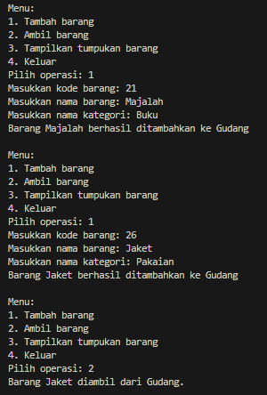
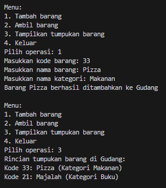
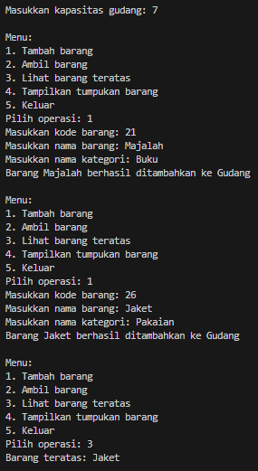
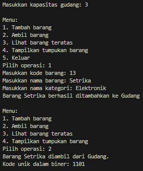
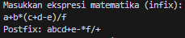
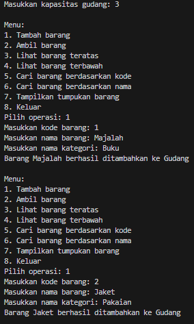
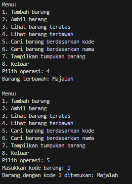
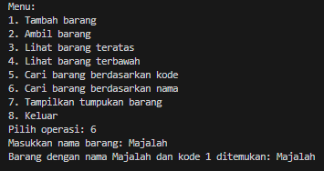

# <p align ="center"> LAPORAN PRAKTIKUM ALGORITMA DAN STRUKTUR DATA </p>

<br><br><br><br>

<p align="center">
    </p>

<br><br><br><br><br>

<p align = "center"> Nama  : Abdillah Noer Said </p>
<p align = "center"> NIM   : 2341720018 </p>
<p align = "center"> Prodi : TEKNIK INFOMATIKA</p>
<p align = "center"> Kelas : 1B </p>
<p align = "center"> Absen : 01 </p>

## Jobsheet 7

### Percobaan 1

Hasil Percobaan

Class Barang01

```java
public class Barang01 {
    int kode;
    String nama, kategori;

    public Barang01(int kode, String nama, String kategori) {
        this.kode = kode;
        this.nama = nama;
        this.kategori = kategori;
    }
}
```

Class Gudang01

```java
   public class Gudang01 {
    Barang01[] tumpukan;
    int size, top;

    public Gudang01(int kapasitas) {
        size = kapasitas;
        tumpukan = new Barang01[size];
        top = -1;
    }

    public boolean cekKosong() {
        if (top == -1) {
            return true;
        } else {
            return false;
        }
    }

    public boolean cekPenuh() {
        if (top == size - 1) {
            return true;
        } else {
            return false;
        }
    }

    public boolean isEmpty() {
        return top == -1;
    }

    public void tambahBarang(Barang01 brg) {
        if (!cekPenuh()) {
            top++;
            tumpukan[top] = brg;
            System.out.println("Barang " + brg.nama + " berhasil ditambahkan ke Gudang");
        } else {
            System.out.println("Gagal! Tumpukan barang di Gudang sudah penuh");
        }
    }

    public Barang01 ambilBarang() {
        if (!cekKosong()) {
            Barang01 delete = tumpukan[top];
            top--;
            System.out.println("Barang " + delete.nama + " diambil dari Gudang.");
            return delete;
        } else {
            System.out.println("Tumpukan barang kosong");
            return null;
        }
    }

    public Barang01 lihatBarangTeratas() {
        if (!isEmpty()) {
            Barang01 barangTeratas = tumpukan[top];
            System.out.println("Barang teratas: " + barangTeratas.nama);
            return barangTeratas;
        } else {
            System.out.println("Tumpukan barang kosong.");
            return null;
        }
    }

    public void tampilkanBarang() {
        if (!cekKosong()) {
            System.out.println("Rincian tumpukan barang di Gudang: ");
            // for (int j = top; j >= 0; j--) {
            for (int i = top; i >= 0; i--) {
                System.out.printf("Kode %d: %s (Kategori %s)\n", tumpukan[i].kode, tumpukan[i].nama,
                        tumpukan[i].kategori);
            }
        } else {
            System.out.println("Tumpukan barang kosong.");
        }
    }
}
```

Class Utama01

```java
import java.util.Scanner;

public class Utama01 {
    public static void main(String[] args) {
        Gudang01 gudang = new Gudang01(7);
        Scanner scanner = new Scanner(System.in);

        while (true) {
            System.out.println("\nMenu:");
            System.out.println("1. Tambah barang");
            System.out.println("2. Ambil barang");
            System.out.println("3. Tampilkan tumpukan barang");
            System.out.println("4. Keluar");
            System.out.print("Pilih operasi: ");
            int pilihan = scanner.nextInt();
            scanner.nextLine();

            switch (pilihan) {
                case 1:
                    System.out.print("Masukkan kode barang: ");
                    int kode = scanner.nextInt();
                    scanner.nextLine();
                    System.out.print("Masukkan nama barang: ");
                    String nama = scanner.nextLine();
                    System.out.print("Masukkan nama kategori: ");
                    String kategori = scanner.nextLine();
                    Barang01 barangBaru = new Barang01(kode, nama, kategori);
                    gudang.tambahBarang(barangBaru);
                    break;
                case 2:
                    gudang.ambilBarang();
                    break;
                case 3:
                    gudang.tampilkanBarang();
                    break;
                case 4:
                    break;
                default:
                    System.out.println("pilihan tidak valid. Silakan coba lagi.");
            }
        }
    }
}
```

Output<br>
<br>


### Pertanyaan

1. Lakukan perbaikan pada kode program, sehingga keluaran yang dihasilkan sama dengan verifikasi hasil percobaan! Bagian mana saja yang perlu diperbaiki?<br>
   Jawab : pada bagian tampilkanBarang()
   ```java
   public void tampilkanBarang() {
        if (!cekKosong()) {
            System.out.println("Rincian tumpukan barang di Gudang: ");
            for (int i = top; i >= 0; i--) {
                System.out.printf("Kode %d: %s (Kategori %s)\n", tumpukan[i].kode, tumpukan[i].nama,
                        tumpukan[i].kategori);
            }
        } else {
            System.out.println("Tumpukan barang kosong.");
        }
    }
   ```
2. Berapa banyak data barang yang dapat ditampung di dalam tumpukan? Tunjukkan potongan kode programnya!<br>
   Jawab : Ada 7, Berikut code programnya
   ```java
   Gudang01 gudang = new Gudang01(7);
   ```
3. Mengapa perlu pengecekan kondisi !cekKosong() pada method tampilkanBarang? Kalau kondisi tersebut dihapus, apa dampaknya?<br>
   Jawab : untuk memastikan bahwa tidak ada upaya untuk menampilkan barang jika tumpukan barang dalam gudang kosong. Jika dihapus maka akan mencoba untuk menampilkan rincian barang dalam tumpukan tanpa memeriksa apakah tumpukan kosong atau tidak dan akan terjadi NullPointerException.<br>
4. Modifikasi kode program pada class Utama sehingga pengguna juga dapat memilih operasi lihat barang teratas, serta dapat secara bebas menentukan kapasitas gudang!<br>
   Jawab : Berikut modifikasi code programnya

   ```java
   import java.util.Scanner;

   public class Utama01 {
      public static void main(String[] args) {
         Scanner scanner = new Scanner(System.in);

         System.out.print("Masukkan kapasitas gudang: ");
         int kapasitas = scanner.nextInt();
         scanner.nextLine();

         Gudang01 gudang = new Gudang01(kapasitas);

         while (true) {
               System.out.println("\nMenu:");
               System.out.println("1. Tambah barang");
               System.out.println("2. Ambil barang");
               System.out.println("3. Lihat barang teratas");
               System.out.println("4. Tampilkan tumpukan barang");
               System.out.println("5. Keluar");
               System.out.print("Pilih operasi: ");
               int pilihan = scanner.nextInt();
               scanner.nextLine();

               switch (pilihan) {
                  case 1:
                     System.out.print("Masukkan kode barang: ");
                     int kode = scanner.nextInt();
                     scanner.nextLine();
                     System.out.print("Masukkan nama barang: ");
                     String nama = scanner.nextLine();
                     System.out.print("Masukkan nama kategori: ");
                     String kategori = scanner.nextLine();
                     Barang01 barangBaru = new Barang01(kode, nama, kategori);
                     gudang.tambahBarang(barangBaru);
                     break;
                  case 2:
                     gudang.ambilBarang();
                     break;
                  case 3:
                     gudang.lihatBarangTeratas();
                     break;
                  case 4:
                     gudang.tampilkanBarang();
                     break;
                  case 5:
                     break;
                  default:
                     System.out.println("Pilihan tidak valid. Silakan coba lagi.");
               }
         }
      }
   }
   ```

   Output<br>
   

### Percobaan 2

Hasil Percobaan

Class StackKonversi01

```java
public class StackKonversi01 {
    int size, top;
    int[] tumpukanBiner;

    public StackKonversi01() {
        this.size = 32; // asumsi 32 bit
        tumpukanBiner = new int[size];
        top = -1;
    }

    public boolean isEmpty() {
        return top == -1;
    }

    public boolean isFull() {
        return top == size - 1;
    }

    public void push(int data) {
        if (isFull()) {
            System.out.println("Stack penuh");
        } else {
            top++;
            tumpukanBiner[top] = data;
        }
    }

    public int pop() {
        if (isEmpty()) {
            System.out.println("Stack kosong");
            return -1;
        } else {
            int data = tumpukanBiner[top];
            top--;
            return data;
        }
    }
}
```

Modifikasi Class Gudang01

```java
public class Gudang01 {
    Barang01[] tumpukan;
    int size, top;

    public Gudang01(int kapasitas) {
        size = kapasitas;
        tumpukan = new Barang01[size];
        top = -1;
    }

    public boolean cekKosong() {
        if (top == -1) {
            return true;
        } else {
            return false;
        }
    }

    public boolean cekPenuh() {
        if (top == size - 1) {
            return true;
        } else {
            return false;
        }
    }

    public boolean isEmpty() {
        return top == -1;
    }

    public void tambahBarang(Barang01 brg) {
        if (!cekPenuh()) {
            top++;
            tumpukan[top] = brg;
            System.out.println("Barang " + brg.nama + " berhasil ditambahkan ke Gudang");
        } else {
            System.out.println("Gagal! Tumpukan barang di Gudang sudah penuh");
        }
    }

    public Barang01 ambilBarang() {
        if (!cekKosong()) {
            Barang01 delete = tumpukan[top];
            top--;
            System.out.println("Barang " + delete.nama + " diambil dari Gudang.");
            System.out.println("Kode unik dalam biner: " + konversiDesimalKeBiner(delete.kode));
            return delete;
        } else {
            System.out.println("Tumpukan barang kosong");
            return null;
        }
    }

    public Barang01 lihatBarangTeratas() {
        if (!isEmpty()) {
            Barang01 barangTeratas = tumpukan[top];
            System.out.println("Barang teratas: " + barangTeratas.nama);
            return barangTeratas;
        } else {
            System.out.println("Tumpukan barang kosong.");
            return null;
        }
    }

    public void tampilkanBarang() {
        if (!cekKosong()) {
            System.out.println("Rincian tumpukan barang di Gudang: ");
            // for (int j = top; j >= 0; j--) {
            for (int i = top; i >= 0; i--) {
                System.out.printf("Kode %d: %s (Kategori %s)\n", tumpukan[i].kode, tumpukan[i].nama,
                        tumpukan[i].kategori);
            }
        } else {
            System.out.println("Tumpukan barang kosong.");
        }
    }

    public String konversiDesimalKeBiner(int kode) {
        StackKonversi01 stack = new StackKonversi01();
        while (kode > 0) {
            int sisa = kode % 2;
            stack.push(sisa);
            kode = kode / 2;
        }
        String biner = new String();
        while (!stack.isEmpty()) {
            biner += stack.pop();
        }
        return biner;
    }
}
```

Output<br>


### Pertanyaan

1. Pada method konversiDesimalKeBiner, ubah kondisi perulangan menjadi while (kode != 0), bagaimana hasilnya? Jelaskan alasannya!<br>
   Jawab : hasilnya akan tetap sama, keduanya code program tersebut memungkinkan untuk mengkonversi bbilangan desimal ke biner dengan benar<br>
2. Jelaskan alur kerja dari method konversiDesimalKeBiner!<br>
   Jawab :
   1. Input Bilangan Desimal: Method konversiDesimalKeBiner menerima bilangan bulat desimal (kode) yang akan dikonversi menjadi representasi biner.
   2. Inisialisasi Stack: Di dalam method, kita membuat objek StackKonversi01 yang digunakan untuk menyimpan sisa pembagian hasil konversi dari desimal ke biner.
   3. Perulangan Pembagian: Selama kode masih lebih besar dari 0, dilakukan perulangan. Pada setiap iterasi, dilakukan operasi modulus (%) dengan 2 pada kode untuk mendapatkan sisa pembagian. Sisa pembagian ini kemudian dimasukkan ke dalam stack menggunakan operasi push.
   4. Pengurangan Nilai Kode: Setelah mendapatkan sisa pembagian, nilai kode dibagi dengan 2 agar mendapatkan nilai baru untuk diiterasi pada perulangan berikutnya. Ini dilakukan dengan kode = kode / 2, sehingga nilai kode berkurang setiap kali dilakukan pembagian.
   5. Pembentukan String Biner: Setelah semua sisa pembagian dimasukkan ke dalam stack, kita mengeluarkan nilai-nilai dari stack satu per satu dengan operasi pop dan membangun string biner dari sisa-sisa tersebut.

### Pertanyaan 3

Hasil Percobaan

Class Postfix01

```java
public class Postfix01 {
    int n, top;
    char[] stack;

    public Postfix01(int total) {
        n = total;
        top = -1;
        stack = new char[n];
        push('(');
    }

    public void push(char c) {
        top++;
        stack[top] = c;
    }

    public char pop() {
        char item = stack[top];
        top--;
        return item;
    }

    public boolean IsOperand(char c) {
        if ((c >= 'A' && c <= 'Z') || (c >= 'a' && c <= 'z') ||
                (c >= '0' && c <= '9') || c == ' ' || c == '.') {
            return true;
        } else {
            return false;
        }
    }

    public boolean IsOperator(char c) {
        if (c == '^' || c == '%' || c == '/' || c == '*' || c == '-' || c == '+') {
            return true;
        } else {
            return false;
        }
    }

    public int derajat(char c) {
        switch (c) {
            case '^':
                return 3;
            case '%':
                return 2;
            case '/':
                return 2;
            case '*':
                return 2;
            case '-':
                return 1;
            case '+':
                return 1;
            default:
                return 0;
        }
    }

    public String konversi(String Q) {
        String P = "";
        char c;
        for (int i = 0; 1 < n; i++) {
            c = Q.charAt(i);
            if (IsOperand(c)) {
                P = P + c;
            }
            if (c == '(') {
                push(c);
            }
            if (c == ')') {
                while (stack[top] != '(') {
                    P = P + pop();
                }
                pop();
            }
            if (IsOperator(c)) {
                while (derajat(stack[top]) >= derajat(c)) {
                    P = P + pop();
                }
                push(c);
            }
        }
        return P;
    }
}
```

Class PostfixMain01

```java
import java.util.Scanner;

public class PostfixMain01 {
    public static void main(String[] args) {
        Scanner sc = new Scanner(System.in);
        String P, Q;
        System.out.println("Masukkan ekspresi matematika (infix): ");
        Q = sc.nextLine();
        Q = Q.trim();
        Q = Q + ")";

        int total = Q.length();
        Postfix01 post = new Postfix01(total);
        P = post.konversi(Q);
        System.out.println("Postfix: " + P);
    }
}
```

Output<br>


### Pertanyaan

1. Pada method derajat, mengapa return value beberapa case bernilai sama? Apabila return value diubah dengan nilai berbeda-beda setiap case-nya, apa yang terjadi?<br>
   Jawab : karena operator" tersebut memiliki prioritas yang sama, yaitu prioritas kedua tertinggi setelah operator ^. Jika mengubah nilai return untuk setiap case sehingga tidak semua case mengembalikan nilai yang sama, maka akan terjadi perubahan dalam prioritas operator-operator tersebut dalam algoritma konversi infix ke postfix.<br>
2. Jelaskan alur kerja method konversi!<br>
   Jawab :
   1. Inisialisasi Variabel: Variabel P diinisialisasi sebagai string kosong yang akan menyimpan ekspresi postfix yang dihasilkan. Variabel c digunakan untuk menyimpan karakter saat ini yang sedang diproses dalam ekspresi infix.
   2. Perulangan: Iterasi dilakukan melalui setiap karakter dalam ekspresi infix yang diberikan (Q). Perulangan ini berlangsung dari i = 0 hingga i = n - 1, di mana n adalah panjang ekspresi infix.
   3. Pemrosesan Karakter: Setiap karakter dalam ekspresi infix diproses satu per satu.
   - Jika karakter tersebut adalah operand (bilangan atau variabel), maka karakter tersebut langsung ditambahkan ke dalam ekspresi postfix P.
   - Jika karakter adalah kurung buka '(', maka karakter tersebut dipush ke dalam stack. Ini menunjukkan awal dari ekspresi dalam tanda kurung.
   - Jika karakter adalah kurung tutup ')', maka dilakukan pop dari stack dan karakter yang dipop ditambahkan ke dalam ekspresi postfix P sampai menemukan kurung buka yang sesuai.
   - Jika karakter adalah operator, maka dilakukan evaluasi prioritas operator dalam stack dengan operator saat ini. Operasi dilakukan untuk memastikan bahwa operator-operator dengan prioritas yang lebih tinggi diproses terlebih dahulu.
   - Jika operator pada stack memiliki prioritas yang sama atau lebih tinggi, maka operator-operator tersebut dipop dari stack dan ditambahkan ke dalam ekspresi postfix P.
   4. Selesai Perulangan: Setelah semua karakter dalam ekspresi infix diproses, ekspresi postfix P telah selesai terbentuk.
3. Pada method konversi, apa fungsi dari potongan kode berikut?

```java
c = Q.chartAt(i);
```

Jawab : code program tersebut digunakan untuk mengambil karakter dari ekspresi infix (Q) pada posisi indeks i selama iterasi perulangan dalam method konversi. Dengan pernyataan ini, karakter yang diproses dalam setiap iterasi disimpan dalam variabel c untuk dilakukan evaluasi selanjutnya.

### Latihan Praktikum

Perhatikan dan gunakan kembali kode program pada Percobaan 1. Tambahkan dua method berikut pada class Gudang:<br>
• Method lihatBarangTerbawah digunakan untuk mengecek barang pada tumpukan terbawah<br>
• Method cariBarang digunakan untuk mencari ada atau tidaknya barang berdasarkan kode barangnya atau nama barangnya<br>
Jawab: Berikut code programnya
Class Gudang01

```java
public class Gudang01 {
    Barang01[] tumpukan;
    int size, top;

    public Gudang01(int kapasitas) {
        size = kapasitas;
        tumpukan = new Barang01[size];
        top = -1;
    }

    public boolean cekKosong() {
        if (top == -1) {
            return true;
        } else {
            return false;
        }
    }

    public boolean cekPenuh() {
        if (top == size - 1) {
            return true;
        } else {
            return false;
        }
    }

    public boolean isEmpty() {
        return top == -1;
    }

    public void tambahBarang(Barang01 brg) {
        if (!cekPenuh()) {
            top++;
            tumpukan[top] = brg;
            System.out.println("Barang " + brg.nama + " berhasil ditambahkan ke Gudang");
        } else {
            System.out.println("Gagal! Tumpukan barang di Gudang sudah penuh");
        }
    }

    public Barang01 ambilBarang() {
        if (!cekKosong()) {
            Barang01 delete = tumpukan[top];
            top--;
            System.out.println("Barang " + delete.nama + " diambil dari Gudang.");
            System.out.println("Kode unik dalam biner: " + konversiDesimalKeBiner(delete.kode));
            return delete;
        } else {
            System.out.println("Tumpukan barang kosong");
            return null;
        }
    }

    public Barang01 lihatBarangTeratas() {
        if (!isEmpty()) {
            Barang01 barangTeratas = tumpukan[top];
            System.out.println("Barang teratas: " + barangTeratas.nama);
            return barangTeratas;
        } else {
            System.out.println("Tumpukan barang kosong.");
            return null;
        }
    }

    public Barang01 lihatBarangTerbawah() {
        if (!isEmpty()) {
            Barang01 barangTerbawah = tumpukan[0];
            System.out.println("Barang terbawah: " + barangTerbawah.nama);
            return barangTerbawah;
        } else {
            System.out.println("Tumpukan barang kosong.");
            return null;
        }
    }

    public Barang01 cariBarangKode(int kodeBarang) {
        for (int i = 0; i <= top; i++) {
            if (tumpukan[i].kode == kodeBarang) {
                return tumpukan[i];
            }
        }
        return null;
    }

    public Barang01 cariBarangNama(String namaBarang) {
        for (int i = 0; i <= top; i++) {
            if (tumpukan[i].nama.equals(namaBarang)) {
                return tumpukan[i];
            }
        }
        return null;
    }

    public void tampilkanBarang() {
        if (!cekKosong()) {
            System.out.println("Rincian tumpukan barang di Gudang: ");
            // for (int j = top; j >= 0; j--) {
            for (int i = top; i >= 0; i--) {
                System.out.printf("Kode %d: %s (Kategori %s)\n", tumpukan[i].kode, tumpukan[i].nama,
                        tumpukan[i].kategori);
            }
        } else {
            System.out.println("Tumpukan barang kosong.");
        }
    }

    public String konversiDesimalKeBiner(int kode) {
        StackKonversi01 stack = new StackKonversi01();
        while (kode > 0) {
            int sisa = kode % 2;
            stack.push(sisa);
            kode = kode / 2;
        }
        String biner = new String();
        while (!stack.isEmpty()) {
            biner += stack.pop();
        }
        return biner;
    }
}
```

Class Utama01

```java
import java.util.Scanner;

public class Utama01 {
    public static void main(String[] args) {
        Scanner scanner = new Scanner(System.in);

        String nama = "";
        int kode = 0;

        System.out.print("Masukkan kapasitas gudang: ");
        int kapasitas = scanner.nextInt();
        scanner.nextLine();

        Gudang01 gudang = new Gudang01(kapasitas);

        while (true) {
            System.out.println("\nMenu:");
            System.out.println("1. Tambah barang");
            System.out.println("2. Ambil barang");
            System.out.println("3. Lihat barang teratas");
            System.out.println("4. Lihat barang terbawah");
            System.out.println("5. Cari barang berdasarkan kode");
            System.out.println("6. Cari barang berdasarkan nama");
            System.out.println("7. Tampilkan tumpukan barang");
            System.out.println("8. Keluar");
            System.out.print("Pilih operasi: ");
            int pilihan = scanner.nextInt();
            scanner.nextLine();

            switch (pilihan) {
                case 1:
                    System.out.print("Masukkan kode barang: ");
                    kode = scanner.nextInt();
                    scanner.nextLine();
                    System.out.print("Masukkan nama barang: ");
                    nama = scanner.nextLine();
                    System.out.print("Masukkan nama kategori: ");
                    String kategori = scanner.nextLine();
                    Barang01 barangBaru = new Barang01(kode, nama, kategori);
                    gudang.tambahBarang(barangBaru);
                    break;
                case 2:
                    gudang.ambilBarang();
                    break;
                case 3:
                    gudang.lihatBarangTeratas();
                    break;
                case 4:
                    gudang.lihatBarangTerbawah();
                    break;
                case 5:
                    System.out.print("Masukkan kode barang: ");
                    kode = scanner.nextInt();
                    scanner.nextLine();
                    Barang01 barangDitemukan = gudang.cariBarangKode(kode);
                    if (barangDitemukan != null) {
                        System.out.println("Barang dengan kode " + kode + " ditemukan: " + barangDitemukan.nama);
                    } else {
                        System.out.println("Barang dengan kode " + kode + " tidak ditemukan.");
                    }
                    break;
                case 6:
                    System.out.print("Masukkan nama barang: ");
                    nama = scanner.nextLine();
                    barangDitemukan = gudang.cariBarangNama(nama);
                    if (barangDitemukan != null) {
                        System.out.println("Barang dengan nama " + nama + " dan kode " + kode + " ditemukan: "
                                + barangDitemukan.nama);
                    } else {
                        System.out.println("Barang dengan nama " + nama + " tidak ditemukan.");
                    }
                    break;
                case 7:
                    gudang.tampilkanBarang();
                    break;
                default:
                    System.out.println("Pilihan tidak valid. Silakan coba lagi.");
            }
        }
    }
}
```

Outpot<br>
<br>
<br>
<br>
