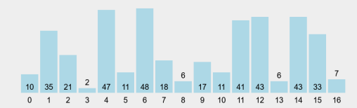
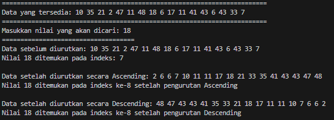
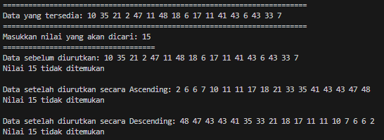

# 
 LAPORAN PRAKTIKUM ALGORITMA DAN STRUKTUR DATA 

    

    

     

 Nama  : Abdillah Noer Said 

 NIM   : 2341720018 

 Prodi : TEKNIK INFOMATIKA

 Kelas : 1B 

 Absen : 01 

## Laporan UTS

### Soal

- Simulasi pengurutan dilakukan secara ascending dan descending!
- Nilai yang dicari merupakan nilai bebas ditentukan setiap mahasiswa dengan ketentuan empat kondisi, yaitu:

  1. nilai yang dapat ditemukan (ditunjukkan pada lokasi index sebelum pengurutan);
  2. nilai yang dapat ditemukan (ditunjukkan pada lokasi index setelah pengurutan secara ascending);
  3. nilai yang dapat ditemukan (ditunjukkan pada lokasi index setelah pengurutan secara descending)
  4. nilai tidak ditemukan.

### Output

Output jika nilai yang dicari ada 

Output jika nilai yang dicari tidak ada 

